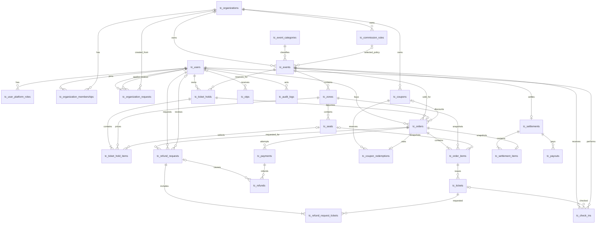

# ERD vật lý ticketing

Nguồn: [SPEC](../references/SPEC.md) §5, §8.2, §14.3 và [model map](model-map.md). Tên vật lý dùng tiền tố `tc_` để tránh từ khóa `USER`, `ORDER`; toàn bộ FK mặc định `NO ACTION`. Không cascade-delete lịch sử đơn hàng, thanh toán, vé, hoàn tiền hoặc audit.

Các bảng kỹ thuật không tạo lớp nghiệp vụ mới:

- `tc_user_platform_roles`: quyền nền tảng; role tổ chức vẫn ở membership.
- `tc_otps`: chỉ giữ hash/HMAC và trạng thái sử dụng, không giữ OTP rõ.
- `tc_coupon_redemptions`: một dòng trên Order, trạng thái `RESERVED/CONSUMED/RELEASED`.
- `tc_refund_request_tickets`: bảng nối có `is_open` để unique filtered index bảo vệ một yêu cầu mở trên mỗi Ticket.
- `tc_outbox`: thông điệp hậu giao dịch có idempotency key và lease.
- `tc_schema_migrations`: lịch sử/checksum do migration runner sở hữu.

## Chuẩn hóa và lưu dư có chủ đích

Khóa ứng viên được khóa bằng UNIQUE cho email chuẩn hóa, membership, mã đơn/vé, `txnRef`, slug, Hold→Order, Event→Settlement và Order→SettlementItem. Các phụ thuộc chính là `User.id → email/profile/status`, `Event.id → organization/category/times/status`, `Order.id → user/event/hold/amounts/status`, và `OrderItem.id → order/zone/seat/price/snapshot`. Phần lớn thuộc tính không khóa phụ thuộc vào khóa của chính bảng.

Các ngoại lệ lưu dư có chủ đích gồm `Order.holdId → userId,eventId` và `OrderItem.seatId → zoneId` để khóa phạm vi giao dịch, cùng snapshot `OrderItem.unitPrice/zoneNameSnapshot/seatLabelSnapshot`, `Ticket.paidAmount`, các tổng trên `Order`, `Settlement` và `SettlementItem`, và bộ đếm khu đứng. Chúng phải giữ lịch sử hoặc giảm tranh chấp truy vấn; SP của use case chịu trách nhiệm kiểm tra cùng phạm vi và cập nhật/đối chiếu, không thay snapshot bằng join tới giá trị hiện tại.

## Chính sách xóa

- Không FK nào dùng cascade trong schema nền.
- Dữ liệu lịch sử `tc_orders`, `tc_payments`, `tc_tickets`, `tc_refunds`, `tc_settlements`, `tc_payouts`, `tc_audit_logs` chỉ chuyển trạng thái hoặc forward-fix.
- Xóa cấu phần draft chỉ được bổ sung ở task nghiệp vụ có kiểm tra trạng thái và test; schema hiện tại ưu tiên từ chối xóa khi còn tham chiếu.
