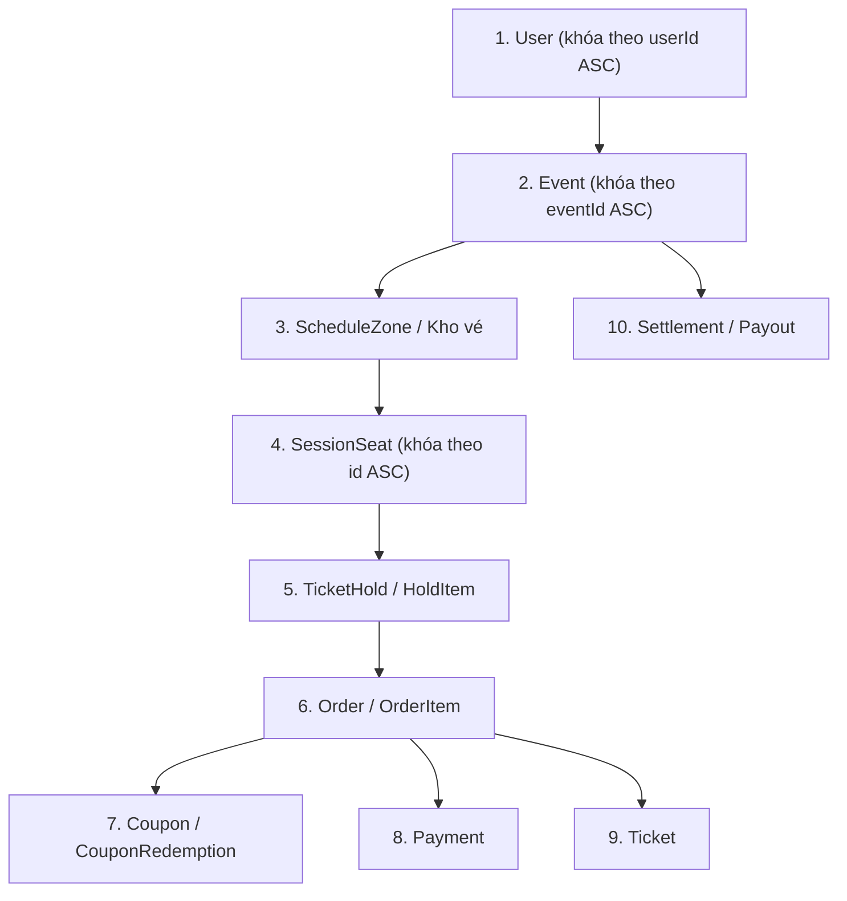

# Sơ Đồ Khóa Transaction và Phòng Ngừa Deadlock (Locking Strategy)

> Ngày cập nhật: 2026-09-24  
> Nguồn: [CONVENTIONS](../tasks/CONVENTIONS.md) §4; [SPEC](../../references/SPEC.md) §14

---

## 1. Nguyên Tắc Cốt Lõi

1. **Thứ tự khóa toàn cục (Global Lock Ordering):** Mọi transaction chạm vào nhiều đối tượng phải tuân thủ nghiêm ngặt một thứ tự duy nhất để triệt tiêu chu trình tranh chấp (deadlock cycle).
2. **Khóa theo thứ tự tăng dần của Khóa Chính:** Khi cần khóa nhiều bản ghi cùng một bảng (ví dụ nhiều ghế `SessionSeat` hoặc nhiều đơn `Order`), bắt buộc sắp xếp danh sách ID tăng dần (`ORDER BY id ASC`) trước khi thực hiện `SELECT ... WITH (UPDLOCK, ROWLOCK)`.
3. **Phân tách I/O mạng ra ngoài Transaction:** Tuyệt đối không giữ connection database hay transaction trong khi gọi các API mạng ngoài (VNPAY, gửi email SMTP, upload ảnh cloud). Mô hình thực hiện:
   *Ghi nhận Outbox trong Transaction* → *Commit* → *Worker bên ngoài gọi I/O* → *Transaction mới cập nhật kết quả*.

---

## 2. Thứ Tự Khóa Phân Cấp Giữa Các Bảng

---

## 3. Chiến Lược Khóa Cho Các Luồng Nghiệp Vụ Chính

### 3.1. Luồng Giữ Vé (Create Hold)
- Bước 1: Khóa kiểm tra `TicketHold` đang `ACTIVE` của `userId` hiện tại (mỗi user tối đa 1 hold active).
- Bước 2: Sắp xếp danh sách `sessionSeatId` cần giữ theo thứ tự tăng dần.
- Bước 3: Khóa các bản ghi ghế `SessionSeat` bằng `UPDLOCK, ROWLOCK`, xác minh `status = 'AVAILABLE'`.
- Bước 4: Tạo bản ghi `TicketHold` và `HoldItem`, cập nhật `SessionSeat.status = 'HELD'`.

### 3.2. Luồng Giải Phóng Vé (Release Hold khi Hết hạn hoặc Chủ động hủy)
- Khóa bản ghi `TicketHold` theo `holdId`.
- Cập nhật trạng thái `TicketHold` thành `RELEASED` hoặc `EXPIRED`.
- Khóa và cập nhật lại trạng thái các ghế trong `HoldItem` về `AVAILABLE`.

### 3.3. Luồng Ghi Nhận Thanh Toán & Phát Hành Vé (Payment Result)
- Khóa bản ghi `Payment` theo `paymentId` / `txnRef` (kiểm tra tính lặp an toàn - idempotency). Nếu đã `CAPTURED` thì bỏ qua (idempotent).
- Khóa bản ghi `Order` liên quan.
- Chuyển `Payment` sang `CAPTURED`, `Order` sang `PAID`.
- Chuyển `CouponRedemption` (nếu có) từ `RESERVED` sang `CONSUMED`.
- Phát hành các bản ghi `Ticket` tương ứng.
- Chuyển ghế `SessionSeat` từ `HELD` sang `SOLD`.

### 3.4. Luồng Hủy Sự Kiện Hàng Loạt (Cancel Event)
- Khóa bản ghi `Event`.
- Cập nhật `Event.status = 'CANCELLED'`.
- Tạo các bản ghi `RefundRequest` tương ứng với từng đơn hàng hợp lệ đã thanh toán.
- Worker xử lý từng đơn theo thứ tự `orderId` tăng dần để tránh giữ transaction lớn kéo dài.
