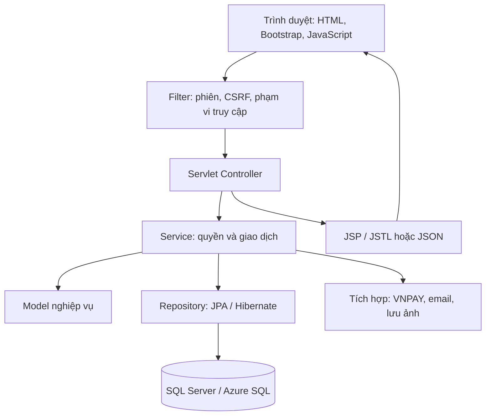

# TicketsCenter — Đặc tả thiết kế

> Ngày cập nhật: 24/09/2026
>
> Mục tiêu: đồ án môn học có chất lượng portfolio, triển khai được một số nghiệp vụ thực tế.
>
> Sơ đồ chuẩn: [docs/classdiagram/diagram.md](docs/classdiagram/diagram.md).

## 1. Cách đọc và phạm vi

Tài liệu này tổng hợp các quyết định đã thống nhất, mô tả kiến trúc và làm cơ sở triển khai. Phần **quy tắc nghiệp vụ** là yêu cầu đã chốt trong trao đổi. Các phần ghi **đề xuất kỹ thuật** là cách hiện thực hóa yêu cầu, có thể điều chỉnh khi triển khai nếu vẫn giữ hành vi nghiệp vụ.

- Triển khai đầy đủ các lớp, thuộc tính, phương thức, quan hệ và ràng buộc trong sơ đồ chuẩn; được bổ sung lớp hỗ trợ.
- Giữ nguyên nền tảng MVC, Java Servlet, JSP/JSTL và hệ dữ liệu Microsoft SQL.
- **JPA/Hibernate thay thế yêu cầu JDBC trực tiếp ban đầu.** JDBC Driver vẫn là thư viện kết nối bên dưới Hibernate.
- Không cắt nghiệp vụ theo hạn nộp. Bản online miễn phí phục vụ demo/portfolio, chưa phải cam kết vận hành bán vé thương mại liên tục.
- Thanh toán dùng VNPAY Sandbox; hoàn tiền và chi trả mô phỏng, không chuyển tiền thật.
- Chưa triển khai mã ứng dụng trong giai đoạn lập đặc tả này.
- **Bắt buộc đáp ứng hướng dẫn project DBMS330284:** các yêu cầu, danh mục đối tượng SQL Server và minh chứng nghiệm thu ở mục 14 là phần phải triển khai, không phải đề xuất tùy chọn. JPA/Hibernate không thay thế yêu cầu sử dụng View, Stored Procedure, Function, Trigger, Index, Transaction và phân quyền tại database.

### Mục lục

1. [Công nghệ và kiến trúc](#2-công-nghệ-và-kiến-trúc)
2. [Cấu trúc dự án](#3-cấu-trúc-dự-án)
3. [Vai trò và phạm vi quyền](#4-vai-trò-và-phạm-vi-quyền)
4. [Mô hình lớp](#5-mô-hình-lớp-và-các-bổ-sung)
5. [Quy tắc nghiệp vụ](#6-quy-tắc-nghiệp-vụ)
6. [Trạng thái dữ liệu](#7-trạng-thái-dữ-liệu--đề-xuất-kỹ-thuật)
7. [JPA và tính nhất quán](#8-jpa-giao-dịch-và-tính-nhất-quán)
8. [Thiết kế giao diện và luồng yêu cầu](#9-thiết-kế-giao-diện-và-luồng-yêu-cầu)
9. [Tích hợp và tác vụ nền](#10-tích-hợp-và-tác-vụ-nền)
10. [Triển khai](#11-triển-khai-và-cấu-hình)
11. [Tiêu chí nghiệm thu](#12-tiêu-chí-nghiệm-thu)
12. [Yêu cầu project DBMS330284 và danh mục SQL Server bắt buộc](#14-yêu-cầu-project-dbms330284-và-danh-mục-sql-server-bắt-buộc)

## 2. Công nghệ và kiến trúc

### 2.1. Bộ công nghệ đã chọn

| Thành phần | Lựa chọn | Trách nhiệm |
|---|---|---|
| IDE | IntelliJ IDEA | Phát triển và chạy local |
| Java | JDK 25 | Biên dịch và chạy ứng dụng |
| Web container | Tomcat 11.0.25 đang dùng | Servlet 6.1, Jakarta Pages/JSP 4.0 |
| View | JSP, Jakarta Tags/JSTL 3.0, EL | Dựng HTML phía máy chủ |
| Giao diện | HTML5, Bootstrap, CSS tùy chỉnh | Bố cục responsive và thành phần giao diện |
| Tương tác | JavaScript, Fetch | Chọn ghế, đồng hồ giữ vé, quét QR, cập nhật không tải lại trang |
| Persistence | Jakarta Persistence/JPA và Hibernate ORM | Ánh xạ đối tượng và truy cập dữ liệu |
| Database local | Microsoft SQL Server | Lưu dữ liệu phát triển/demo local |
| Database online | Azure SQL Database Free | Lưu dữ liệu bản portfolio |
| Quản trị database | SSMS | Kết nối và quản lý database; không phải dịch vụ cần deploy |
| Build | Maven, WAR | Quản lý thư viện, kiểm thử và đóng gói |
| Deploy | Docker trên Render Free | Chạy một ứng dụng Tomcat |
| Thanh toán | VNPAY Sandbox | Giao dịch thử nghiệm |

Servlet/JPA dùng namespace `jakarta.*`. Driver SQL Server vẫn sử dụng các API JDBC `java.sql`/`javax.sql` bên dưới. Không thêm Spring hoặc Spring Boot. Không dùng Hibernate để bỏ qua các phương thức nghiệp vụ đã có trong diagram.

**Đề xuất kỹ thuật:** khóa phiên bản Hibernate, Persistence API, Microsoft JDBC Driver, Maven plugins và Bootstrap trong cấu hình build sau khi kiểm tra tổ hợp JDK 25/Tomcat 11 thực tế. Tomcat cung cấp Servlet/JSP; ứng dụng đóng gói implementation JSTL, Hibernate và driver. Không đóng gói thêm một Servlet container trong WAR.

### 2.2. Luồng xử lý



| Tầng | Làm gì | Không đặt ở đây |
|---|---|---|
| Model | Trạng thái, hành vi và bất biến của đối tượng | HTTP request, session, truy vấn database |
| Service | Kiểm tra quyền theo đối tượng, điều phối use case, giao dịch | HTML và chi tiết render JSP |
| Repository | Tìm kiếm, lưu, truy vấn tổng hợp và khóa dữ liệu | Quyết định ai được hoàn tiền hoặc bán vé |
| Servlet | Đọc/kiểm tra định dạng đầu vào, gọi Service, trả View/JSON | Toàn bộ quy trình nghiệp vụ |
| JSP/JSTL | Hiển thị DTO, vòng lặp và điều kiện trình bày | SQL, mở EntityManager, Java scriptlet |
| Integration | Giao tiếp cổng thanh toán, email, lưu ảnh | Tự quyết định trạng thái đơn ngoài Service |

Đây là **một ứng dụng triển khai thống nhất**, không tách microservice. Một lớp nghiệp vụ không bắt buộc có một Servlet, Service và Repository riêng. Ví dụ, `TicketHoldItem` được quản lý qua quy trình giữ vé.

## 3. Cấu trúc dự án

Tầng ở ngoài, nhóm nghiệp vụ ở trong. Package gốc dưới đây là đề xuất đặt tên.

```text
TicketsCenter/
├── SPEC.md
├── pom.xml
├── Dockerfile
├── .env.example
├── docs/
│   └── classdiagram/diagram.md
├── database/
│   ├── migrations/                 # Thay đổi schema có thứ tự
│   └── seeds/                      # Danh mục và dữ liệu demo
├── src/main/java/vn/ticketscenter/
│   ├── model/
│   │   ├── identity/               # User, Organization, Membership, Request
│   │   ├── event/                  # Event, EventCategory, Zone, Seat
│   │   ├── ticketing/              # TicketHold, TicketHoldItem
│   │   ├── order/                  # Order, OrderItem, Payment, Coupon, Redemption
│   │   ├── fulfillment/            # Ticket, CheckIn, RefundRequest, Refund
│   │   └── settlement/             # CommissionRule, Settlement, Item, Payout
│   ├── model/audit/                # AuditLog
│   ├── controller/                 # Chia nhóm tương ứng với các use case
│   ├── service/                    # Chia nhóm tương ứng với nghiệp vụ
│   ├── repository/                 # JPA; không duy trì DAO JDBC song song
│   ├── dto/                        # Form, view, JSON; không trả entity trực tiếp
│   ├── integration/
│   │   ├── payment/
│   │   ├── mail/
│   │   └── storage/
│   ├── filter/
│   ├── config/
│   ├── transaction/
│   ├── job/
│   └── exception/
├── src/main/resources/
│   └── META-INF/persistence.xml
├── src/main/webapp/
│   ├── assets/                     # Bootstrap, CSS, JavaScript, ảnh đóng gói
│   └── WEB-INF/views/              # JSP theo chức năng, layout dùng chung
└── src/test/java/vn/ticketscenter/
```

`database/`, `transaction/` và `job/` là cấu trúc đề xuất khi triển khai, chưa phải các thư mục đã được tạo. Các enum nằm cùng nhóm nghiệp vụ liên quan. Không tạo lớp tiện ích tổng hợp chứa logic không liên quan.

## 4. Vai trò và phạm vi quyền

| Tác nhân | Phạm vi được phép |
|---|---|
| Khách chưa đăng nhập | Xem, tìm kiếm sự kiện đã công khai; xem giá và tình trạng chỗ; đăng ký |
| Người dùng chưa xác minh | Xem sự kiện, xác minh email; chưa được giữ vé |
| Người mua đã xác minh | Giữ/mua vé, xem đơn và vé của mình, yêu cầu hoàn, gửi yêu cầu tạo tổ chức |
| Quản lý tổ chức | Quản lý sự kiện, mã giảm giá, thành viên, báo cáo và check-in của tổ chức mình |
| Nhân viên check-in | Chọn sự kiện của tổ chức mình, kiểm tra vé và xem kết quả; không quản lý doanh thu/thành viên |
| Quản trị nền tảng | Duyệt tổ chức/sự kiện/hoàn vé, hủy sự kiện, quản lý mã của mọi tổ chức, hoa hồng, đối soát và chi trả |

- Người mua thông thường không cần một `PlatformRole` riêng. `platformRoles` chứa quyền nền tảng như `ADMIN`.
- `OrganizationRole` có `MANAGER` và `CHECK_IN_STAFF`.
- Một người có thể thuộc nhiều tổ chức với vai trò khác nhau. Mỗi cặp người dùng–tổ chức có tối đa một membership, có thể kích hoạt/vô hiệu hóa.
- Không hạ quyền hoặc vô hiệu hóa người quản lý đang hoạt động cuối cùng của tổ chức.
- Quản lý thêm thành viên đã có tài khoản bằng email. Đây là thêm trực tiếp; chưa thiết kế quy trình lời mời.
- Mã tổ chức được chọn trên giao diện chỉ là ngữ cảnh, không phải bằng chứng quyền. Service kiểm tra membership và tổ chức sở hữu đối tượng ở mỗi thao tác.
- Nhân viên có quyền check-in cho mọi sự kiện của tổ chức, không có phân công riêng theo sự kiện.

### Tài khoản quản trị demo

Chỉ có một tài khoản quản trị mặc định. Local/demo dùng `admin` / `admin`; không có giao diện tạo thêm hoặc cấp quyền quản trị. `admin` là alias đặc biệt khi đăng nhập, không bổ sung `username` cho mọi `User`.

**Đề xuất kỹ thuật:** seed idempotent qua cấu hình, vẫn cấp email hợp lệ cho User quản trị để giữ ràng buộc mô hình. Không ghi đè mật khẩu mỗi lần khởi động. Lưu hash mật khẩu; profile công khai lấy email/mật khẩu quản trị từ biến môi trường và không chấp nhận mật khẩu demo mặc định. Quản trị được xác minh trong lúc khởi tạo, không phải đăng ký OTP công khai.

## 5. Mô hình lớp và các bổ sung

### 5.1. Các lớp nghiệp vụ giữ lại

| Nhóm | Các lớp và trách nhiệm |
|---|---|
| Tài khoản/tổ chức | `User`: hồ sơ và quyền nền tảng; `Organization`: bên tổ chức; `OrganizationMembership`: thành viên và vai trò |
| Sự kiện/chỗ | `EventCategory`: danh mục; `Event`: lịch, địa điểm, trạng thái; `Zone`: giá và loại khu; `Seat`: ghế và tình trạng |
| Giữ vé | `TicketHold`: chủ sở hữu, thời hạn; `TicketHoldItem`: khu, ghế/số lượng và giá giữ |
| Đơn/thanh toán | `Order`: tổng tiền và trạng thái; `OrderItem`: dữ liệu vé tại thời điểm mua; `Payment`: từng lần thanh toán |
| Khuyến mãi | `Coupon`: loại giảm, hiệu lực, tổ chức phát hành và giới hạn |
| Phát hành/check-in | `Ticket`: một quyền vào cửa, QR và thực trả; `CheckIn`: kết quả mỗi lần kiểm tra |
| Hoàn tiền | `RefundRequest`: yêu cầu theo một đơn và tập vé; `Refund`: lần xử lý hoàn, gồm bù trừ thanh toán |
| Đối soát | `CommissionRule`: mức phí; `Settlement`: đối soát sự kiện; `SettlementItem`: số liệu từng đơn; `Payout`: chi trả |
| Lịch sử | `AuditLog`: ai thực hiện thao tác gì, trên đối tượng nào, lúc nào |

Tất cả thuộc tính và phương thức cũ của 22 lớp vẫn được giữ trong diagram. Ví dụ `Seat.hold()`, `Order.markPaid()`, `Ticket.markUsed()`, `RefundRequest.approve()` tiếp tục là hành vi Model; Service gọi chúng trong đúng ngữ cảnh giao dịch và quyền.

`Ticket.generateQRCode()` vẫn được đáp ứng bằng một bộ mã hóa QR dùng chung; không kéo database hoặc HTTP vào entity. Các phương thức như `Organization.addMember()` chỉ thay đổi mô hình; Service thực hiện kiểm tra quyền và lưu trữ.

### 5.2. Bổ sung trong sơ đồ chuẩn

Sơ đồ vẫn là XML của diagrams.net dù phần mở rộng là `.md`. Toàn bộ lớp gốc và lớp bổ sung được trình bày trên cùng một trang `Trang-1`, đặt trong đúng khối nghiệp vụ để có thể xem tổng thể mà không chuyển tab.

| Bổ sung | Thuộc tính/quan hệ chính | Ràng buộc |
|---|---|---|
| `OrganizationRequest` | Người gửi, người duyệt, tên tổ chức, liên hệ, mô tả, trạng thái, thời gian, lý do từ chối, tổ chức được tạo | Duyệt tạo đúng một tổ chức và membership quản lý trong cùng giao dịch |
| `User` | `emailVerifiedAt`, `authVersion` | Email xác minh trước giữ vé; phiên cũ mất hiệu lực khi đổi phiên bản xác thực |
| `Event` | `coverImageUrl`, quan hệ `CommissionRule` | Ảnh bắt buộc trước khi gửi duyệt; quy tắc phí bắt buộc khi công khai |
| `Coupon` | `maxUses` | Số nguyên dương; mức giảm thực tế tối đa 30% |
| `RefundRequest` | `reasonType` | Phân biệt khách yêu cầu với hoàn tự động do hủy sự kiện |

`Event → CommissionRule` có đầu quy tắc `0..1` để cho phép bản nháp; sự kiện đã công khai phải có đúng một quy tắc. Quy tắc phải thuộc cùng tổ chức với sự kiện. Một quy tắc có thể được nhiều sự kiện sử dụng.

Quan hệ `Organization → CommissionRule` có sẵn được giữ lại dưới ý nghĩa tổ chức có chính sách phí; **quản trị nền tảng** là người thiết lập chính sách. Khi tạo tổ chức, Service gắn quy tắc phí có hiệu lực theo cấu hình quản trị để đáp ứng quan hệ một tổ chức có ít nhất một quy tắc. Không tự giả định một mức phần trăm/phí cố định cụ thể.

### 5.3. Cơ chế persistence kỹ thuật ngoài sơ đồ nghiệp vụ

Sơ đồ gồm **23 lớp: 22 lớp gốc và duy nhất lớp bổ sung `OrganizationRequest`**. OTP và kiểm soát lượt dùng coupon là cơ chế kỹ thuật, không bổ sung lớp nghiệp vụ vào diagram. Bảng hỗ trợ và ánh xạ persistence cụ thể sẽ được quyết định khi thiết kế database.

- **OTP:** lưu người dùng, mục đích, hash/HMAC mã, thời hạn, số lần sai và thời điểm dùng/vô hiệu hóa; tách xác minh email với đặt lại mật khẩu, bảo đảm mã chỉ dùng một lần.
- **Lượt dùng coupon:** theo dõi lượt đang giữ, đã dùng và đã trả theo đơn; mỗi đơn tối đa một lượt đang giữ hoặc đã dùng. Trạng thái kỹ thuật dự kiến là `RESERVED → CONSUMED` hoặc `RELEASED`; lượt đã dùng không được trả khi hoàn tiền. Service và giao dịch database bảo đảm tổng lượt đang giữ + đã dùng không vượt `Coupon.maxUses`.

### 5.4. Những chỉnh lý quan hệ

- Gắn đầu mút `OrderItem → Seat` còn thiếu vào lớp `Seat`.
- Gắn các đường tổ chức–sự kiện và yêu cầu hoàn–hoàn tiền vào hộp lớp thay vì ô nội dung.
- Giữ `OrderItem → Ticket` là `0..*`: trước thanh toán chưa có vé; sau phát hành thành công số Ticket phải bằng `quantity`.
- Giữ `CheckIn → Ticket` là `0..1`: mã không tồn tại vẫn có thể được ghi nhận kết quả quét không hợp lệ.

## 6. Quy tắc nghiệp vụ

### 6.1. Tài khoản, OTP và phiên đăng nhập

- Đăng ký bằng email và mật khẩu; bắt buộc xác minh email trước khi giữ vé.
- OTP email gồm 6 chữ số, hiệu lực 5 phút, dùng một lần. Gửi lại sau ít nhất 60 giây; mã mới thay thế mã cũ cùng mục đích.
- Nhập sai 5 lần thì vô hiệu hóa mã. Giới hạn thêm tần suất gửi/xác minh theo tài khoản và nguồn yêu cầu.
- Quên mật khẩu cũng dùng OTP nhưng có mục đích riêng. Xác minh thành công cho phép đặt mật khẩu mới; không dùng OTP xác minh tài khoản để đặt lại mật khẩu.
- Cho phép nhiều phiên trên nhiều thiết bị. Đặt lại mật khẩu vô hiệu hóa toàn bộ phiên cũ.
- Dùng session phía máy chủ và cookie phiên. Tái tạo session ID khi đăng nhập; cookie `HttpOnly`, `Secure` trên HTTPS, cấu hình `SameSite` phù hợp luồng thanh toán.

**Đề xuất kỹ thuật:** token OTP lưu dưới dạng HMAC với khóa bí mật phía máy chủ, không lưu hoặc log mã rõ. Endpoint đăng ký/quên mật khẩu trả thông báo phù hợp để hạn chế dò tài khoản. Sau xác minh OTP đặt lại mật khẩu, dùng quyền đổi mật khẩu một lần, có thời hạn; cập nhật hash và tăng `authVersion` trong cùng giao dịch.

### 6.2. Đăng ký và quản lý tổ chức

1. Người dùng đăng nhập gửi yêu cầu với tên tổ chức, email/điện thoại liên hệ và mô tả.
2. Quản trị duyệt hoặc từ chối kèm lý do.
3. Duyệt tạo Organization, quy tắc phí ban đầu và membership `MANAGER` cho người gửi trong cùng giao dịch.
4. Xử lý lại yêu cầu đã duyệt phải trả kết quả cũ, không sinh thêm tổ chức.
5. Người quản lý thêm, đổi vai trò, vô hiệu hóa thành viên của tổ chức; không cấp quyền nền tảng.

### 6.3. Sự kiện và chỗ ngồi

- Tổ chức tạo bản nháp, gửi duyệt. Quản trị công khai hoặc từ chối kèm lý do; tổ chức được sửa và gửi lại.
- Chỉ sự kiện đã công khai và trong khoảng mở bán mới được giữ/mua vé.
- Giữ bất biến: `saleStart < saleEnd <= startTime < endTime`.
- Mỗi Event thuộc một tổ chức và một danh mục; có ảnh bìa, tên/địa chỉ địa điểm, mô tả.
- Khu ngồi: nhập tên khu, số hàng, số ghế mỗi hàng; sinh hàng A, B… và số ghế, bảo đảm nhãn duy nhất trong khu.
- Khu đứng: nhập sức chứa, không tạo Seat; theo dõi số lượng đã giữ và đã bán.
- Giá đặt theo `Zone.price`. Sau công khai, không đổi loại khu, thêm/xóa ghế, thay đổi số hàng hoặc sức chứa.
- Có thể đổi giá niêm yết; lượt giữ còn hiệu lực giữ giá đã chụp tại thời điểm giữ, lượt giữ mới nhận giá mới.
- Chính sách hoa hồng được chọn khi công khai; không thay đổi tỷ lệ/phí của quy tắc đã gắn cho sự kiện. Thay đổi chính sách tạo bản quy tắc mới.

**Đề xuất kỹ thuật:** cho phép giá bằng 0 nếu cần sự kiện miễn phí, nhưng không cho giá âm. Đơn 0đ xử lý theo mục 6.6, không phải hệ quả của coupon giảm 100% vì mức giảm tối đa đã chốt là 30%. Đây là xử lý trường hợp biên của mô hình, không thêm loại sản phẩm mới.

### 6.4. Giữ vé và tạo đơn

- Bắt buộc đăng nhập và xác minh email.
- Mỗi tài khoản tối đa một TicketHold `ACTIVE` trên toàn hệ thống, kể cả nhiều tab/thiết bị.
- Muốn giữ lượt khác phải chủ động hủy lượt hiện tại. Không tự thay thế lượt giữ.
- Thời hạn 10 phút tính từ lúc giữ thành công. Tải lại trang, tạo đơn hay áp dụng coupon không gia hạn.
- Mỗi lượt giữ/đơn tối đa 8 vé, tính tổng quantity; được kết hợp khu đứng và khu ngồi của **cùng một sự kiện**.
- Item ngồi bắt buộc có Seat và quantity = 1. Item đứng không có Seat và quantity > 0.
- Seat phải thuộc đúng Zone; mọi Zone của Item phải thuộc Event của Hold/Order.
- Giữ toàn bộ lựa chọn trong một giao dịch: thiếu một chỗ thì không giữ một phần âm thầm.
- Mỗi Hold tạo tối đa một Order. Giá từ HoldItem chuyển sang OrderItem; tên khu và nhãn ghế được lưu snapshot.
- Hết hạn/hủy khi chưa thanh toán: trả chỗ, trả lượt coupon đang giữ và cập nhật đơn tương ứng.
- Đồng hồ trên trình duyệt chỉ hiển thị; thời gian máy chủ quyết định hiệu lực.

### 6.5. Mã giảm giá

| Quy tắc | Thiết kế |
|---|---|
| Chủ sở hữu | Mỗi Coupon thuộc đúng một Organization |
| Người quản lý | Quản lý tổ chức chỉ quản lý mã của mình; admin quản lý mã của mọi tổ chức |
| Phạm vi | Tất cả sự kiện của tổ chức phát hành, không có mã chung không thuộc tổ chức |
| Số mã mỗi đơn | Tối đa một |
| Phần trăm | Lớn hơn 0, không vượt 30% |
| Số tiền cố định | Dương; số tiền giảm thực tế = min(số tiền cấu hình, 30% subtotal) |
| Hiệu lực | Đang kích hoạt, còn thời hạn và đúng tổ chức |
| Giới hạn | Tổng lượt dùng `maxUses`; không giới hạn riêng mỗi người |
| Giữ lượt | Áp dụng vào đơn chưa trả tiền giữ một lượt đến thời hạn Hold |
| Dùng lượt | Thanh toán/hoàn tất đơn thành công chuyển sang đã dùng |
| Trả lượt | Đơn chưa trả tiền bị hủy/hết hạn; hoặc chủ động bỏ mã trước khi khởi tạo thanh toán |
| Sau hoàn tiền | Không trả lượt đã dùng, dù hoàn một phần hay toàn bộ |

Số lượt `RESERVED + CONSUMED` không vượt `maxUses`. Kiểm tra và giữ lượt trong cùng giao dịch với khóa trên Coupon. Không hạ `maxUses` dưới số lượt đang giữ và đã dùng.

**Đề xuất kỹ thuật:** khi bắt đầu Payment, cố định số tiền và coupon của lần thanh toán đó. Không cho đổi tổng tiền trong lúc có Payment đang xử lý/chưa rõ kết quả. Sau thất bại đã xác định, có thể thử lại trong thời hạn Hold. Coupon đã được đặt hợp lệ không bị thay đổi hồi tố do sửa cấu hình mã; thay đổi áp dụng cho lượt mới.

### 6.6. Thanh toán và phát hành vé

1. Kiểm tra chủ đơn, trạng thái sự kiện, Hold còn hiệu lực; tính tổng hoàn toàn ở máy chủ.
2. Ghi Payment với `txnRef` duy nhất, số tiền của đơn; kết thúc giao dịch database trước khi gọi VNPAY.
3. Chuyển khách đến VNPAY Sandbox. Trang quay về hiển thị kết quả, không tự coi là bằng chứng thanh toán.
4. Thông báo máy chủ/IPN hoặc truy vấn được xác thực mới là cơ sở ghi nhận kết quả.
5. Khi còn hạn và hợp lệ: ghi Payment thành công, Order đã trả, Hold đã dùng, chuyển chỗ sang đã bán, dùng lượt coupon và phát hành Ticket trong một giao dịch.
6. Một Ticket cho một người vào cửa. OrderItem đứng quantity = N phát hành N vé, mỗi vé có mã QR riêng.
7. Sau commit, gửi email thông tin vé và liên kết xem QR. Lỗi email không đảo ngược giao dịch đã trả tiền.

Kiểm tra chữ ký, mã merchant, tham chiếu đơn, số tiền, loại tiền và trạng thái từ cổng. Xử lý IPN lặp trả cùng kết quả, không phát hành thêm vé.

Nếu xác nhận thanh toán đến khi Hold đã hết hạn/đã giải phóng, **không phát hành vé**, dù ngân hàng ghi nhận thời điểm thanh toán trước đó. Ghi nhận khoản thu và tạo Refund bù trừ. Áp dụng tương tự khi đã thu trùng cho đơn đã hoàn tất hoặc sự kiện bị hủy. Refund bù trừ không cần RefundRequest, đúng ràng buộc diagram.

Thanh toán chưa rõ kết quả phải truy vấn lại, không đoán là thất bại để tạo lần thu khác. Hold vẫn có thể hết hạn; khoản thu được xác nhận sau đó đi qua quy trình bù trừ.

**Đề xuất kỹ thuật cho đơn 0đ:** `Order.markPaid(null, now)` cho phép hoàn tất mà không gọi VNPAY và không tạo Payment giả. Vẫn kiểm tra Hold, phát hành vé và tính lượt coupon nếu có. Vé 0đ được hủy hiệu lực/hoàn theo quy trình yêu cầu, không tạo giao dịch hoàn tiền không có Payment.

### 6.7. Tiền tệ và phân bổ giảm giá

- Dùng VND, hiển thị theo đồng nguyên; tính toán Java bằng `BigDecimal`, không dùng `double`.
- `subtotalAmount` = tổng quantity × unitPrice; `totalAmount` = subtotal − discount.
- Phân bổ discount theo tỷ lệ giá gốc từng vé; lưu thực trả vào `Ticket.paidAmount`.
- Tổng `Ticket.paidAmount` phải bằng `Order.totalAmount` và không có vé thực trả âm.
- Ví dụ: vé 200.000đ và 300.000đ, giảm 100.000đ → thực trả 160.000đ và 240.000đ.
- Hoàn vé nào dùng số thực trả đã lưu của vé đó, không tính lại theo giá/coupon hiện tại.

**Đề xuất kỹ thuật:** phần trăm tính đủ độ chính xác, giảm tổng lấy xuống đến đồng để không vượt trần 30%. Phân bổ phần đồng lẻ bằng phần dư lớn nhất, thứ tự vé ổn định khi bằng nhau. Hoa hồng làm tròn `HALF_UP` đến đồng sau khi tính, rồi giới hạn bằng số tiền còn lại.

### 6.8. Vé và check-in

- Vé xuất hiện trong “Vé của tôi”; gửi email thông tin và liên kết xem QR.
- Người mua được chia sẻ QR cho người đi cùng; người cầm vé không cần tài khoản để vào cửa.
- Người mua vẫn là người quản lý đơn và yêu cầu hoàn. Không thiết kế chuyển quyền sở hữu tài khoản/đơn.
- Nhân viên chọn sự kiện trước khi kiểm tra; hỗ trợ camera điện thoại/webcam và nhập mã thủ công.
- Kiểm tra quyền thành viên đang hoạt động, đúng sự kiện, trạng thái vé và thời gian.
- Khoảng check-in: `[startTime − 60 phút, endTime)`. Sự kiện đã hủy không được check-in.
- Vé chờ hoàn, đã hoàn, vô hiệu hoặc đã dùng không được vào cửa.
- Hai yêu cầu check-in đồng thời chỉ có một lần thành công; ghi nhận kết quả các lần kiểm tra.

**Đề xuất kỹ thuật:** mã vé/QR có độ ngẫu nhiên đủ lớn, không suy đoán từ ID tuần tự. Liên kết xem vé cho người mua yêu cầu đăng nhập; chức năng chia sẻ cung cấp ảnh QR hoặc liên kết token riêng, không lộ toàn bộ đơn. Không log nguyên QR hoặc token chia sẻ. Quét camera bản online qua HTTPS.

### 6.9. Yêu cầu hoàn vé

- Chỉ chủ đơn gửi yêu cầu; các Ticket trong một yêu cầu thuộc cùng một Order.
- Chỉ trước giờ bắt đầu sự kiện, vé chưa sử dụng; mỗi vé tối đa một yêu cầu đang mở.
- Số tiền yêu cầu bằng tổng paidAmount của các vé đã chọn.
- Khi gửi yêu cầu hợp lệ, vé chuyển `REFUND_PENDING`, chặn check-in.
- Chỉ quản trị nền tảng duyệt hoặc từ chối. Từ chối cần lý do và khôi phục trạng thái hoạt động nếu sự kiện chưa bị hủy.
- Duyệt tạo xử lý hoàn mô phỏng; chỉ khi hoàn thành công mới đánh dấu Ticket đã hoàn và Request hoàn tất.
- Hoàn thành công trả Seat/số lượng đứng về kho. Chỉ bán lại khi sự kiện còn được bán; vé cũ không sử dụng lại.
- Hoàn thất bại/chưa rõ kết quả giữ trạng thái cần xử lý, không tự khôi phục vé và cũng không thử lại mù quáng.
- Không trả lượt coupon đã dùng.
- Trạng thái hiển thị trong tài khoản; gửi email khi từ chối hoặc hoàn thành công. Email lỗi không làm thay đổi kết quả.

**Đề xuất kỹ thuật:** lý do quyết định từ chối lưu trong AuditLog gắn RefundRequest để giữ thuộc tính `reason` là lý do khách gửi. Giao diện đọc quyết định tương ứng. Một yêu cầu chỉ có một lần xử lý thành công; các lần thất bại được giữ lịch sử.

### 6.10. Hủy sự kiện

- Chỉ quản trị nền tảng được hủy sự kiện đã công khai, và chỉ trước `startTime`.
- Ngừng bán, ngăn giữ mới/check-in, giải phóng Hold còn hiệu lực và lượt coupon đang giữ.
- Tự tạo và duyệt yêu cầu hoàn theo từng Order cho các vé đủ điều kiện; không cần khách gửi yêu cầu.
- Request có `reasonType = EVENT_CANCELLATION`; không sửa tiền thực trả trên vé.
- Không tạo yêu cầu hoặc giao dịch hoàn trùng cho vé đã hoàn/đang xử lý.

**Đề xuất kỹ thuật:** nếu đã có yêu cầu của khách đang chờ thì dùng lại và chuyển sang xử lý theo hủy sự kiện; không tạo request thứ hai. Request đang thực hiện hoàn tiếp tục được theo dõi. Vé đã check-in trước giờ bắt đầu không tự động đủ điều kiện hoàn theo mô hình đã chốt; ghi nhận ngoại lệ cho quản trị, không âm thầm hoàn hoặc khôi phục vé. Thông báo hủy có hiệu lực ngay, xử lý nhiều đơn có thể chia lô và tiếp tục sau khởi động lại.

### 6.11. Hoa hồng, đối soát và chi trả

- Chọn quy tắc theo tổ chức, đang hiệu lực ở thời điểm sự kiện được duyệt công khai; sự kiện lưu quy tắc đó.
- Không thay đổi tỷ lệ/phí của quy tắc đã áp dụng. Cấu hình mới tạo quy tắc khác.
- Mỗi Event tối đa một Settlement; mỗi Order thuộc tối đa một SettlementItem.
- Tính phí theo từng đơn trên tiền còn lại sau hoàn thành công:

```text
grossAmount      = số tiền thanh toán hợp lệ của đơn sau giảm giá
refundAmount     = tiền hoàn thành công cho vé của đơn
remainingAmount  = grossAmount - refundAmount
commissionAmount = 0, nếu remainingAmount = 0
commissionAmount = min(remainingAmount,
                       remainingAmount × ratePercent / 100 + fixedFee), nếu > 0
netAmount        = remainingAmount - commissionAmount
```

- Khoản thu trùng/đến muộn và Refund bù trừ không tạo doanh thu vé hoặc hoa hồng. Báo cáo tiền thu/hoàn vẫn phản ánh chúng riêng để đối chiếu dòng tiền.
- Settlement tổng hợp các Item thành grossRevenue, totalRefund, totalCommission, netPayable.
- Chỉ xác nhận sau khi sự kiện kết thúc và không còn Payment/Refund liên quan đang chờ hoặc chưa rõ kết quả. Sự kiện hủy vẫn chờ qua thời điểm kết thúc đã lên lịch theo điều kiện đã chốt.
- Trước xác nhận được tính lại; sau xác nhận đóng băng số tiền. Chính sách mới không làm đổi số liệu lịch sử.
- Admin ghi nhận chi trả mô phỏng, số tiền và mã tham chiếu. Tổng chi trả thành công không vượt netPayable.

**Đề xuất kỹ thuật:** cho phép nhiều Payout để đáp ứng quan hệ `0..*`; Settlement chỉ chuyển đã chi trả khi tổng thành công bằng netPayable. Nếu netPayable = 0 thì hoàn tất không cần Payout giả. Event không có đơn đủ điều kiện hiển thị báo cáo 0, không tạo Settlement rỗng vì diagram yêu cầu ít nhất một Item.

### 6.12. Tìm kiếm, báo cáo và quy ước hiển thị

- Tìm sự kiện theo tên, lọc danh mục/khoảng ngày, sắp xếp thời gian bắt đầu hoặc giá khu thấp nhất, có phân trang.
- Danh sách công khai chỉ hiển thị sự kiện đã duyệt; event hủy không tiếp tục xuất hiện như sự kiện có thể mua, nhưng lịch sử đơn vẫn xem được.
- Admin xem tổng quan toàn hệ thống; quản lý xem phạm vi tổ chức: đơn, vé, tiền thu/hoàn, hoa hồng, đối soát, vé theo khu và check-in.
- Báo cáo lọc theo sự kiện/thời gian; giao diện và CSV dùng cùng công thức và bộ lọc. Phân biệt rõ tiền đã thu, doanh thu vé, tiền hoàn và tiền còn phải trả.
- CSV hỗ trợ tiếng Việt khi mở Excel; vô hiệu hóa nội dung ô có thể bị diễn giải thành công thức từ dữ liệu người dùng.
- Giao diện/email tiếng Việt; tiền VND; nhập/hiển thị thời gian `Asia/Ho_Chi_Minh`; lưu UTC/`Instant`.

## 7. Trạng thái dữ liệu — đề xuất kỹ thuật

Các tên enum dưới đây cụ thể hóa những kiểu trạng thái trong diagram. Không suy diễn thêm quyền từ tên trạng thái.

| Đối tượng | Trạng thái đề xuất | Chuyển trạng thái chính |
|---|---|---|
| User | ACTIVE, DISABLED | Xác minh email là trường độc lập, không thay cho trạng thái tài khoản |
| OrganizationRequest | PENDING, APPROVED, REJECTED | PENDING → một kết quả cuối |
| Event | DRAFT, PENDING_APPROVAL, REJECTED, PUBLISHED, CANCELLED | Bị từ chối được sửa/gửi lại; hủy là kết thúc |
| Seat | AVAILABLE, HELD, SOLD | AVAILABLE → HELD → SOLD; release hoặc hoàn thành công → AVAILABLE |
| TicketHold | ACTIVE, RELEASED, CONSUMED | Hết hạn được nhận biết bằng expiresAt và chuyển RELEASED |
| Order | PENDING_PAYMENT, PAID, CANCELLED, EXPIRED | Hoàn vé được biểu diễn bởi Ticket/RefundRequest, không xóa lịch sử PAID |
| Payment | PENDING, CAPTURED, FAILED, UNKNOWN | UNKNOWN cần truy vấn; chỉ CAPTURED được ghi nhận thu thành công |
| Ticket | ACTIVE, USED, REFUND_PENDING, REFUNDED, INVALIDATED | REFUND_PENDING → ACTIVE khi từ chối hợp lệ, hoặc REFUNDED khi thành công |
| RefundRequest | PENDING, APPROVED, REJECTED, COMPLETED | APPROVED chỉ COMPLETED sau hoàn thành công/hoàn 0đ hợp lệ |
| Refund | PENDING, SUCCEEDED, FAILED, UNKNOWN | UNKNOWN cần xác minh trước khi thử lại |
| Settlement | DRAFT, CONFIRMED, PAID | Chỉ DRAFT được tính lại |
| Payout | PENDING, SUCCEEDED, FAILED | Ghi nhận mô phỏng, có kiểm tra số tiền |

Enum khác: `ZoneType = SEATED/STANDING`; `DiscountType = PERCENTAGE/FIXED_AMOUNT`; `RefundPurpose = CUSTOMER_REFUND/PAYMENT_COMPENSATION`; `RefundRequestReason = CUSTOMER_REQUEST/EVENT_CANCELLATION`; `OtpPurpose = VERIFY_EMAIL/RESET_PASSWORD`.

CheckInResult phân biệt tối thiểu: thành công, mã không hợp lệ, sai sự kiện, đã dùng, không trong giờ, vé không hoạt động. Yêu cầu không có quyền bị từ chối trước thao tác check-in và được ghi audit phù hợp.

Quy ước thời gian đề xuất: khoảng hiệu lực `[bắt đầu, kết thúc)`, `now >= expiresAt` là hết hạn. Không thêm trạng thái EXPIRED vào Hold nếu đã dùng RELEASED cùng expiresAt; hiển thị lý do hết hạn qua thời gian/audit.

## 8. JPA, giao dịch và tính nhất quán

### 8.1. Vòng đời persistence

**Đề xuất kỹ thuật:** dùng JPA resource-local trên Tomcat.

- Tái sử dụng `EntityManagerFactory` theo cấu hình persistence/principal DB ở mục 14.10, khởi tạo/đóng qua listener; không tạo factory theo request. Tổng pool và bộ nhớ của các cấu hình phải nằm trong ngân sách chung của ứng dụng.
- Một `EntityManager` cho một đơn vị công việc, không chia sẻ giữa các thread.
- `TransactionManager` mở transaction, gọi Service/Repository, commit khi thành công; rollback và đóng tài nguyên khi lỗi.
- Repository nhận EntityManager thuộc giao dịch hiện tại, không tự mở transaction độc lập trong cùng use case.
- Có thể chia sẻ kết nối bằng connection pool nhỏ; khởi đầu tối đa khoảng 5 kết nối trên bản free và đo lại.
- Chuyển dữ liệu cần cho View thành DTO trước khi đóng EntityManager. Không giữ session persistence mở đến JSP để truy vấn lười khi render.
- Không giữ khóa database trong lúc chờ VNPAY, email, upload ảnh hoặc thao tác của người dùng.

Các use case dùng Stored Procedure ở mục 14.5 vẫn đi qua Service/Repository. Quyền sở hữu transaction và đồng bộ persistence context tuân theo mục 14.2; không để SP tự commit giao dịch đang do JPA quản lý.

### 8.2. Ánh xạ và ràng buộc database

| Kiểu/quy tắc | Đề xuất triển khai |
|---|---|
| UUID | SQL Server `uniqueidentifier`, kiểm chứng mapping với driver/dialect |
| Tiền | `decimal(19,0)` cho VND; BigDecimal ở Java |
| Phần trăm | Decimal có scale phù hợp, kiểm tra miền giá trị |
| Thời điểm | UTC trong `datetime2`, converter/mapping Instant được kiểm thử |
| Enum | Lưu tên bằng chuỗi, không dùng ordinal |
| Quan hệ | FK rõ ràng; lazy mặc định cho quan hệ phù hợp, fetch theo use case |
| Phiên bản | `@Version` trên thực thể có cập nhật cạnh tranh khi phù hợp |
| Duy nhất | Email chuẩn hóa, mã đơn, mã vé, txnRef, cặp User–Organization, nhãn Seat trong Zone |
| Một đối tượng hiện hành | Unique filtered index cho Hold ACTIVE theo User và yêu cầu đang mở theo vé |
| OTP | Chỉ mục User + purpose + thời gian, vô hiệu hóa mã cũ nguyên tử |
| Coupon | Unique Order cho redemption; index Coupon + status |
| Đối soát | Unique Event trong Settlement và unique Order trong SettlementItem |

Không dựa vào thời gian hiện tại trong filtered index. Khi giữ mới, khóa User và giải phóng Hold đã quá hạn trước khi chèn Hold ACTIVE. Bảng nối RefundRequest–Ticket có dấu hiệu đang mở để unique index bảo vệ một yêu cầu mở/vé; hoặc thực hiện ràng buộc tương đương có kiểm thử cạnh tranh.

Composition không đồng nghĩa xóa dây chuyền lịch sử. Chỉ xóa các cấu phần bản nháp khi hợp lệ; không cascade remove Order, Payment, Ticket, Refund hay AuditLog đã phát sinh. Schema dùng migrations có phiên bản; Hibernate ở chế độ validate trên bản online, không tự `create/drop/update` schema.

### 8.3. Những giao dịch phải nguyên tử

| Use case | Những thay đổi trong cùng transaction |
|---|---|
| Duyệt tổ chức | Request, Organization, quy tắc ban đầu, membership quản lý, audit |
| Giữ vé | User/Hold hiện hành, khóa Seat/Zone, Hold và Item, cập nhật lượng giữ |
| Áp dụng mã | Coupon, quota, redemption và tổng tiền Order |
| Thanh toán hợp lệ | Payment, Order, Hold, Seat/Zone, redemption, Ticket, sự kiện gửi email |
| Hết hạn/hủy giữ | Hold, Order chưa trả, Seat/Zone, trả lượt mã |
| Check-in | Ticket ACTIVE → USED và CheckIn thành công |
| Yêu cầu hoàn | Kiểm tra vé, tạo Request/tập vé, Ticket → REFUND_PENDING |
| Hoàn thành công | Refund, Request, Ticket, trả kho và audit/email |
| Xác nhận đối soát | Kiểm tra giao dịch liên quan, snapshot Item, tổng tiền, trạng thái |

Khóa ghi các hàng Seat/Zone khi giữ chỗ; lượng đứng không được vượt capacity hoặc xuống âm. Sắp thứ tự khóa thống nhất theo ID để giảm deadlock. Optimistic locking phù hợp sửa cấu hình; quota/ghế phải có khóa hoặc cập nhật có điều kiện, không chỉ kiểm tra trạng thái đối tượng Java.

Thanh toán, giải phóng Hold, hủy Event và hoàn tiền phải dùng thứ tự khóa thống nhất ở cấp Event/Order/Hold liên quan, tránh phát hành vé sau khi hủy hoặc trả chỗ trong lúc thanh toán được chấp nhận. Deadlock có thể thử lại giới hạn với thao tác idempotent; hết lượt trả lỗi có thể thử lại, không im lặng bỏ qua.

### 8.4. Khởi động lại và tác vụ nền

- Lưu thời hạn Hold trong database; tác vụ quét chỉ dọn trạng thái, không phải nguồn duy nhất quyết định hết hạn.
- Mỗi yêu cầu giữ/mua phải kiểm tra hạn và xử lý dữ liệu quá hạn liên quan ngay trong giao dịch.
- Tác vụ sau khởi động lại tiếp tục giải phóng Hold, truy vấn Payment UNKNOWN, xử lý Refund và gửi email còn chờ.
- Không dùng vòng lặp đọc database quá thường xuyên chỉ để giữ dịch vụ miễn phí thức.
- **Đề xuất:** outbox kỹ thuật lưu trong database cùng transaction nghiệp vụ, worker trong ứng dụng nhận theo lô; khóa nhận việc, số lần thử, thời điểm thử lại và khóa idempotency. Outbox không thay thế AuditLog và không làm thay đổi diagram nghiệp vụ chính.

## 9. Thiết kế giao diện và luồng yêu cầu

Phần này là đặc tả màn hình dạng văn bản theo bố cục của chương “Thiết kế giao diện” trong báo cáo mẫu: danh sách màn hình và chuyển đổi, sau đó mô tả từng màn hình theo **ý nghĩa, page frame, đối tượng và biến cố**. `Page frame` chỉ nêu các vùng nội dung và thứ tự thao tác; chưa phải ảnh giao diện hay thiết kế màu sắc. Nội dung màn hình tuân theo vai trò ở mục 4 và quy tắc ở mục 6; đây là màn hình dự kiến, chưa phải giao diện đã triển khai.

### 9.1. Danh sách màn hình và sơ đồ chuyển đổi

| Mã | Màn hình / page frame | Tác nhân | Điểm đến chính |
|---|---|---|---|
| UI-01 | Danh sách và tìm kiếm sự kiện | Mọi người | UI-02, UI-03 |
| UI-02 | Chi tiết sự kiện và chọn vé | Mọi người; giữ vé cần tài khoản đã xác minh | UI-03, UI-04 |
| UI-03 | Đăng ký, đăng nhập, OTP và đặt lại mật khẩu | Khách, người dùng | UI-01, UI-02, UI-04, UI-10, UI-18 |
| UI-04 | Lượt giữ và thanh toán | Người mua đã xác minh | UI-02, UI-05 |
| UI-05 | Kết quả thanh toán | Chủ đơn | UI-06, UI-07 |
| UI-06 | Đơn của tôi | Người mua | UI-07, UI-08 |
| UI-07 | Vé và mã QR | Chủ đơn; người được chia sẻ chỉ xem vé được chia sẻ | UI-06, UI-08 |
| UI-08 | Yêu cầu hoàn vé | Chủ đơn | UI-06, UI-07 |
| UI-09 | Yêu cầu tạo tổ chức | Người dùng đã đăng nhập | UI-10 |
| UI-10 | Chọn tổ chức và tổng quan tổ chức | Quản lý tổ chức | UI-11 đến UI-15, UI-17 |
| UI-11 | Thành viên tổ chức | Quản lý tổ chức | UI-10 |
| UI-12 | Danh sách sự kiện của tổ chức | Quản lý tổ chức | UI-13 |
| UI-13 | Biên tập sự kiện, khu và ghế | Quản lý tổ chức | UI-12 |
| UI-14 | Mã giảm giá | Quản lý tổ chức | UI-10 |
| UI-15 | Chọn sự kiện check-in | Quản lý, nhân viên check-in | UI-16 |
| UI-16 | Quét hoặc nhập mã vé | Quản lý, nhân viên check-in | UI-15 |
| UI-17 | Báo cáo tổ chức | Quản lý tổ chức | UI-10 |
| UI-18 | Tổng quan quản trị | Quản trị nền tảng | UI-19 đến UI-23 |
| UI-19 | Duyệt yêu cầu tổ chức | Quản trị nền tảng | UI-18 |
| UI-20 | Duyệt và hủy sự kiện | Quản trị nền tảng | UI-18 |
| UI-21 | Duyệt yêu cầu hoàn vé | Quản trị nền tảng | UI-18 |
| UI-22 | Chính sách hoa hồng, đối soát và chi trả | Quản trị nền tảng | UI-18 |
| UI-23 | Báo cáo toàn hệ thống và nhật ký thao tác | Quản trị nền tảng | UI-18 |
| UI-24 | Hồ sơ tài khoản | Người dùng đã đăng nhập | UI-03, khu vực theo quyền |

**Luồng chuyển đổi chính:**

```text
Khám phá: UI-01 → UI-02 → UI-04 → UI-05 → UI-06 → UI-07
                       ↘ UI-03 ↗                 ↘ UI-08
Tạo tổ chức: UI-03 → UI-09 → [admin: UI-19] → UI-10 → UI-12 → UI-13 → [admin: UI-20]
Vào cửa: UI-10 hoặc quyền nhân viên → UI-15 → UI-16 → UI-15
Quản trị: UI-18 → UI-19 / UI-20 / UI-21 / UI-22 / UI-23 → UI-18
```

- Thanh điều hướng công khai luôn có sự kiện, tìm kiếm, đăng nhập hoặc menu tài khoản. Menu tài khoản hiện hồ sơ (UI-24), đơn/vé, yêu cầu tạo tổ chức và các khu vực theo quyền hiện có. Người thuộc nhiều tổ chức chọn ngữ cảnh tổ chức trước khi vào trang quản lý; đổi ngữ cảnh không cấp thêm quyền.
- Truy cập trang cần đăng nhập chuyển đến UI-03 và nhớ đích hợp lệ để quay lại. Người chưa xác minh email được đưa đến bước OTP trước khi giữ vé. Trang thiếu quyền trả thông báo từ chối và lối về khu vực được phép; không hiển thị dữ liệu của đối tượng ngoài phạm vi.
- Mỗi danh sách có bộ lọc, phân trang, trạng thái rỗng và thông báo lỗi. Form có nhãn, chỉ rõ trường sai và giữ dữ liệu đã nhập khi có thể. Nút đổi trạng thái hiển thị đang xử lý và chặn gửi lặp. Trên điện thoại, vùng thao tác mua vé và check-in phải dùng được bằng chạm.
- Tiền hiển thị bằng VND, thời gian bằng `Asia/Ho_Chi_Minh`; thời hạn giữ do máy chủ quyết định. Giao diện/email dùng tiếng Việt. Không đưa mật khẩu, OTP, toàn bộ QR, token chia sẻ hoặc chi tiết lỗi máy chủ vào thông báo và nhật ký phía trình duyệt.

### 9.2. Mô tả chi tiết các màn hình

#### UI-01. Danh sách và tìm kiếm sự kiện

- **Ý nghĩa:** Giúp khách tìm sự kiện đã công khai và còn hiển thị để xem thông tin trước khi mua.
- **Page frame:** Đầu trang và ô tìm kiếm → bộ lọc danh mục/khoảng ngày, sắp xếp → danh sách thẻ sự kiện có ảnh bìa, tên, thời gian, địa điểm, giá thấp nhất và tình trạng bán → phân trang.
- **Các đối tượng:** Ô từ khóa; bộ lọc danh mục, ngày; lựa chọn sắp xếp theo ngày bắt đầu hoặc giá thấp nhất; thẻ sự kiện; nút xem chi tiết; phân trang.
- **Sơ đồ biến cố:** Mở trang/đổi bộ lọc → tải lại kết quả theo điều kiện → chọn thẻ → UI-02. Không có kết quả → thông báo rỗng và thao tác xóa bộ lọc. Sự kiện hủy không xuất hiện như sự kiện còn có thể mua.

#### UI-02. Chi tiết sự kiện và chọn vé

- **Ý nghĩa:** Cho xem sự kiện, giá và chỗ còn lại; lập lựa chọn vé cùng một sự kiện.
- **Page frame:** Tiêu đề, ảnh bìa, thời gian và địa điểm → mô tả → danh sách khu, giá và tình trạng → khu ngồi với ghế theo hàng hoặc khu đứng với ô số lượng → tóm tắt số vé/tạm tính và nút giữ vé.
- **Các đối tượng:** Bộ chọn ghế khả dụng; ô số lượng khu đứng; trạng thái ghế không khả dụng; bộ đếm tối đa 8 vé; nút giữ vé; cảnh báo thời gian mở bán.
- **Sơ đồ biến cố:** Chọn/bỏ ghế hoặc đổi số lượng → cập nhật tóm tắt; giữ vé → nếu chưa đăng nhập/chưa xác minh thì UI-03, nếu hợp lệ thì UI-04. Ghế hoặc sức chứa vừa hết, sự kiện chưa mở bán/đã hết bán → báo nguyên nhân và yêu cầu chọn lại; không giữ một phần lựa chọn.

#### UI-03. Đăng ký, đăng nhập, OTP và đặt lại mật khẩu

- **Ý nghĩa:** Tạo và truy cập tài khoản, xác minh email trước khi giữ vé; hỗ trợ khôi phục mật khẩu.
- **Page frame:** Khung đăng nhập có email/mật khẩu và liên kết đăng ký/quên mật khẩu; khung đăng ký có email, mật khẩu, xác nhận mật khẩu; khung OTP có 6 ô số và gửi lại; khung quên mật khẩu có email rồi OTP riêng; khung đặt lại mật khẩu chỉ mở sau khi OTP khôi phục đúng. Mỗi khung là một trạng thái/trang có tiêu đề và lối quay lại rõ ràng.
- **Các đối tượng:** Email, mật khẩu, xác nhận mật khẩu khi cần; ô OTP; nút gửi lại kèm đếm 60 giây; nút xác nhận; thông báo OTP hết hạn/sai quá số lần; liên kết quay về trang trước.
- **Sơ đồ biến cố:** Đăng ký → gửi OTP → xác minh → quay về đích hợp lệ. Đăng nhập thành công → quay về đích hoặc khu vực theo quyền (UI-01, UI-10, UI-15, UI-18); tài khoản chưa xác minh muốn giữ vé → bước OTP. Quên mật khẩu → OTP riêng → đặt mật khẩu mới → đăng nhập lại. OTP hết 5 phút hoặc sai 5 lần → yêu cầu mã mới; không dùng OTP xác minh email để đặt lại mật khẩu.

#### UI-04. Lượt giữ và thanh toán

- **Ý nghĩa:** Xem lượt giữ đang hoạt động, xác nhận đơn, áp dụng tối đa một coupon và bắt đầu thanh toán.
- **Page frame:** Thông tin sự kiện và đồng hồ còn hạn → danh sách khu/ghế/số lượng với giá đã giữ → ô coupon và phân rã tạm tính/giảm giá/tổng trả → nút tiếp tục thanh toán và nút hủy lượt giữ.
- **Các đối tượng:** Thời điểm hết hạn lấy từ máy chủ; nút áp dụng/bỏ coupon; bảng tóm tắt đơn; nút thanh toán; hộp xác nhận hủy lượt giữ.
- **Sơ đồ biến cố:** Tải trang → đối chiếu lượt giữ/đơn hiện có; áp dụng mã → kiểm tra và cập nhật số tiền ở máy chủ; thanh toán → tạo/tiếp tục đơn rồi chuyển VNPAY Sandbox, hoặc hoàn tất trực tiếp đơn 0đ → UI-05. Hết hạn/hủy → giải phóng chỗ và lượt coupon, quay UI-02. Có lượt giữ khác → nêu sự kiện đang giữ và cho hủy chủ động; không tự thay thế. Payment đang xử lý/chưa rõ kết quả → khóa thay đổi coupon và không tạo lần thu mới.

#### UI-05. Kết quả thanh toán

- **Ý nghĩa:** Thông báo trạng thái của đơn sau khi quay từ VNPAY hoặc hoàn tất đơn 0đ.
- **Page frame:** Mã đơn và số tiền → trạng thái “đã xác nhận”, “đang xác minh”, “thất bại” hoặc “đã thu nhưng cần hoàn bù trừ” → lời giải thích và lối đến đơn/vé.
- **Các đối tượng:** Nhãn trạng thái; nút xem đơn; nút xem vé chỉ khi đã phát hành; thao tác cập nhật trạng thái an toàn khi đang xác minh.
- **Sơ đồ biến cố:** Quay về từ cổng → truy vấn trạng thái máy chủ; kết quả trả về của trình duyệt không tự xác nhận đã trả tiền. Đã xác nhận → UI-07; đang xác minh → chờ/truy vấn lại, không mời thanh toán lần nữa; thất bại xác định và Hold còn hạn → UI-04; thu đến muộn/thu trùng → báo trạng thái bù trừ tại UI-06, không hiển thị vé.

#### UI-06. Đơn của tôi

- **Ý nghĩa:** Tra cứu đơn của chính người mua và trạng thái thanh toán, vé, hoàn tiền.
- **Page frame:** Bộ lọc trạng thái/thời gian → danh sách đơn gồm mã, sự kiện, ngày mua, tổng tiền, trạng thái → khối chi tiết đơn và các vé/hoàn tiền liên quan.
- **Các đối tượng:** Hàng đơn; bộ lọc; nút xem vé; nút xem yêu cầu hoàn; nhãn trạng thái thanh toán chưa rõ hoặc hoàn bù trừ.
- **Sơ đồ biến cố:** Chọn đơn → mở chi tiết; đơn đã phát hành vé → UI-07; vé đủ điều kiện hoàn → UI-08. Đơn hết hạn hoặc chưa thanh toán không có vé; khoản thu đang xác minh hoặc bù trừ được trình bày riêng để tránh hiểu là đơn thành công.

#### UI-07. Vé và mã QR

- **Ý nghĩa:** Hiển thị từng quyền vào cửa đã phát hành và hỗ trợ chia sẻ QR cho người đi cùng.
- **Page frame:** Danh sách vé theo sự kiện/đơn → chi tiết vé gồm tên sự kiện, thời gian, khu/ghế hoặc khu đứng, trạng thái và mã QR → thao tác chia sẻ riêng từng vé.
- **Các đối tượng:** Mã QR/mã vé; nhãn đang hiệu lực, đã dùng, chờ hoàn, đã hoàn hoặc vô hiệu; nút chia sẻ ảnh QR hoặc liên kết riêng; liên kết yêu cầu hoàn cho chủ đơn.
- **Sơ đồ biến cố:** Chủ đơn mở vé → hiển thị QR theo quyền; chia sẻ → người nhận chỉ xem vé được chia sẻ, không thấy đơn hoặc vé khác. Vé chờ hoàn/đã hoàn/đã dùng/vô hiệu → hiển thị trạng thái rõ ràng, không diễn đạt là có thể vào cửa; chủ đơn chuyển UI-08 khi đủ điều kiện.

#### UI-08. Yêu cầu hoàn vé

- **Ý nghĩa:** Cho chủ đơn chọn vé chưa dùng của cùng một đơn để gửi yêu cầu, theo dõi quyết định và số tiền hoàn.
- **Page frame:** Thông tin đơn/sự kiện → danh sách vé đủ điều kiện với ô chọn → lý do yêu cầu và tổng thực trả của các vé chọn → nút gửi → lịch sử trạng thái/ý do từ chối hoặc kết quả hoàn.
- **Các đối tượng:** Ô chọn vé; lý do; tổng tiền yêu cầu; nút gửi; nhãn chờ duyệt, đang xử lý, từ chối, hoàn tất, cần xử lý.
- **Sơ đồ biến cố:** Chọn vé → tính tổng từ `Ticket.paidAmount` đã lưu; gửi trước giờ bắt đầu → vé chuyển chờ hoàn, UI-07 cập nhật trạng thái. Vé đã dùng, đã có yêu cầu mở, hoặc sự kiện đã bắt đầu → không cho gửi và giải thích. Từ chối → hiện lý do; duyệt nhưng hoàn chưa thành công → tiếp tục hiển thị đang xử lý, không báo đã hoàn.

#### UI-09. Yêu cầu tạo tổ chức

- **Ý nghĩa:** Người dùng gửi và theo dõi yêu cầu trở thành đơn vị tổ chức.
- **Page frame:** Form tên tổ chức, email/điện thoại liên hệ và mô tả → nút gửi → danh sách yêu cầu của mình với trạng thái, thời gian và lý do từ chối.
- **Các đối tượng:** Trường tên/liên hệ/mô tả; nút gửi; thẻ trạng thái chờ duyệt/đã duyệt/từ chối; liên kết vào UI-10 sau khi có quyền quản lý.
- **Sơ đồ biến cố:** Gửi yêu cầu hợp lệ → chờ UI-19 xử lý. Được duyệt → xuất hiện tổ chức trong bộ chọn UI-10; bị từ chối → hiển thị lý do. Gửi lặp không tạo nhiều tổ chức từ cùng một yêu cầu đã duyệt.

#### UI-10. Chọn tổ chức và tổng quan tổ chức

- **Ý nghĩa:** Đặt ngữ cảnh cho người quản lý có thể thuộc nhiều tổ chức và dẫn vào công việc của tổ chức đang chọn.
- **Page frame:** Bộ chọn tổ chức → tên và trạng thái tổ chức → chỉ số sự kiện/đơn/vé cơ bản → menu sự kiện, thành viên, mã giảm giá, báo cáo và check-in.
- **Các đối tượng:** Bộ chọn tổ chức; thẻ chỉ số; liên kết UI-11, UI-12, UI-14, UI-15, UI-17; nhãn vai trò hiện tại.
- **Sơ đồ biến cố:** Chọn tổ chức → tải lại dữ liệu đúng phạm vi; chọn chức năng → màn hình tương ứng. Nếu membership bị vô hiệu hóa giữa phiên → từ chối thao tác, bỏ ngữ cảnh không còn hợp lệ. Nhân viên chỉ có quyền check-in đi thẳng UI-15, không thấy báo cáo hoặc quản lý thành viên.

#### UI-11. Thành viên tổ chức

- **Ý nghĩa:** Quản lý vai trò và trạng thái thành viên trong tổ chức đang chọn.
- **Page frame:** Danh sách email, vai trò, trạng thái → form thêm người đã có tài khoản bằng email → thao tác đổi vai trò/vô hiệu hóa kèm xác nhận.
- **Các đối tượng:** Ô email; chọn `MANAGER` hoặc `CHECK_IN_STAFF`; nút thêm; bộ chọn vai trò; nút vô hiệu hóa; thông báo lỗi quyền/ràng buộc.
- **Sơ đồ biến cố:** Thêm email tồn tại → tạo membership hợp lệ; đổi vai trò/vô hiệu hóa → cập nhật danh sách. Nếu là quản lý hoạt động cuối cùng → chặn hạ quyền/vô hiệu hóa và giải thích. Không có luồng mời qua email và không có thao tác cấp `ADMIN`.

#### UI-12. Danh sách sự kiện của tổ chức

- **Ý nghĩa:** Theo dõi bản nháp, sự kiện chờ duyệt, bị từ chối, đã công khai hoặc đã hủy của tổ chức.
- **Page frame:** Bộ lọc trạng thái → bảng sự kiện có tên, danh mục, thời gian, trạng thái bán và trạng thái duyệt → nút tạo sự kiện, sửa, xem lý do từ chối và vào UI-13.
- **Các đối tượng:** Bộ lọc; hàng sự kiện; nhãn trạng thái; nút tạo/sửa/xem; lý do từ chối.
- **Sơ đồ biến cố:** Tạo mới hoặc chọn sự kiện → UI-13. Bị từ chối → sửa rồi gửi duyệt lại. Sự kiện đã công khai chỉ cho sửa các trường còn được phép theo mục 6.3; đã hủy không còn thao tác mở bán.

#### UI-13. Biên tập sự kiện, khu và ghế

- **Ý nghĩa:** Tạo và hoàn thiện bản nháp sự kiện trước khi gửi duyệt; quản lý giá khu sau công khai trong phạm vi cho phép.
- **Page frame:** Thông tin cơ bản (tên, danh mục, mô tả, ảnh bìa, địa điểm) → lịch mở/kết thúc bán và lịch diễn ra → danh sách khu → form khu ngồi (tên, số hàng, ghế mỗi hàng, giá) hoặc khu đứng (tên, sức chứa, giá) → xem trước cấu trúc và nút lưu/gửi duyệt.
- **Các đối tượng:** Trường thông tin; tải ảnh bìa; bộ chọn loại khu; bộ đếm chỗ; bảng/khung ghế theo hàng; giá VND; nút lưu nháp, gửi duyệt; cảnh báo khóa cấu trúc sau công khai.
- **Sơ đồ biến cố:** Lưu nháp → UI-12; gửi duyệt → kiểm tra ảnh bìa, ít nhất một khu và thứ tự `saleStart < saleEnd <= startTime < endTime`, rồi chờ UI-20. Khu ngồi sinh nhãn ghế duy nhất; khu đứng chỉ theo sức chứa. Sau công khai, thay giá niêm yết chỉ tác động lượt giữ mới; không cho đổi loại khu, cấu trúc ghế hoặc sức chứa.

#### UI-14. Mã giảm giá

- **Ý nghĩa:** Tạo và quản lý coupon của tổ chức; quản trị nền tảng có thể quản lý mã của mọi tổ chức theo cùng bộ trường.
- **Page frame:** Danh sách mã và bộ lọc trạng thái → form mã, loại giảm, giá trị, thời hạn, `maxUses`, kích hoạt → số lượt đang giữ/đã dùng và thao tác chỉnh sửa.
- **Các đối tượng:** Ô mã; loại phần trăm/số tiền; giá trị; thời hạn; giới hạn lượt; công tắc hoạt động; số lượt; nút lưu.
- **Sơ đồ biến cố:** Lưu → kiểm tra phần trăm tối đa 30%, số tiền dương và phạm vi tổ chức. Khi hạ `maxUses` dưới tổng lượt đang giữ + đã dùng → từ chối. Mã đã áp dụng hợp lệ vào đơn không đổi hồi tố khi cấu hình được sửa.

#### UI-15. Chọn sự kiện check-in

- **Ý nghĩa:** Đặt đúng tổ chức và sự kiện trước khi kiểm tra vé tại cửa.
- **Page frame:** Tên tổ chức/quyền hiện tại → danh sách sự kiện thuộc tổ chức với thời gian, trạng thái và khoảng check-in → nút vào màn quét.
- **Các đối tượng:** Bộ chọn tổ chức nếu có nhiều membership; hàng sự kiện; nhãn khoảng thời gian; nút bắt đầu check-in.
- **Sơ đồ biến cố:** Chọn sự kiện hợp lệ → UI-16. Sự kiện không thuộc tổ chức, đã hủy hoặc ngoài khoảng `[startTime − 60 phút, endTime)` → không nhận check-in; vẫn có thể hiển thị thông tin và lý do nếu thuộc phạm vi xem.

#### UI-16. Quét hoặc nhập mã vé

- **Ý nghĩa:** Xác nhận một vé cho sự kiện đã chọn và đưa ra kết quả rõ ràng tại cửa.
- **Page frame:** Thanh cố định tên sự kiện → vùng camera QR hoặc ô nhập mã thủ công → nút kiểm tra → kết quả nổi bật (hợp lệ/không hợp lệ và nguyên nhân) → lịch sử lần kiểm tra trong phạm vi quyền.
- **Các đối tượng:** Xin quyền camera; khung quét; ô mã; nút kiểm tra; nhãn kết quả; nút quét tiếp; danh sách kết quả gần đây.
- **Sơ đồ biến cố:** Quét/nhập → máy chủ kiểm tra membership, sự kiện, thời gian và trạng thái vé → một lần hợp lệ chuyển vé đã dùng; lần quét tiếp theo báo đã sử dụng. Mã lạ, sai sự kiện, chờ hoàn, đã hoàn, vô hiệu hoặc ngoài giờ → từ chối với lý do phù hợp và vẫn ghi kết quả kiểm tra. Không đưa QR đầy đủ vào danh sách lịch sử.

#### UI-17. Báo cáo tổ chức

- **Ý nghĩa:** Cho quản lý xem số liệu bán vé và vận hành trong phạm vi tổ chức.
- **Page frame:** Bộ lọc sự kiện/khoảng thời gian → thẻ tiền đã thu, doanh thu vé, tiền hoàn, hoa hồng, tiền còn phải trả → bảng vé theo khu, đơn và check-in → nút xuất CSV.
- **Các đối tượng:** Bộ lọc; chỉ số có tên và đơn vị; bảng dữ liệu phân trang; nút CSV; thời điểm cập nhật.
- **Sơ đồ biến cố:** Đổi bộ lọc → tải lại chỉ số/bảng; xuất CSV → dùng cùng bộ lọc, công thức và phạm vi quyền. Không có dữ liệu → hiển thị số 0/trạng thái rỗng có ngữ cảnh; không lẫn khoản thu bù trừ với doanh thu vé.

#### UI-18. Tổng quan quản trị

- **Ý nghĩa:** Tập trung công việc chờ xử lý của quản trị nền tảng.
- **Page frame:** Chỉ số/yêu cầu đang chờ → các khối tổ chức, sự kiện, hoàn vé, đối soát → menu báo cáo và nhật ký.
- **Các đối tượng:** Thẻ số lượng đang chờ; liên kết UI-19, UI-20, UI-21, UI-22, UI-23 và quản lý coupon toàn hệ thống qua UI-14 với bộ chọn tổ chức; bộ lọc thời gian tổng quan.
- **Sơ đồ biến cố:** Chọn nhóm công việc → trang tương ứng; trở về → làm mới số liệu. Không có chức năng tạo thêm tài khoản `ADMIN` trên giao diện.

#### UI-19. Duyệt yêu cầu tổ chức

- **Ý nghĩa:** Xem hồ sơ xin tạo tổ chức và quyết định duyệt hoặc từ chối.
- **Page frame:** Danh sách yêu cầu chờ → chi tiết người gửi, tên, liên hệ, mô tả → nút duyệt hoặc form lý do từ chối → lịch sử quyết định.
- **Các đối tượng:** Bộ lọc trạng thái; hàng yêu cầu; nút duyệt; ô lý do từ chối; hộp xác nhận.
- **Sơ đồ biến cố:** Duyệt → tạo tổ chức, quy tắc phí ban đầu và membership quản lý trong một giao dịch; UI-09 cập nhật kết quả. Từ chối → bắt buộc lý do. Xử lý lại yêu cầu đã quyết định → hiện kết quả cũ, không tạo tổ chức trùng.

#### UI-20. Duyệt và hủy sự kiện

- **Ý nghĩa:** Quyết định công khai sự kiện tổ chức gửi lên và hủy sự kiện đã công khai khi đủ điều kiện.
- **Page frame:** Danh sách chờ duyệt/đã công khai → chi tiết sự kiện, ảnh bìa, lịch, khu/giá/sức chứa → chọn quy tắc hoa hồng khi duyệt → nút công khai/từ chối hoặc hủy với xác nhận hậu quả.
- **Các đối tượng:** Bộ lọc; bản tóm tắt sự kiện; bộ chọn quy tắc phí cùng tổ chức; lý do từ chối; nút công khai/hủy; xác nhận hủy.
- **Sơ đồ biến cố:** Công khai → kiểm tra dữ liệu và quy tắc phí có hiệu lực → UI-01 có thể hiển thị khi phù hợp. Từ chối → lưu lý do cho UI-12/13. Hủy trước giờ bắt đầu → ngừng bán/check-in, giải phóng Hold và khởi động hoàn vé theo mục 6.10; hiển thị tiến độ xử lý hoàn, không báo mọi khoản đã hoàn ngay.

#### UI-21. Duyệt yêu cầu hoàn vé

- **Ý nghĩa:** Xét yêu cầu của khách và theo dõi việc hoàn tiền mô phỏng.
- **Page frame:** Danh sách yêu cầu và bộ lọc trạng thái → chi tiết đơn, từng vé, số thực trả và lý do khách gửi → nút duyệt/từ chối → lịch sử xử lý hoàn.
- **Các đối tượng:** Hàng yêu cầu; tổng tiền; nút duyệt; ô lý do từ chối; nhãn đang xử lý, hoàn tất, thất bại/chưa rõ.
- **Sơ đồ biến cố:** Duyệt → bắt đầu xử lý hoàn; chỉ kết quả hoàn thành công mới chuyển vé sang đã hoàn. Từ chối → bắt buộc lý do, UI-08 hiển thị quyết định. Kết quả chưa rõ/thất bại → giữ trạng thái cần xử lý, không tự cho vé vào cửa lại hoặc lặp hoàn mù quáng.

#### UI-22. Chính sách hoa hồng, đối soát và chi trả

- **Ý nghĩa:** Cấu hình quy tắc phí và chốt số phải trả cho tổ chức theo sự kiện.
- **Page frame:** Tab quy tắc phí theo tổ chức → danh sách sự kiện có số liệu đối soát → chi tiết gross/refund/commission/net theo đơn → nút xác nhận sau khi đủ điều kiện → form ghi nhận chi trả mô phỏng với số tiền và tham chiếu.
- **Các đối tượng:** Bộ chọn tổ chức/sự kiện; form quy tắc mới; bảng SettlementItem; nút tính lại khi chưa xác nhận; nút xác nhận; số tiền và mã tham chiếu Payout.
- **Sơ đồ biến cố:** Tạo quy tắc mới → áp dụng cho sự kiện được duyệt sau đó, không sửa phí lịch sử. Sự kiện chưa kết thúc hoặc còn Payment/Refund chưa rõ → không xác nhận đối soát. Xác nhận → đóng băng số liệu; ghi chi trả → tổng thành công không vượt `netPayable`; đủ số tiền hoặc `netPayable = 0` → trạng thái hoàn tất.

#### UI-23. Báo cáo toàn hệ thống và nhật ký thao tác

- **Ý nghĩa:** Xem số liệu toàn nền tảng và truy vết quyết định quản trị.
- **Page frame:** Tab báo cáo với bộ lọc tổ chức/sự kiện/thời gian, chỉ số và bảng dữ liệu → nút xuất CSV; tab nhật ký với thời gian, người thực hiện, thao tác, đối tượng và kết quả.
- **Các đối tượng:** Bộ lọc; chỉ số tiền thu/doanh thu vé/hoàn/hoa hồng/còn phải trả; bảng phân trang; nút CSV; danh sách AuditLog.
- **Sơ đồ biến cố:** Đổi bộ lọc → tải số liệu đúng phạm vi; xuất CSV → cùng dữ liệu và bộ lọc đang xem. Mở dòng nhật ký → xem chi tiết đủ để đối chiếu quyết định, không lộ mật khẩu, OTP hoặc bí mật thanh toán.

#### UI-24. Hồ sơ tài khoản

- **Ý nghĩa:** Cho người dùng xem thông tin tài khoản và trạng thái xác minh email của mình.
- **Page frame:** Thông tin email, trạng thái xác minh và vai trò hiện có → thao tác xác minh email nếu còn thiếu → danh sách tổ chức mình tham gia với vai trò/trạng thái → liên kết đến các khu vực được phép.
- **Các đối tượng:** Email; nhãn xác minh; nút gửi OTP xác minh; danh sách membership; liên kết đơn/vé, yêu cầu tổ chức, quản lý hoặc check-in theo quyền.
- **Sơ đồ biến cố:** Chọn xác minh → UI-03 ở bước OTP; thành công → quay UI-24 với trạng thái mới. Chọn tổ chức → UI-10 nếu là quản lý, UI-15 nếu chỉ là nhân viên check-in. Membership bị vô hiệu hóa → cập nhật danh sách và không cho vào khu vực cũ.

### 9.3. Quy ước triển khai các page frame

JSP trong `WEB-INF/views` không được truy cập trực tiếp. Bootstrap làm nền, CSS riêng thống nhất màu, kiểu chữ và khoảng cách. Trang danh sách và form dùng chung header, điều hướng, vùng tiêu đề/nội dung, thông báo kết quả và footer; UI-04 và UI-16 ưu tiên vùng thao tác chính khi màn hình hẹp. Khung chọn ghế không được diễn đạt ghế đã chọn trên trình duyệt là đã giữ thành công cho đến khi máy chủ xác nhận.

Mỗi thao tác có trạng thái đang tải, thành công và lỗi; danh sách có trạng thái trống. Form có nhãn và thông báo lỗi đọc được, focus quay về trường sai. Trạng thái 401 dẫn đến đăng nhập, 403 dẫn đến thông báo thiếu quyền, 409/hết chỗ dẫn đến cập nhật dữ liệu và chọn lại, 5xx dẫn đến thông báo dịch vụ tạm thời không sẵn sàng. Sau lỗi mạng ở bước thanh toán/hoàn/check-in, giao diện tra cứu trạng thái thật trước khi cho thao tác tiếp để tránh gửi lặp. Tất cả điều kiện quyền, tổng tiền, tồn kho và thời gian được kiểm tra lại ở máy chủ.

### 9.4. Quy ước endpoint — đề xuất kỹ thuật

| Ví dụ | Cách trả dữ liệu |
|---|---|
| `GET /events`, `GET /events/{id}` | JSP qua Servlet |
| `POST /auth/login`, `POST /auth/otp/verify` | Form/JSON tùy màn hình |
| `POST /holds`, `POST /holds/{id}/cancel` | JSON, kiểm tra quyền/chống gửi lặp |
| `POST /orders`, `POST /orders/{id}/coupon` | JSON hoặc redirect sau form |
| `POST /orders/{id}/payments` | URL chuyển thanh toán do server tạo |
| `GET /payments/vnpay/return` | Trang trạng thái; không tự xác nhận thu tiền |
| `GET /payments/vnpay/ipn` | Phản hồi đúng giao thức VNPAY, xác thực chữ ký |
| `POST /check-ins`, `POST /refund-requests` | JSON kết quả nghiệp vụ |
| `GET /reports/export` | CSV cùng quyền và bộ lọc với báo cáo |

Đây là quy ước dự kiến, không phải API đã triển khai. Thao tác đổi trạng thái của người dùng dùng POST và CSRF; IPN là ngoại lệ theo giao thức nhà cung cấp, không yêu cầu session người dùng. Validation có cả phía trình duyệt và máy chủ; máy chủ là quyết định cuối.

Không trả stack trace ra trình duyệt. Phân biệt lỗi đầu vào, chưa đăng nhập, không có quyền, xung đột trạng thái/hết chỗ và lỗi hệ thống. Dùng mã tương quan để tra log, không log mật khẩu/OTP/bí mật thanh toán.

## 10. Tích hợp và tác vụ nền

### VNPAY

Tách interface cổng thanh toán và implementation Sandbox; cấu hình merchant, khóa ký, return/IPN qua môi trường. Xác minh chữ ký theo tài liệu chính thức và giữ tham chiếu giao dịch duy nhất. Truy vấn giao dịch UNKNOWN có retry hữu hạn; không tạo nhiều Refund bù trừ cho cùng khoản thu.

### Hoàn tiền và chi trả mô phỏng

Adapter mô phỏng hỗ trợ kết quả thành công, thất bại và chưa xác định để kiểm thử đầy đủ state machine. Chỉ admin có quyền thao tác vận hành; không có nút công khai để người mua tự đánh dấu đã thanh toán/đã hoàn. Giao diện ghi rõ môi trường demo.

### Email

Email gồm OTP, vé và kết quả hoàn đã chọn. OTP được gửi với độ trễ thấp, không gửi mã đã hết hạn từ hàng đợi. Email nghiệp vụ có retry và trạng thái theo dõi; một sự kiện nghiệp vụ có khóa gửi để hạn chế trùng. Không hứa giao thư đúng một lần khi nhà cung cấp không hỗ trợ idempotency.

### Ảnh

Ảnh bìa lưu ngoài container. Kiểm tra dung lượng, loại ảnh thực tế và quyền upload; không tin phần mở rộng. Thay ảnh cập nhật URL sau upload thành công, dọn ảnh cũ theo tác vụ an toàn. Không lưu bí mật truy cập storage trong JSP/JavaScript.

Nhà cung cấp email và lưu ảnh **chưa được chọn**. Đây là quyết định hạ tầng còn lại, không phải nghiệp vụ còn thiếu. Tiêu chí: có hạn mức free phù hợp, hỗ trợ HTTPS, SDK/HTTP tương thích Java, và phương án xác thực tài khoản/tên miền khả thi. Chưa cam kết email và storage miễn phí vô hạn.

## 11. Triển khai và cấu hình

### 11.1. Hai môi trường

| Môi trường | Ứng dụng | Database | Mục đích |
|---|---|---|---|
| Local/demo | IntelliJ, JDK 25, Tomcat 11 | SQL Server local + SSMS | Phát triển, kiểm thử, demo chủ động |
| Online | WAR trong Docker trên Render Free | Azure SQL Database Free | Link portfolio và thử luồng HTTPS |

Build WAR bằng Maven, dùng container runtime có JDK 25/Tomcat 11 tương thích; kiểm tra image/tag thật trước khi khóa cấu hình. Deploy không cần IntelliJ hoặc SSMS trên host. Bí mật nằm trong biến môi trường, không trong repository/image.

Azure SQL Database là dịch vụ được quản lý, không hoàn toàn giống SQL Server tự cài. Dùng cùng Microsoft JDBC Driver, kiểm thử migrations/truy vấn/khóa trên cả hai. Không dùng tính năng chỉ có ở SQL Server local nếu không có phương án tương ứng trên Azure SQL.

### 11.2. Giới hạn miễn phí và thiết kế đáp ứng

Theo tài liệu đã tra cứu trong quá trình bàn thiết kế:

- Render Free: 512 MB RAM, 0,1 CPU; ngủ khi không có truy cập khoảng 15 phút, có độ trễ khởi động lại; filesystem không bền vững.
- Azure SQL Free: hạn mức theo tháng 100.000 vCore-giây và 32 GB dữ liệu mỗi database theo điều kiện gói. Chọn **auto-pause khi hết hạn mức**, không chọn tiếp tục có tính phí.
- Không chạy SQL Server cùng Tomcat trong container 512 MB; tách database.
- Tài khoản Azure/điều kiện gói, phương thức xác minh và khả năng đăng ký phải kiểm tra lúc triển khai; chưa giả định người dùng có Azure for Students.
- Hạn mức/thông số dịch vụ có thể thay đổi; xác minh lại trước khi tạo tài nguyên.

**Đề xuất kỹ thuật cho host nhỏ:** một instance ứng dụng; JVM heap khởi điểm khoảng 192–256 MB, chừa RAM cho metaspace, thread và native memory, đo RSS thực tế rồi điều chỉnh. Pool kết nối nhỏ, session gọn, phân trang bắt buộc, nén/tối ưu ảnh. Không cam kết số người đồng thời trước khi đo tải.

Host ngủ có thể làm mất phiên trong RAM; người dùng đăng nhập lại, nhưng Hold/Order/Ticket vẫn khôi phục từ database. Payment callback có thể chậm: thiết kế query/retry và hoàn bù trừ như mục 6.6. Azure SQL có thể tạm dừng khi hết quota; giao diện cần thông báo dịch vụ tạm thời không sẵn sàng, không coi đơn là thất bại để thu lại.

### 11.3. Nhóm biến môi trường dự kiến

| Nhóm | Ví dụ |
|---|---|
| Ứng dụng | `APP_ENV`, `APP_BASE_URL`, `PORT` |
| Database | `DB_URL`, `DB_USER`, `DB_PASSWORD`, giới hạn pool |
| Thanh toán | `VNPAY_TMN_CODE`, `VNPAY_HASH_SECRET`, URL sandbox |
| Email/OTP | API key hoặc SMTP credentials, địa chỉ gửi, `OTP_HMAC_SECRET` |
| Ảnh | Endpoint/bucket và khóa truy cập |
| Quản trị | `ADMIN_EMAIL`, `ADMIN_PASSWORD`, cờ seed demo local |

HTTPS cho bản online; TLS cho kết nối database; tài khoản DB tối thiểu quyền cần thiết. Cấu hình firewall Azure cho đường kết nối triển khai, không mặc định mở cho mọi IP. Migrations chạy bằng quyền riêng nếu cần. Health check không trả bí mật hoặc gây truy vấn nặng.

### 11.4. Tài liệu tham chiếu chính thức

- [Tomcat 11: tương thích Java và Jakarta](https://tomcat.apache.org/migration-11.0.html)
- [Jakarta Tags/JSTL 3.0](https://jakarta.ee/specifications/tags/3.0/)
- [Microsoft JDBC Driver](https://learn.microsoft.com/en-us/sql/connect/jdbc/microsoft-jdbc-driver-for-sql-server?view=sql-server-ver17)
- [Render Docker](https://render.com/docs/docker), [gói compute](https://render.com/docs/compute-plans), [giới hạn free](https://render.com/docs/free)
- [Azure SQL Database Free](https://learn.microsoft.com/en-us/azure/azure-sql/database/free-offer?view=azuresql)
- [VNPAY: thanh toán và IPN](https://sandbox.vnpayment.vn/apis/docs/thanh-toan-pay/pay.html)

## 12. Tiêu chí nghiệm thu

Đây là danh sách kiểm tra khi triển khai, **chưa phải kết quả kiểm thử ứng dụng**.

| Nhóm | Kết quả cần chứng minh |
|---|---|
| Mô hình | Đủ 23 lớp: 22 lớp gốc và `OrganizationRequest`; quan hệ/bất biến tương ứng diagram; không bỏ hành vi Model vào Servlet |
| Tài khoản | OTP hết hạn/sai quá lần/dùng lại bị từ chối; chưa xác minh không giữ vé; reset mật khẩu vô hiệu hóa phiên cũ |
| Phân quyền | Không truy cập đơn người khác hoặc tổ chức khác bằng sửa ID; nhân viên không xem doanh thu; không loại quản lý cuối |
| Tổ chức | Duyệt lặp không tạo trùng Organization/membership |
| Sự kiện | Duyệt trước công khai; cấu trúc ghế khóa sau công khai; quy tắc phí đúng tổ chức và cố định |
| Giữ vé | Hai người tranh cùng ghế chỉ một thành công; không vượt quota đứng, 8 vé, một Hold/người; TTL 10 phút qua nhiều thiết bị |
| Giá | Giá niêm yết đổi không ảnh hưởng Hold còn hạn; giá snapshot đi đúng sang Order |
| Coupon | Không vượt 30%; đúng tổ chức; quota không vượt khi nhiều đơn đồng thời; hủy trả lượt, hoàn sau trả tiền không trả lượt |
| Thanh toán | IPN giả/sai tiền bị từ chối; IPN lặp không nhân vé; đến muộn tạo đúng một hoàn bù trừ; UNKNOWN được đối chiếu |
| Tiền | Tổng paidAmount bằng totalAmount; phân bổ làm tròn ổn định; hoàn theo số thực trả |
| Vé/check-in | Mỗi vé có QR riêng; camera và nhập tay cùng logic; chỉ một lần check-in thành công, đúng sự kiện và giờ |
| Hoàn/hủy | Không hai yêu cầu mở/vé; từ chối khôi phục hợp lệ; hoàn thành công trả kho; hủy không tạo hoàn trùng |
| Đối soát | Hoa hồng trên phần còn lại; hoàn toàn bộ phí 0; thu bù trừ không tính doanh thu; snapshot không đổi; payout không vượt số phải trả |
| Email/ảnh | Email lỗi không mất vé; retry không sửa trạng thái đơn; ảnh tồn tại qua redeploy |
| Báo cáo | UI/CSV cùng số liệu/phạm vi; không lộ dữ liệu tổ chức khác |
| Triển khai | Build WAR và khởi động Docker; migrations chạy local/Azure; tái khởi động không mất dữ liệu nghiệp vụ |
| Đối tượng SQL Server | Đủ danh mục mở rộng mục 14: 23 lớp nghiệp vụ giữ nguyên, dữ liệu tối thiểu 3NF; 20 nhóm ràng buộc, 10 View, 17 SP, 10 Function, 10 Trigger và 15 Index; có script chạy và kiểm thử hành vi |
| Tích hợp SQL và giao dịch | Ứng dụng thực sự gọi View/SP/Function; đủ 17 nghiệp vụ transaction với minh chứng commit/rollback và cạnh tranh theo mục 14.9 |
| Phân quyền database | Đủ 4 Role/Login theo mục 14.10; chứng minh GRANT/REVOKE/DENY và ứng dụng dùng quyền tương ứng, không chạy toàn bộ bằng tài khoản chủ database |
| Hồ sơ môn học | Báo cáo, slide, database, source, README, phân công và demo trực tiếp đủ mục 14.11–14.13; không dùng tài liệu thiết kế để thay bằng chứng đã chạy |

### Chiến lược kiểm thử đề xuất

1. Unit test các bất biến Model, công thức tiền/phân bổ, state transitions.
2. Integration test Repository/transaction trên SQL Server; không dùng database khác để kết luận đúng khóa, kiểu dữ liệu hoặc filtered index.
3. Kiểm thử cạnh tranh cho giữ ghế, quota đứng, coupon, check-in và hoàn vé.
4. Kiểm thử HTTP/session/phân quyền/CSRF và callback VNPAY với dữ liệu ký hợp lệ/không hợp lệ.
5. Kiểm thử luồng đầy đủ: đăng ký → OTP → giữ vé → giảm giá → thanh toán → nhận QR → check-in; luồng hoàn/hủy/đối soát riêng.
6. Smoke test trên host free, khởi động lạnh và mô phỏng restart; đo bộ nhớ, thời gian truy vấn và tài nguyên trước khi kết luận khả năng chịu tải.

## 13. Bàn giao thiết kế

- **Sơ đồ chuẩn đã cập nhật:** các lớp gốc và lớp bổ sung cùng nằm trên một trang; quan hệ mới nối trực tiếp với các lớp gốc, không dùng hộp tham chiếu trùng lặp.
- **Đặc tả này:** nguồn mô tả luồng, quyền, công thức và cách triển khai. Nếu phát hiện bất đồng với diagram, cần chỉnh cả hai trước khi code phần liên quan.
- **Chưa chọn nhà cung cấp email/ảnh và chưa khóa bộ phiên bản dependency chi tiết.** Chọn bằng một kiểm tra tích hợp nhỏ khi chuẩn bị triển khai, không tự mặc định nhà cung cấp hoặc mức phí.
- **Mức hoa hồng/phí cố định thực tế do quản trị cấu hình.** Đặc tả chốt cách tính và thời điểm áp dụng, không tự đặt tỷ lệ kinh doanh.
- Bước tiếp theo sau khi người dùng xem tài liệu là lập kế hoạch triển khai; chưa tự triển khai ứng dụng, tạo tài khoản dịch vụ hoặc deploy.

## 14. Yêu cầu project DBMS330284 và danh mục SQL Server bắt buộc

Nguồn đối chiếu: tài liệu **“Hướng dẫn thực hiện project cuối kỳ – Hệ quản trị cơ sở dữ liệu – DBMS330284”**, tên file `HuongDan_Project_Rubric_DBMS330284.docx (1).pdf`, gồm 6 trang. Mục này đưa yêu cầu của môn học vào phạm vi TicketsCenter và chốt danh mục mở rộng phải thực hiện. Các bảng bên dưới là **cam kết thiết kế và tiêu chí nghiệm thu**, chưa phải xác nhận đã có script hoặc đã chạy thành công.

**Giới hạn mô hình:** giữ nguyên đúng 23 lớp và quan hệ nghiệp vụ ở mục 5/diagram. Việc mở rộng này chỉ thêm đối tượng SQL và hợp đồng xử lý cho nghiệp vụ đã có; không thêm class, entity báo cáo, lớp “View”, hay một bộ Controller/Service/Repository cho từng SP. Kết quả đọc dùng DTO/projection và Repository hiện hữu. Bảng nối, OTP, coupon redemption và outbox đã được đặc tả trước đó vẫn là cơ chế persistence; danh mục mở rộng không yêu cầu một bảng hoặc lớp nghiệp vụ mới để đủ số lượng.

### 14.1. Ma trận yêu cầu tối thiểu

| Hạng mục | Yêu cầu của hướng dẫn | Phạm vi bắt buộc của TicketsCenter | Minh chứng cần bàn giao |
|---|---|---|---|
| Thiết kế dữ liệu | ERD, lược đồ quan hệ; ít nhất 8 bảng liên quan, tối thiểu 3NF; PK/FK đầy đủ | Ánh xạ đủ 23 lớp nghiệp vụ, các bảng nối và bảng hỗ trợ cần thiết; giải thích snapshot và dữ liệu tổng hợp | ERD, relational schema, từ điển dữ liệu, phân tích phụ thuộc hàm/chuẩn hóa |
| Ràng buộc | Ít nhất 5 CHECK/UNIQUE/DEFAULT có ý nghĩa | 20 nhóm C01–C20 tại mục 14.3, ngoài PK/FK | DDL; dữ liệu hợp lệ được nhận và dữ liệu vi phạm bị chặn |
| View | Ít nhất 5 | 10 View V01–V10 tại mục 14.4 | Truy vấn kết quả và màn hình/CSV thực sự dùng View |
| Stored Procedure | Ít nhất 5 nghiệp vụ khác nhau; TRY...CATCH | 17 SP SP01–SP17 tại mục 14.5 | Script tạo SP, ca thành công/lỗi và lời gọi từ ứng dụng |
| User-Defined Function | Ít nhất 5 Scalar hoặc Table-Valued Function | 10 Function F01–F10 tại mục 14.6 | Ca biên, kết quả tính và lời gọi SQL từ ứng dụng |
| Trigger | Ít nhất 5 | 10 Trigger TR01–TR10 tại mục 14.7 | Kiểm thử từng trigger, gồm lệnh tác động nhiều dòng |
| Index | Ít nhất 5, có ít nhất 1 index không phải PK; giải thích và chứng minh hiệu năng | 15 Index IX01–IX15 tại mục 14.8 đều là index bổ sung ngoài PK | Query, actual execution plan, logical reads và thời gian trước/sau |
| Transaction | Ít nhất 5 nghiệp vụ BEGIN/COMMIT/ROLLBACK; minh chứng cạnh tranh hoặc khôi phục | 17 nghiệp vụ TX01–TX17 tại mục 14.9, bao phủ các luồng ghi chính mục 8.3 | Script commit/rollback từng nghiệp vụ, kết quả hai phiên cạnh tranh |
| Bảo mật database | Ít nhất 4 Role/Login, quyền khác nhau; GRANT/REVOKE/DENY | R01–R04 tại mục 14.10; phân biệt quyền DB với phạm vi dữ liệu người dùng | Script tạo Login/User/Role, ma trận quyền và thử quyền cho phép/từ chối |
| Ứng dụng | Kết nối cấu hình được; đăng nhập/phân quyền; CRUD; tìm kiếm/báo cáo; dùng SP/Function; xử lý lỗi; UI rõ ràng | Mục 4, 6, 9 và các đường tích hợp ở mục 14.11 | Demo trực tiếp kết nối SQL Server, kiểm thử ứng dụng |
| Báo cáo/bảo vệ | Đúng cấu trúc, độ dài, sản phẩm nộp và hình thức bảo vệ | Mục 14.12–14.13 | Bộ hồ sơ hoàn chỉnh và phân công có thể kiểm chứng |

Không tính phương thức Java là SQL Function; không tính lọc collection Java là View; không tính chỉ có `@Transactional` hoặc transaction JPA là minh chứng T-SQL. Đối tượng chỉ được tính hoàn thành khi có DDL, hành vi đúng, ca kiểm thử và nơi sử dụng được chỉ rõ. Ngưỡng “ít nhất 5” là yêu cầu môn học; danh mục 10 View, 17 SP, 10 Function, 10 Trigger, 15 Index và 17 Transaction là phạm vi TicketsCenter cam kết thực hiện. Mỗi mục gắn với luồng đang có, không bổ sung sản phẩm hoặc lớp nghiệp vụ mới.

### 14.2. Phối hợp SQL Server với Model, Service và JPA

- Giữ kiến trúc mục 2: Servlet → Service → Model/Repository; Repository gọi SQL Server bằng JPA/Hibernate. Gọi SP qua `StoredProcedureQuery`; đọc View và gọi UDF bằng truy vấn native có bind parameter, ánh xạ kết quả sang DTO. Không nối dữ liệu đầu vào vào chuỗi SQL.
- SP01–SP17 sở hữu phần ghi của các use case tương ứng. Service xác thực, xác định người thao tác, kiểm tra quyền và điều phối; SP kiểm tra lại điều kiện dữ liệu/quyền theo đối tượng, khóa và ghi nguyên tử. Nếu một use case cần phần ghi do SP khác sở hữu thì gọi lại SP đó trên cùng transaction, không chép một đường cập nhật JPA song song. Các thao tác chưa giao cho SP vẫn có thể ghi bằng JPA theo mục 8.3.
- Giữ hành vi Model trong diagram. Với use case dùng SP, có thể kiểm tra hành vi Model trên bản sao không do EntityManager quản lý; không đồng thời sửa entity managed rồi gọi SP để thực hiện lại cùng thay đổi. SP kiểm tra trạng thái thực tế trong transaction vì dữ liệu có thể đổi sau bước kiểm tra ở Java.
- Một use case chỉ có một chủ thể quyết định commit. Khi gọi từ ứng dụng, `TransactionManager` mở transaction JPA; SP tham gia đúng connection/transaction đó. Khi gọi độc lập từ SSMS/script mà chưa có transaction, SP tự mở và hoàn tất transaction của mình.
- SP ghi nhận `@@TRANCOUNT` lúc vào. Chỉ dùng `BEGIN TRANSACTION`/`COMMIT TRANSACTION` khi tự sở hữu; nếu đã có transaction thì đặt savepoint. Trong `CATCH`, dùng `XACT_STATE()`: rollback toàn bộ nếu tự sở hữu và còn transaction; rollback savepoint nếu transaction bên ngoài còn hợp lệ; nếu bên ngoài không thể commit thì `THROW` để caller rollback toàn bộ. Không nuốt lỗi hoặc commit transaction của caller. Dùng `SET NOCOUNT ON`, `SET XACT_ABORT ON` và kiểm thử cả lỗi constraint/trigger lẫn lỗi nghiệp vụ.
- Flush các thay đổi hợp lệ có trước nếu cần trước khi gọi SQL trực tiếp; không để entity liên quan còn dirty với thay đổi trùng SP. Sau SP, refresh/clear các entity bị ảnh hưởng trước khi dùng tiếp; không trả dữ liệu cũ trong persistence context hoặc cache. Có kiểm thử rollback ngoài SP để xác nhận không commit sớm.
- Trigger chỉ bảo vệ bất biến hoặc ghi audit được chỉ định ở mục 14.7. Việc tăng/giảm kho, giữ/trả quota coupon và chuyển trạng thái thanh toán có một nơi ghi theo use case; không đồng thời làm trong SP, trigger và Java.
- Tiền dùng cùng quy tắc mục 6.7/6.11. Model Java và UDF SQL có chung bộ dữ liệu kiểm thử đối chiếu; không để màn hình dùng một công thức, CSV hoặc đối soát dùng công thức khác.
- View/UDF chỉ đọc/tính toán; kết quả tồn kho hiển thị không phải cam kết giữ chỗ. Kiểm tra quyết định vẫn nằm trong transaction ghi có khóa. Mọi đường ghi liên quan, kể cả JPA và SP, dùng cùng thứ tự khóa đã xác định cho use case.

Tham chiếu kỹ thuật: [Jakarta Persistence StoredProcedureQuery](https://jakarta.ee/specifications/persistence/3.2/apidocs/jakarta.persistence/jakarta/persistence/storedprocedurequery), [SQL Server SAVE TRANSACTION và quyền sở hữu transaction](https://learn.microsoft.com/en-us/sql/t-sql/language-elements/save-transaction-transact-sql?view=sql-server-ver17). Đây là tham chiếu API/hành vi, không thay quyết định khóa phiên bản dependency tại mục 2.1.

### 14.3. Bảng dữ liệu, chuẩn hóa và ràng buộc

**Bảng nghiệp vụ bắt buộc:** `User`, `Organization`, `OrganizationMembership`, `OrganizationRequest`, `EventCategory`, `Event`, `Zone`, `Seat`, `TicketHold`, `TicketHoldItem`, `Order`, `OrderItem`, `Payment`, `Coupon`, `Ticket`, `CheckIn`, `RefundRequest`, `Refund`, `CommissionRule`, `Settlement`, `SettlementItem`, `Payout`, `AuditLog`. Đây là tên logic; tên vật lý phải thống nhất và tránh xung đột từ khóa SQL.

Bổ sung bảng nối quyền nền tảng, bảng nối RefundRequest–Ticket và các bảng kỹ thuật OTP, coupon redemption, outbox khi triển khai cơ chế tương ứng. Mỗi bảng có PK, FK, nullability, kiểu dữ liệu và chính sách xóa được mô tả; không thêm các bảng kỹ thuật thành lớp nghiệp vụ mới trong diagram. ERD phải thể hiện cả bảng nối và bảng kỹ thuật đã thực sự tạo.

Phân tích khóa ứng viên và phụ thuộc hàm để chứng minh tối thiểu 3NF; không kết luận đạt 3NF chỉ vì đã có PK/FK. Tên khu/ghế tại lúc mua, giá đã giữ/thực trả và số tiền đối soát là dữ liệu lịch sử; giải thích vì sao không thay bằng giá trị hiện tại. Các bộ đếm tồn kho và tổng tiền lưu sẵn phải có quy tắc cập nhật/đối chiếu nhất quán, ghi rõ phần lưu dư có chủ đích trong báo cáo.

| Mã | Constraint dự kiến | Bất biến và ca thử bắt buộc |
|---|---|---|
| C01 | `UQ_User_NormalizedEmail` | Email sau chuẩn hóa là duy nhất và NOT NULL; hai đăng ký khác cách viết hoa/khoảng trắng theo quy ước chuẩn hóa không tạo hai tài khoản |
| C02 | `UQ_Membership_User_Organization` | Mỗi cặp người dùng–tổ chức chỉ một membership, kể cả membership không hoạt động |
| C03 | `UQ_Seat_Zone_Row_Number` | Không trùng nhãn hàng/số ghế trong cùng khu |
| C04 | `CK_Event_TimeRange` | `saleStart < saleEnd <= startTime < endTime`; thử mốc bằng nhau và thứ tự sai |
| C05 | `CK_Zone_Price_Quota` | Giá không âm; STANDING có capacity dương, held/sold không âm và tổng không vượt capacity; SEATED không dùng bộ đếm đứng |
| C06 | `CK_Coupon_Discount_Limit` | Đúng một loại giảm: phần trăm trong `(0,30]` hoặc fixedAmount dương; trường không dùng là NULL; `maxUses > 0`, `validFrom < validTo` |
| C07 | `CK_HoldItem_Seat_Quantity` và `CK_OrderItem_Seat_Quantity` | Có seat thì quantity = 1; không có seat thì quantity > 0; quan hệ với loại Zone và Event được kiểm tra thêm trong transaction, không giả định CHECK đơn bảng xác minh được FK xuyên bảng |
| C08 | `CK_Order_Amounts` | Subtotal/discount/total không âm; `totalAmount = subtotalAmount - discountAmount`; discount không quá 30% subtotal |
| C09 | `UQ_Payment_TxnRef` | Mỗi lần thanh toán có tham chiếu duy nhất, NOT NULL; callback lặp không tạo Payment mới |
| C10 | `DF_OrganizationRequest_Status` | Mặc định `PENDING`; CHECK riêng giới hạn miền trạng thái; việc duyệt vẫn kiểm tra quyền và trạng thái trước đó |
| C11 | `CK_TicketHold_TimeRange` | `expiresAt > createdAt`, cả hai NOT NULL; thời hạn đúng 10 phút do SP02 đặt, không nhận expiresAt tùy ý từ khách |
| C12 | `CK_HoldItem_UnitPrice` và `CK_OrderItem_UnitPrice` | Giá snapshot không âm và NOT NULL; cho phép vé 0đ, chặn giá âm dù quantity hợp lệ |
| C13 | `CK_Ticket_PaidAmount` | `paidAmount >= 0`, NOT NULL; tổng phân bổ theo đơn được kiểm tra ở SP09/F06, không giả định CHECK đơn vé kiểm tra được tổng các vé |
| C14 | `CK_Payment_PositiveAmount` | `amount > 0`, NOT NULL; đơn 0đ không tạo Payment giả |
| C15 | `CK_Refund_PositiveAmount` | `amount > 0`, NOT NULL; yêu cầu hoàn 0đ hoàn tất hiệu lực vé qua SP10, không tạo Refund giả |
| C16 | `CK_CommissionRule_Terms` | ratePercent/fixedFee không âm, NOT NULL; effectiveFrom < effectiveTo; phí thực tế vẫn bị giới hạn bởi remainingAmount theo F02, không tự thêm mức phần trăm kinh doanh |
| C17 | `CK_SettlementItem_Amounts` | gross/refund/commission/net không âm; refund ≤ gross; commission ≤ gross − refund; net = gross − refund − commission |
| C18 | `CK_Settlement_Amounts` | Các tổng không âm; totalRefund ≤ grossRevenue; totalCommission ≤ grossRevenue − totalRefund; netPayable = grossRevenue − totalRefund − totalCommission; SP14/SP15 kiểm tra thêm tổng Item |
| C19 | `CK_Payout_PositiveAmount` | `amount > 0`, NOT NULL; netPayable = 0 không tạo Payout; SP16 bảo vệ tổng nhiều lần chi |
| C20 | `CK_Refund_Purpose_Request` | CUSTOMER_REFUND phải gắn RefundRequest; PAYMENT_COMPENSATION không gắn Request; luôn gắn Payment hợp lệ qua FK và kiểm tra nghiệp vụ ở SP09/SP10/SP11 |

Các trường cần bắt buộc phải có `NOT NULL`; CHECK xử lý rõ nhánh NULL để không bị vượt qua bằng kết quả UNKNOWN. Toàn bộ enum phải có miền giá trị hợp lệ. Giữ các ràng buộc duy nhất khác ở mục 8.2: mã đơn/vé, Hold ACTIVE/người dùng, một Order/Hold, một yêu cầu mở/vé, Settlement/Event và SettlementItem/Order. Ràng buộc “một yêu cầu mở/vé” áp dụng trên bảng nối với trạng thái kỹ thuật được cập nhật cùng transaction.

### 14.4. Mười View bắt buộc

| Mã | Tên View | Hạt dữ liệu và nội dung | Nơi dùng và nghiệm thu |
|---|---|---|---|
| V01 | `dbo.vw_PublicEvents` | Một dòng/Event PUBLISHED: thông tin công khai, organizationId/categoryId, lịch, địa điểm, ảnh, giá khu thấp nhất; không lộ dữ liệu tài khoản | UI-01/UI-02 tìm kiếm, lọc, sắp xếp, phân trang; không có sự kiện nháp/từ chối/hủy |
| V02 | `dbo.vw_ZoneInventory` | Một dòng/Zone: eventId, organizationId, loại, giá, capacity, held, sold, available; SEATED đếm Seat, STANDING dùng quota | UI-02/UI-13/UI-17 và CSV; khu rỗng/không bán có kết quả đúng, không cộng trùng do join |
| V03 | `dbo.vw_OrderFinancialSummary` | Một dòng/Order: ownerId, eventId, organizationId, trạng thái, subtotal/discount/total, doanh thu vé hợp lệ, hoàn vé thành công, tiền còn lại; tách tiền thu và hoàn bù trừ | UI-06/UI-17/UI-22/UI-23; tổng hợp Payment, Refund và Ticket riêng trước khi join để không nhân tiền |
| V04 | `dbo.vw_EventSalesReport` | Một dòng/Event: số đơn hoàn tất, số vé theo trạng thái, doanh thu vé, hoàn vé, hoa hồng, tiền phải trả; nhận cả sự kiện chưa có đơn với số 0 | UI-17/UI-23 và CSV; dùng V03 làm nguồn tiền; đối soát đã xác nhận lấy snapshot, chưa xác nhận là số dự tính ghi nhãn rõ |
| V05 | `dbo.vw_CheckInHistory` | Một dòng/CheckIn: eventId, organizationId, nhân viên, thời điểm, kết quả, ticketId/nhãn khu ghế nếu có; LEFT JOIN để giữ lần quét mã không tồn tại | UI-16/UI-17/UI-23; không xuất QR/token đầy đủ; số lần quét tách với số vé check-in thành công |
| V06 | `dbo.vw_TicketDetails` | Một dòng/Ticket: ownerId, orderId, eventId, organizationId, lịch/địa điểm, nhãn khu/ghế snapshot, paidAmount và trạng thái; không chứa ticketCode/QR/token chia sẻ | UI-06/UI-07; lấy QR qua đường đọc riêng sau kiểm tra chủ đơn hoặc token của đúng vé; không join lịch sử CheckIn làm nhân vé |
| V07 | `dbo.vw_RefundRequestOverview` | Một dòng/RefundRequest: chủ đơn, sự kiện/tổ chức, reasonType, trạng thái, số vé, tổng paidAmount, tổng hoàn thành công và tình trạng lần hoàn; các tập vé/lần hoàn được tổng hợp riêng | UI-08/UI-21; request 0đ có thể COMPLETED dù không có Refund; request nhiều lần thử không nhân số tiền yêu cầu |
| V08 | `dbo.vw_SettlementPayoutBalance` | Một dòng/Settlement: số tiền snapshot, tổng Payout SUCCEEDED/PENDING, số còn phải trả và số còn có thể khởi tạo; không có Payout trả tổng 0 | UI-22/UI-17; pending là khoản đang chờ, không báo đã trả; confirmed netPayable không bị tính lại từ giá/quy tắc hiện tại |
| V09 | `dbo.vw_CouponUsage` | Một dòng/Coupon: organizationId, hiệu lực, maxUses, số redemption RESERVED/CONSUMED/RELEASED và số lượt còn có thể giữ | UI-14 và F08/SP03; coupon chưa dùng vẫn có dòng; hoàn vé không làm giảm CONSUMED; không âm thầm bỏ RESERVED chỉ vì đồng hồ đã hết hạn trước khi SP07 xử lý |
| V10 | `dbo.vw_OrganizationMembers` | Một dòng/Membership: organizationId, userId, email/tên thành viên, role, active và trạng thái tài khoản; không có passwordHash/OTP/auth secret | UI-10/UI-11/UI-24; quản lý chỉ xem tổ chức mình, cá nhân chỉ xem membership của mình; không gộp vai trò khác tổ chức |

View không nhận tham số. Repository áp dụng bộ lọc, phạm vi người dùng/tổ chức, phân trang và ORDER BY ở truy vấn ngoài bằng tham số; không coi View có organizationId là tự có bảo mật từng dòng. V04 dùng cho tổng quan theo sự kiện/lịch sự kiện; báo cáo lọc theo thời điểm thanh toán hoặc hoàn phải lọc dữ liệu giao dịch trước khi tổng hợp, không lấy tổng cả Event rồi coi là số phát sinh trong khoảng ngày. UI và CSV dùng cùng định nghĩa thời gian lọc.

### 14.5. Mười bảy Stored Procedure bắt buộc

Các tham số dưới đây là hợp đồng logic; kiểu dữ liệu SQL cụ thể được chốt trong DDL. Người thao tác lấy từ phiên đã xác thực ở backend. Với danh sách lựa chọn, dùng tham số JSON được kiểm tra đầy đủ hoặc kiểu bảng khi tổ hợp JPA/driver đã kiểm chứng; không truyền chuỗi SQL hoặc danh sách ID nối trực tiếp vào query. Thời điểm quyết định lấy từ máy chủ/database theo UTC, không tin giờ trình duyệt.

| Mã | Stored Procedure và đầu vào chính | Hành vi trong transaction | Kết quả và đường gọi |
|---|---|---|---|
| SP01 | `dbo.usp_ApproveOrganizationRequest(requestId, actorId, initialCommissionPolicy)` | Kiểm tra ADMIN; khóa Request; duyệt PENDING, tạo Organization, CommissionRule ban đầu từ chính sách quản trị và MANAGER membership; cập nhật Request/audit nguyên tử; đã duyệt trả tổ chức cũ, đã từ chối báo xung đột | organizationId và trạng thái; UI-19 → Service → Repository; không nhận tùy tiện mức phí do khách gửi |
| SP02 | `dbo.usp_CreateTicketHold(userId, eventId, selections)` | Kiểm tra tài khoản hoạt động/đã xác minh, Event đang bán; xử lý Hold quá hạn liên quan, chặn Hold ACTIVE khác; kiểm tra tổng 1–8 vé, trùng ghế, loại khu và cùng Event; khóa kho, tạo Hold/Item, giữ toàn bộ hoặc không giữ; chụp giá và TTL 10 phút | holdId, expiresAt, giá/số lượng đã giữ; UI-02/UI-04; dùng F03 cho đọc/đối chiếu, ghi kho có khóa/cập nhật có điều kiện |
| SP03 | `dbo.usp_ApplyOrderCoupon(orderId, actorId, couponCodeOrNull)` | Kiểm tra chủ đơn, Event/Hold còn hiệu lực, Order chưa trả; chặn Payment đang xử lý/UNKNOWN; khóa Coupon và redemption; áp dụng, đổi hoặc bỏ mã, trả lượt cũ và giữ lượt mới nguyên tử; tính tiền bằng F01; không gia hạn Hold | Subtotal/discount/total và mã hiện hành; UI-04; áp dụng lặp cùng mã không giữ thêm lượt, đổi mã lỗi phải giữ nguyên mã cũ |
| SP04 | `dbo.usp_CheckInTicket(eventId, actorId, ticketCode)` | Kiểm tra membership/quyền, Event và khung giờ; khóa vé nếu tìm thấy; đúng vé ACTIVE thì chuyển USED và ghi CheckIn thành công nguyên tử; mã sai/sai sự kiện/đã dùng/ngoài giờ ghi kết quả từ chối; không log ticketCode rõ | CheckInResult, thời điểm và thông tin hiển thị tối thiểu; camera/nhập tay ở UI-16 dùng cùng SP; thiếu quyền bị từ chối trước ghi CheckIn |
| SP05 | `dbo.usp_CreateRefundRequest(orderId, actorId, ticketIds, reason)` | Kiểm tra chủ đơn, trước giờ bắt đầu, danh sách không rỗng/không trùng và mọi vé thuộc đơn; khóa vé, kiểm tra ACTIVE và không có yêu cầu mở; tạo Request/bảng nối, chuyển vé REFUND_PENDING, ghi audit; lỗi một vé rollback toàn bộ | requestId, số tiền từ tổng paidAmount của vé chọn; UI-08; chỉ tạo yêu cầu CUSTOMER_REQUEST, việc duyệt/hoàn tiền theo mục 6.9 |
| SP06 | `dbo.usp_CreateOrderFromHold(holdId, actorId)` | Kiểm tra chủ Hold, trạng thái/thời hạn và Event; khóa Hold, tạo đúng một Order cùng OrderItem; sao chép unitPrice từ HoldItem, snapshot nhãn khu/ghế; tính subtotal/total ở DB, không nhận tiền từ trình duyệt; đã có đơn thì trả đơn cũ | orderId, orderCode, tổng tiền và hạn giữ không đổi; UI-04; gọi đồng thời không tạo hai đơn/Hold |
| SP07 | `dbo.usp_ReleaseTicketHold(holdId, actorIdOrNull, reason)` | Chỉ RELEASED từ ACTIVE khi chủ động hủy có quyền, quá hạn hoặc Event CANCELLED; trả Seat/quota và redemption RESERVED đúng một lần, cập nhật Order chưa trả thành CANCELLED/EXPIRED; CONSUMED không được giải phóng; reason hệ thống chỉ dành cho worker được cấp quyền | Trạng thái Hold/Order; UI-04, worker hết hạn, SP02 dọn Hold cũ, SP17; không sửa Payment thành FAILED chỉ vì hết hạn |
| SP08 | `dbo.usp_BeginOrderPayment(orderId, actorId)` | Khóa đơn/Hold/Event, kiểm tra chủ đơn, còn hạn và còn bán; chốt số tiền/coupon, tạo Payment PENDING/txnRef duy nhất; còn lần PENDING/UNKNOWN thì trả lần đang theo dõi, không tạo lần thu mới; lần trước FAILED xác định mới được thử lại trong hạn | paymentId/txnRef/amount để integration tạo URL sau commit; UI-04; tổng 0đ chuyển luồng SP09, không tạo Payment |
| SP09 | `dbo.usp_ApplyPaymentResult(orderId, actorIdOrNull, paymentIdOrNull, verifiedResult, ticketCodes, retryFailedCompensation = false)` | Chỉ nhận kết quả đã xác minh từ backend/worker; khóa Event/Order/Hold/Payment và kho. Thu hợp lệ, Hold còn hạn: CAPTURED, PAID, CONSUMED, chuyển kho, tiêu thụ coupon và phát hành vé theo F06 cùng outbox. Thu muộn/trùng/Event hủy: ghi CAPTURED và tạo đúng khoản Refund PAYMENT_COMPENSATION, không phát hành. Kết quả FAILED/UNKNOWN không phát hành; không hạ CAPTURED do callback cũ. Đơn 0đ bắt buộc actorId từ phiên xác thực là chủ đơn, total = 0 và Hold/Event vẫn hợp lệ rồi phát hành không Payment | Trạng thái đơn/thanh toán hoặc bù trừ; IPN/query worker dùng actor NULL, luồng 0đ dùng actor chủ đơn; UI-05 chỉ đọc kết quả. ticketCodes ngẫu nhiên do backend sinh, kiểm tra đủ số lượng/duy nhất, không dùng mã tuần tự từ khách |
| SP10 | `dbo.usp_DecideRefundRequest(requestId, actorIdOrNull, decision, rejectionReasonOrNull, retryFailed = false)` | Khóa Request/tập vé/Order; ADMIN duyệt hoặc từ chối CUSTOMER_REQUEST; từ chối cần lý do, khôi phục ACTIVE chỉ khi Event chưa hủy và ghi audit/outbox. Duyệt tạo một Refund CUSTOMER_REFUND PENDING gắn khoản thanh toán hợp lệ; request 0đ hoàn tất vé/trả kho không tạo Refund. Luồng EVENT_CANCELLATION chỉ tự duyệt khi Event CANCELLED qua SP17; không nhận quyền hệ thống từ input công khai | Request và refundId nếu có; UI-21 hoặc SP17; quyết định lặp mặc định trả kết quả cũ, quyết định trái với kết quả đã chốt bị từ chối |
| SP11 | `dbo.usp_ApplyRefundResult(refundId, verifiedResult)` | Chỉ backend/worker ghi kết quả adapter mô phỏng. SUCCEEDED lần đầu: lưu tham chiếu/thời điểm, hoàn tất Request và vé, trả kho, đóng dấu hiệu yêu cầu mở, ghi audit/outbox; PAYMENT_COMPENSATION chỉ cập nhật hoàn khoản thu, không trả kho/phát hành vé. FAILED/UNKNOWN giữ yêu cầu cần xử lý, không phục hồi vé; kết quả lặp không hoàn/trả kho lần hai | Trạng thái Refund/Request; worker hoàn và UI-08/UI-21 đọc; chặn tổng hoàn thành công vượt Payment.amount và không hồi quy SUCCEEDED |
| SP12 | `dbo.usp_PublishEvent(eventId, actorId, commissionRuleId)` | ADMIN; khóa Event và quy tắc phí, yêu cầu PENDING_APPROVAL, ảnh, ít nhất một khu với cấu trúc hợp lệ, lịch hợp lệ; quy tắc cùng tổ chức/đang hiệu lực; gắn quy tắc và PUBLISHED nguyên tử; TR05 ghi audit trạng thái | Event công khai; UI-20; gọi lặp không chọn lại chính sách phí cho Event đã công khai |
| SP13 | `dbo.usp_CancelEvent(eventId, actorId)` | ADMIN; khóa Event PUBLISHED, chỉ trước startTime; chuyển CANCELLED và ghi công việc dọn/hoàn vào outbox hiện hữu trong cùng transaction; TR05 ghi audit. Commit sớm để mọi luồng mua/check-in chặn ngay; chưa tuyên bố tất cả đơn đã hoàn | Trạng thái hủy và tiến độ; UI-20; worker gọi SP07 với Hold không có Order và SP17 từng Order; hủy lặp không tạo thêm công việc |
| SP14 | `dbo.usp_RecalculateSettlement(eventId, actorId)` | ADMIN; khóa Event/Settlement, chỉ tạo hoặc tính lại DRAFT; tổng hợp từng Order hợp lệ bằng V03 và F02, ghi Item/tổng; loại thu/hoàn bù trừ; không có đơn đủ điều kiện trả báo cáo 0, không tạo Settlement rỗng | settlementId và số dự tính; UI-22; không sửa CONFIRMED/PAID, không nhận tổng tiền do khách tính |
| SP15 | `dbo.usp_ConfirmSettlement(settlementId, actorId)` | ADMIN; khóa cùng phạm vi với thanh toán/hoàn; Event đã qua endTime và F09 không còn blocker; gọi SP14 tính lại DRAFT trên cùng transaction rồi đóng băng Item/tổng/confirmedAt. netPayable = 0 hoàn tất PAID không Payout; đã xác nhận trả snapshot cũ | Snapshot đối soát; UI-22; không chốt số cũ trong lúc có giao dịch hoàn hoặc thanh toán được ghi nhận |
| SP16 | `dbo.usp_RecordPayout(settlementId, payoutId, actorId, amount, reference, verifiedResult)` | ADMIN, chỉ chi trả mô phỏng; khóa Settlement và lần chi. Tạo/cập nhật cùng payoutId để không nhân lần chi khi gửi lại; chỉ CONFIRMED được tạo lần mới. Tổng SUCCEEDED + PENDING không vượt netPayable; FAILED giải phóng phần chờ, SUCCEEDED bất biến. Chỉ tổng SUCCEEDED = netPayable mới chuyển PAID | Số đã trả/đang chờ/còn lại; UI-22 và adapter mô phỏng; không chuyển tiền thật hoặc nhận callback chi trả từ người mua |
| SP17 | `dbo.usp_ProcessCancelledOrder(eventId, orderId)` | Chỉ worker được cấp quyền, Event phải CANCELLED và Order đúng Event. Đơn chưa trả gọi SP07 để giải phóng Hold. Đơn đã phát hành: khóa vé, dùng lại request PENDING của khách và đổi reasonType đúng mục 6.10; tiếp tục request APPROVED, bỏ qua vé đã hoàn, tạo request cho tập vé còn đủ điều kiện rồi gọi SP10 tự duyệt; vé USED ghi ngoại lệ, không tự hoàn | Tiến độ một Order cho UI-20/worker; từng Order một transaction có thể chạy lại sau restart; không tạo hai request mở/hoàn trùng cho cùng vé |

Tất cả SP có `TRY...CATCH`, quy tắc transaction mục 14.2 và ánh xạ lỗi đầu vào/quyền/xung đột rõ ràng. Từ chối check-in theo nghiệp vụ là kết quả cần lưu rồi commit; lỗi hệ thống là exception phải rollback. Khi thiếu quyền, không tạo bản ghi CheckIn; audit bảo mật nếu có được ghi ở luồng thích hợp, không dựa vào bản ghi sẽ bị rollback.

Không dùng trigger để tự thực hiện lại các cập nhật kho/quota/trạng thái trên. Phần ghi giải phóng Hold thuộc SP07; kết quả thanh toán thuộc SP09; quyết định hoàn thuộc SP10; kết quả hoàn thuộc SP11. SP13 chỉ khởi động hủy Event; SP17 xử lý từng đơn và tái sử dụng SP07/SP10. Các SP gọi nhau tham gia cùng transaction ngoài và không commit riêng; tác vụ gửi email/gọi cổng/adapter thực hiện sau commit.

SP09/SP11/SP16 nhận kết quả đã được integration/backend kiểm tra, không phải trạng thái do browser tự khai. Chữ ký VNPAY, merchant, txnRef, số tiền/tiền tệ và mã phản hồi được xác minh trước SP09; SP kiểm tra lại liên kết và số tiền trong DB. Mã QR không tạo bằng UDF hoặc trigger; SP chỉ lưu mã ngẫu nhiên đã kiểm tra. Số tiền đã thanh toán, đã hoàn và đã chi thành công là bất biến của lịch sử.

Hoàn thất bại đã xác định chỉ được thử lại qua luồng vận hành được cho phép: SP10 với `retryFailed = true` có thể tạo lần Refund mới cho Request APPROVED khi không còn PENDING/UNKNOWN/SUCCEEDED cho nghĩa vụ đó; SP09 với `retryFailedCompensation = true` xử lý lại nghĩa vụ bù trừ theo cùng quy tắc, không nhân khoản thu. Hai cờ mặc định false; IPN lặp, worker giao lại công việc hoặc quyết định duyệt lặp không tự bật cờ. Việc thử lại phải kiểm tra quyền, chứng cứ lần trước đã thất bại và ghi audit. Giữ nguyên các lần FAILED để truy vết; UNKNOWN bắt buộc đối chiếu trước. Hoàn tiền 0đ trong SP10 dùng cùng quy tắc chuyển vé/trả kho với nhánh CUSTOMER_REFUND thành công của SP11, nhưng không tạo Refund/Payment giả và không gọi SP11 bằng ID giả. Payout FAILED cũng giữ lịch sử; thử chi lại dùng payoutId mới sau xác nhận thất bại, không hồi sinh lần chi cũ.

### 14.6. Mười Function bắt buộc

| Mã | Function và loại | Đầu vào → đầu ra, quy tắc | Nơi dùng và ca biên |
|---|---|---|---|
| F01 | `dbo.fn_CalculateCouponDiscount` — scalar | subtotal, discountType, percentage, fixedAmount → số đồng giảm; phần trăm ≤ 30%; fixed giảm min(fixedAmount, 30% subtotal); lấy xuống đến đồng | SP03 và phần xem trước UI-04; thử subtotal = 0, tiền lẻ, mức đúng 30%, fixed vượt trần |
| F02 | `dbo.fn_CalculateCommission` — scalar | remainingAmount, ratePercent, fixedFee → phí; remaining = 0 thì 0, còn lại HALF_UP đến đồng và không vượt remaining | Truy vấn đối soát UI-22 và báo cáo dự tính V04; thử hoàn toàn bộ, phí cố định lớn hơn tiền còn lại, làm tròn |
| F03 | `dbo.fn_GetZoneAvailability` — inline TVF | zoneId → một dòng capacity/held/sold/available theo đúng loại khu; zone không tồn tại trả tập rỗng | Repository gọi khi tải/cập nhật khu ở UI-02; đọc V02 để dùng chung công thức; không thay khóa trong SP02 |
| F04 | `dbo.fn_GetRefundableTickets` — inline TVF | orderId, nowUtc → các vé ACTIVE đủ điều kiện trước startTime, chưa có request mở, kèm paidAmount | Repository gọi cho UI-08 và đối chiếu SP05 sau khi khóa; chủ đơn được kiểm tra trước đọc; đơn không có vé hợp lệ trả tập rỗng |
| F05 | `dbo.fn_GetOrganizationRevenue` — inline TVF | organizationId, fromUtc, toUtc → doanh thu vé của cohort đơn PAID có paidAt trong `[fromUtc,toUtc)`, hoàn vé thành công liên quan đã ghi nhận đến toUtc, tiền còn lại; không tính thu trùng/đến muộn là doanh thu | UI-17/UI-23 và CSV cùng bộ lọc, tên báo cáo ghi rõ “theo ngày thanh toán đơn”; thử tổ chức không có đơn, mốc đầu/cuối, nhiều Payment/Refund |
| F06 | `dbo.fn_AllocateTicketPaidAmounts` — inline TVF | orderId → một dòng cho mỗi quyền vào cửa dự kiến: orderItemId, thứ tự vé trong Item, giá gốc, phần giảm, paidAmount; chia giảm theo tỷ lệ, phân đồng lẻ bằng phần dư lớn nhất, phá hòa theo orderItemId/thứ tự ổn định | SP09 phát hành 1–8 vé và đối chiếu UI-04; tổng paidAmount = totalAmount; xử lý toàn vé 0đ không chia cho 0; không tạo bảng/lớp vé nháp |
| F07 | `dbo.fn_GetEventCheckInWindow` — inline TVF | eventId, nowUtc → mở cửa startTime − 60 phút, đóng cửa endTime, trạng thái hủy và cờ đang trong giờ; Event không tồn tại trả tập rỗng | UI-15 và SP04; đúng mốc mở được nhận, đúng endTime bị chặn; chỉ kiểm tra giờ/Event, quyền và trạng thái Ticket vẫn do SP04 |
| F08 | `dbo.fn_GetCouponEligibility` — inline TVF | couponId, organizationId, subtotal, nowUtc → cờ hợp lệ, lý do, lượt còn lại và mức giảm xem trước qua F01/V09 | UI-04 trước khi đặt mã, UI-14 và SP03 khi giữ lượt mới; sai tổ chức/hết hạn/tắt/hết quota trả lý do; không dùng kết quả tính lại để đổi hồi tố mã đã RESERVED hợp lệ |
| F09 | `dbo.fn_GetSettlementBlockers` — inline TVF | eventId, nowUtc → các lý do chưa thể chốt: chưa qua endTime, Payment PENDING/UNKNOWN, yêu cầu hoàn còn mở, nghĩa vụ hoàn còn chưa xử lý xong hoặc công việc hủy còn dở; trả loại/ID/liên kết cần xử lý, không tạo entity blocker | UI-22 giải thích và SP15 kiểm tra dưới khóa; lịch sử FAILED đã được lần sau SUCCEEDED giải quyết không chặn mãi; Event hủy vẫn chờ endTime theo SPEC |
| F10 | `dbo.fn_GetOrganizationCashFlow` — inline TVF | organizationId, fromUtc, toUtc → khoản thu CAPTURED theo paidAt và khoản hoàn SUCCEEDED theo processedAt trong `[fromUtc,toUtc)`, chia thanh toán vé/thu bù trừ/hoàn vé/hoàn bù trừ và dòng tiền thuần | UI-17/UI-23/CSV báo cáo phát sinh, bổ sung F05 theo cohort; hoàn của đơn mua ngoài kỳ vẫn tính nếu processedAt trong kỳ; tổng hợp hai tập trước khi kết hợp |

F05 tổng hợp mỗi Order đúng một lần; hoàn gắn Payment bù trừ được tách riêng. Báo cáo dòng tiền phát sinh theo ngày thu/hoàn là truy vấn riêng theo thời điểm giao dịch, không diễn giải kết quả cohort F05 thành báo cáo dòng tiền. Báo cáo lịch sử đến toUtc cần lọc từng khoản hoàn theo processedAt, không sử dụng tổng hoàn hiện tại của V03 thay cho dữ liệu quá khứ.

Function không thay đổi dữ liệu, không quản lý transaction và không gọi HTTP/email. F01/F02 trả NULL cho tham số bắt buộc bị thiếu hoặc ngoài miền hợp lệ; caller phải báo lỗi, không mặc định NULL thành số tiền 0. SP kiểm tra đầu vào trước khi gọi. F03–F10 xử lý không có dữ liệu theo hợp đồng; phạm vi quyền luôn được Service/Repository kiểm tra. F06 chỉ tính trên Order hợp lệ đã chốt Item/tổng, nếu không đủ dữ liệu hoặc tổng phân bổ không khớp thì SP09 phải báo lỗi trước phát hành. Có integration test chứng minh ứng dụng dùng đủ F01–F10 trực tiếp qua Repository hoặc qua SP/View được ứng dụng gọi, không chỉ tạo hàm rồi để đó.

F09 đọc các quan hệ và trạng thái đã có của Payment, RefundRequest, Refund và outbox; “blocker” chỉ là dòng kết quả truy vấn. Khi nhiều lần Refund thuộc cùng nghĩa vụ, đối chiếu Request hoặc Payment bù trừ và tổng đã hoàn để xác định đã giải quyết; không coi mọi dòng FAILED cũ là một nghĩa vụ mới. SP15 đọc F09 trong cùng khóa với các đường ghi để tránh chốt trong khoảng giữa kiểm tra và cập nhật.

### 14.7. Mười Trigger bắt buộc

| Mã | Trigger, bảng và sự kiện | Vai trò và ranh giới | Kiểm thử bắt buộc |
|---|---|---|---|
| TR01 | `dbo.trg_Zone_ProtectPublishedLayout` — Zone, AFTER INSERT/UPDATE/DELETE | Với Event đã công khai hoặc đã hủy sau công khai: chặn thêm/xóa/chuyển khu, đổi loại và capacity; cho đổi giá hợp lệ, cập nhật standingHeld/standingSold theo giao dịch | Sửa cấu trúc bị từ chối; đổi giá và giữ/trả quota hợp lệ được nhận; chuyển giữa Event nháp/công khai bị chặn ở cả nguồn lẫn đích |
| TR02 | `dbo.trg_Seat_ProtectPublishedLayout` — Seat, AFTER INSERT/UPDATE/DELETE | Chặn thêm/xóa/chuyển khu hoặc sửa nhãn ghế của Event đã công khai/hủy; cho đổi Seat.status hợp lệ. Không tự giữ/bán/giải phóng ghế | Sửa nhãn/chuyển ghế bị từ chối; giữ, bán, hoàn rồi trả AVAILABLE vẫn chạy; lệnh nhiều dòng có một dòng sai phải bị chặn |
| TR03 | `dbo.trg_CommissionRule_ProtectAppliedTerms` — CommissionRule, AFTER UPDATE/DELETE | Quy tắc đã được Event tham chiếu không được đổi ratePercent/fixedFee hoặc tổ chức sở hữu, không được xóa; điều chỉnh khoảng hiệu lực cho việc chọn quy tắc tương lai không làm đổi phí Event đã gắn | Quy tắc chưa dùng sửa được; quy tắc đã dùng đổi phí bị từ chối; sửa hiệu lực hợp lệ không đổi snapshot lịch sử |
| TR04 | `dbo.trg_SettlementItem_ProtectConfirmedAmounts` — SettlementItem, AFTER INSERT/UPDATE/DELETE | Chặn mọi thêm/sửa/xóa/chuyển Item liên quan Settlement CONFIRMED/PAID; kiểm tra cả cha cũ và cha mới. Chỉ DRAFT được tính lại | DRAFT cập nhật được; sau xác nhận không sửa tiền hoặc đổi cha để vượt khóa; chạy đồng thời với confirm phải giữ bất biến |
| TR05 | `dbo.trg_Event_AuditStatusChange` — Event, AFTER UPDATE | Khi status thực sự đổi, ghi AuditLog với eventId, trạng thái trước/sau, UTC và actorId của backend; không ghi toàn bộ entity hoặc dữ liệu bí mật | UPDATE không đổi status không tạo log; nhiều Event đổi trạng thái tạo đúng mỗi Event một log; rollback trạng thái phải rollback log |
| TR06 | `dbo.trg_Membership_ProtectLastManager` — OrganizationMembership, AFTER UPDATE/DELETE | Với tổ chức bị tác động, chặn thao tác làm mất MANAGER active cuối cùng; kiểm tra cả tổ chức cũ/mới khi thay FK. Luồng ghi khóa Organization trước thay membership; trigger là chốt bảo vệ, không tự thêm người quản lý | Hạ quyền/vô hiệu/xóa người cuối bị chặn; còn quản lý khác thì nhận; hai người đồng thời hạ quyền không để tổ chức mất quản lý |
| TR07 | `dbo.trg_Coupon_ProtectUsageLimit` — Coupon, AFTER UPDATE | Chặn maxUses nhỏ hơn tổng redemption RESERVED + CONSUMED; không trả lượt khi hoàn vé và không tính lại đơn đã áp dụng. Các đường giữ/trả lượt cùng khóa Coupon | Hạ bằng số đang dùng được nhận, thấp hơn bị chặn; tranh chấp SP03 và sửa maxUses vẫn giữ quota đúng |
| TR08 | `dbo.trg_Ticket_ProtectIssuedSnapshot` — Ticket, AFTER UPDATE | Không đổi orderItemId, ticketCode, issuedAt và paidAmount của vé đã phát hành; cho chuyển status hợp lệ qua SP04/SP05/SP10/SP11. Không tự phát hành, sinh QR hay tính lại thực trả | Đổi giá/coupon sau mua không sửa vé; UPDATE trạng thái đúng vẫn được; lệnh nhiều dòng đổi snapshot một vé bị từ chối |
| TR09 | `dbo.trg_Settlement_ProtectConfirmedSnapshot` — Settlement, AFTER UPDATE/DELETE | Khi trạng thái cũ CONFIRMED/PAID, chặn sửa Event, createdAt/confirmedAt, các tổng tiền, xóa hoặc quay về DRAFT; cho CONFIRMED → PAID bởi luồng chi trả hợp lệ. Bảo vệ header, bổ sung TR04 bảo vệ Item | SP14 sửa DRAFT được; sau confirm không sửa tổng/lùi trạng thái; SP16 hoàn tất PAID không bị chặn |
| TR10 | `dbo.trg_AuditLog_AppendOnly` — AuditLog, AFTER UPDATE/DELETE | AuditLog chỉ thêm, không sửa/xóa bằng thao tác vận hành; không tự ghi log vào chính AuditLog để tránh đệ quy | INSERT hợp lệ được nhận; UPDATE/DELETE một hoặc nhiều dòng bị chặn; rollback transaction tạo log vẫn hoạt động và không bị coi là DELETE nghiệp vụ |

Trigger xử lý theo tập `inserted`/`deleted`, không giả định một dòng và không dùng cursor cho các kiểm tra trên. Trigger bảo vệ ném `THROW` khi vi phạm; phối hợp với cơ chế rollback của caller, không tự mở/commit transaction độc lập. Khi kiểm tra trạng thái bản ghi cha, phải phối hợp khóa với luồng publish/confirm và kiểm thử cạnh tranh, không chỉ kiểm tra đúng trong một phiên.

TR05 là nơi duy nhất ghi loại audit `EVENT_STATUS_CHANGED`; Service chỉ ghi các quyết định/chi tiết khác bằng action riêng. Actor được backend thiết lập trên đúng connection qua session context; phải ghi đè/xóa khi mượn/trả connection để không lẫn người dùng. Session context phục vụ audit, không phải bằng chứng quyền do trình duyệt cung cấp. Tác vụ hệ thống được ghi actor NULL kèm nguồn hệ thống; thao tác quản trị phải truy vết được người thực hiện.

Tham chiếu: [SQL Server: trigger phải xử lý nhiều dòng](https://learn.microsoft.com/en-us/sql/relational-databases/triggers/create-dml-triggers-to-handle-multiple-rows-of-data?view=sql-server-ver17).

### 14.8. Mười lăm Index và minh chứng hiệu năng

Tên bảng/cột dưới đây là tên logic tương ứng mục 14.3. Các index đều không phải PK; thứ tự khóa/INCLUDE được kiểm chứng bằng query thật trước khi chốt DDL.

| Mã | Index dự kiến | Query và lý do tạo | Minh chứng phải có |
|---|---|---|---|
| IX01 | `IX_Event_Status_StartTime` trên `(status, startTime, id)`, INCLUDE categoryId, organizationId, title, coverImageUrl | Danh sách sự kiện PUBLISHED theo khoảng ngày và phân trang ổn định UI-01; không tuyên bố index này tối ưu tìm chuỗi `%từ_khóa%` | Plan và logical reads cho query danh sách với cùng bộ lọc trước/sau |
| IX02 | `IX_Seat_Zone_Status` trên `(zoneId, status, id)`, INCLUDE rowName, seatNumber | Đếm/lấy ghế AVAILABLE của một khu trong V02/F03; PK vẫn phục vụ chọn ghế theo ID | Query khu có nhiều ghế, đối chiếu số dòng và reads |
| IX03 | `IX_Order_User_CreatedAt` trên `(userId, createdAt DESC, id)`, INCLUDE eventId, status, totalAmount | UI-06 truy vấn lịch sử đúng chủ đơn, có phân trang; giảm đọc toàn bộ Order | Plan và reads khi một người có ít đơn trong tập dữ liệu lớn |
| IX04 | `IX_Payment_Status_CreatedAt` trên `(status, createdAt, id)`, INCLUDE orderId, txnRef | Worker lấy theo lô Payment PENDING/UNKNOWN cần đối chiếu; truy vấn trạng thái và khoảng thời gian rõ ràng | Query hai trạng thái với phân bố dữ liệu gần thực tế, không scan toàn bộ lịch sử nếu plan phù hợp |
| IX05 | `IX_CheckIn_Event_ScannedAt` trên `(eventId, scannedAt DESC, id)`, INCLUDE result, ticketId | Lịch sử quét và thống kê theo Event/khoảng giờ ở V05, UI-16/UI-17 | Plan, reads, thời gian truy vấn theo cùng Event trước/sau |
| IX06 | `IX_TicketHold_Status_ExpiresAt` trên `(status, expiresAt, id)`, INCLUDE userId, eventId | Worker tìm Hold ACTIVE đã quá hạn để gọi SP07 theo lô; không quét mọi Hold lịch sử | Query dọn Hold với mốc UTC cố định và tập ACTIVE nhỏ trong lịch sử lớn |
| IX07 | `IX_Order_Event_Status_PaidAt` trên `(eventId, status, paidAt, id)`, INCLUDE userId, totalAmount | V03/V04, SP14 đối soát theo Event và F05 báo cáo đơn PAID | Query tổng hợp Event; phân biệt hiệu quả với IX03 có userId đứng đầu |
| IX08 | `IX_Refund_Status_CreatedAt` trên `(status, createdAt, id)`, INCLUDE paymentId, refundRequestId, amount, purpose | Worker tìm Refund PENDING/UNKNOWN; hỗ trợ theo dõi lần FAILED cần vận hành | Query lấy lô hoàn đang chờ/chưa rõ với tham số và kết quả trước/sau |
| IX09 | `IX_CouponRedemption_Coupon_Status` trên `(couponId, status, orderId)` | Đếm RESERVED/CONSUMED cho V09/F08/SP03/TR07 trên bảng kỹ thuật đã có trong mục 5.3 | Query coupon nhiều lịch sử RELEASED; giữ riêng unique theo Order để chống giữ hai lượt |
| IX10 | `IX_RefundRequest_Status_RequestedAt` trên `(status, requestedAt, id)`, INCLUDE orderId, reasonType | UI-21 danh sách yêu cầu chờ xử lý; V07 đọc theo trạng thái/thời gian có phân trang | Query hàng chờ nhỏ trên tập request lớn; không INCLUDE nội dung reason dài |
| IX11 | `IX_Ticket_OrderItem_Status` trên `(orderItemId, status, id)`, INCLUDE paidAmount | UI-06/07/08 lấy vé của Item/Order, SP05/SP17 đối chiếu vé còn đủ điều kiện | Query qua OrderItem theo Order; không thay unique ticketCode dùng khi quét |
| IX12 | `IX_Payout_Settlement_Status` trên `(settlementId, status, id)`, INCLUDE amount | V08/SP16 tính tổng chi thành công/đang chờ dưới khóa Settlement | Query Settlement nhiều lần chi; tổng không bị nhân với SettlementItem |
| IX13 | `IX_AuditLog_Aggregate_CreatedAt` trên `(aggregateType, aggregateId, createdAt DESC, id)`, INCLUDE action | UI-08/19/20/21/23 tra quyết định và lịch sử của đúng đối tượng | Query theo loại/ID đối tượng; không INCLUDE toàn bộ detail hoặc bí mật |
| IX14 | `IX_CommissionRule_Organization_EffectiveFrom` trên `(organizationId, effectiveFrom, id)`, INCLUDE effectiveTo, ratePercent, fixedFee | UI-22/SP12 tìm chính sách đúng tổ chức, bắt đầu có hiệu lực trước thời điểm công khai rồi kiểm tra effectiveTo | Query tổ chức nhiều phiên bản chính sách; nếu nhiều quy tắc cùng hiệu lực, admin vẫn chọn rule cụ thể, index không tự quyết định |
| IX15 | `IX_Event_Organization_Status_StartTime` trên `(organizationId, status, startTime, id)`, INCLUDE title, categoryId | UI-12 danh sách nội bộ theo tổ chức/trạng thái và UI-15 chọn Event; khác V01 công khai toàn nền tảng | Query một tổ chức giữa nhiều tổ chức, so sánh với IX01 có status đứng đầu |

Ngoài 15 index này, các unique constraint/filtered unique index bảo vệ bất biến ở mục 8.2 và 14.3 vẫn bắt buộc. Không tạo index trùng khóa/thứ tự của index đã có chỉ để đủ số lượng; nếu cần gộp/thay một index thì ghi lý do đo được và cập nhật danh mục tương ứng, không tự giảm phạm vi đã cam kết về mức tối thiểu của rubric.

Benchmark trên database kiểm thử riêng với dữ liệu đủ lớn và có phân bố được mô tả; lưu script seed có thể tái tạo. Với từng IX01–IX15: giữ nguyên dữ liệu/query/tham số, thu actual execution plan và `SET STATISTICS IO, TIME ON` trước/sau; chạy nhiều lần trong điều kiện tương đương, ghi số dòng, logical reads, CPU, elapsed time. Kiểm tra kết quả query không đổi và giải thích cả chi phí ghi/dung lượng index. Nếu không có cải thiện có thể chứng minh thì điều chỉnh query/index và đo lại; không ghi trước phần trăm cải thiện hoặc ép INDEX để tạo kết quả đẹp. Thử bỏ/tạo index chỉ trên bản benchmark có thể phục hồi, không trên database đang phục vụ demo/người dùng.

### 14.9. Mười bảy nghiệp vụ Transaction và kiểm thử cạnh tranh

Mỗi TX có script gọi SP tương ứng để minh họa `BEGIN TRANSACTION`, `COMMIT TRANSACTION`, `ROLLBACK TRANSACTION`, `TRY...CATCH`, đồng thời có integration test qua ứng dụng. Minh chứng gồm trạng thái trước/sau thành công và một lỗi được gây ra sau khi đã có thay đổi để chứng minh rollback; chỉ thử input sai ngay đầu SP chưa đủ chứng minh tính nguyên tử.

| Mã | Nghiệp vụ / SP | Dữ liệu phải nguyên tử | Minh chứng rollback và cạnh tranh |
|---|---|---|---|
| TX01 | Duyệt tổ chức — SP01 | Request, Organization, CommissionRule ban đầu, Membership, AuditLog | Gây lỗi sau tạo Organization thì không còn tổ chức/membership mồ côi; hai phiên duyệt cùng Request trả cùng organizationId |
| TX02 | Giữ vé — SP02 | Xử lý Hold quá hạn liên quan, kho Seat/Zone, Hold và HoldItem mới; giải phóng Order/coupon liên quan khi cần | Gây lỗi ở item sau thì item trước không bị giữ; hai người tranh cùng ghế chỉ một thành công; quota đứng và một Hold ACTIVE/người không bị vượt |
| TX03 | Áp dụng/đổi/bỏ coupon — SP03 | Redemption cũ/mới, lượt đang giữ và số tiền Order | Lỗi sau trả lượt mã cũ phải phục hồi mã cũ/tổng tiền; hai đơn tranh lượt cuối chỉ một được nhận; áp dụng lặp không tăng quota |
| TX04 | Check-in — SP04 | Ticket ACTIVE → USED và CheckIn thành công | Lỗi ghi CheckIn phải trả Ticket về ACTIVE; hai phiên quét cùng vé chỉ một thành công, lần còn lại trả đã dùng và được ghi lịch sử |
| TX05 | Gửi yêu cầu hoàn — SP05 | RefundRequest, tập vé yêu cầu, dấu hiệu đang mở và Ticket → REFUND_PENDING, audit | Lỗi một vé/ghi bảng nối phải rollback cả yêu cầu; hai request cùng vé chỉ một được mở; tranh chấp check-in và hoàn chỉ một chuyển trạng thái hợp lệ |
| TX06 | Tạo đơn từ Hold — SP06 | Order và toàn bộ OrderItem snapshot | Lỗi ghi một Item không để Order thiếu Item; hai tab tạo đơn cùng Hold nhận cùng orderId; TTL không tăng |
| TX07 | Giải phóng Hold — SP07 | Hold/Order chưa trả, Seat/quota và coupon RESERVED | Lỗi giữa trả ghế và trả coupon rollback cả hai; worker và khách cùng hủy chỉ trả một lần; đua với SP09 không vừa bán vừa giải phóng |
| TX08 | Khởi tạo thanh toán — SP08 | Payment/txnRef và số tiền/coupon được cố định theo trạng thái đang xử lý | Lỗi tạo Payment không để khóa logic thanh toán dở; hai yêu cầu cùng lúc không tạo hai lần thu; commit trước gọi VNPAY |
| TX09 | Ghi nhận thanh toán/phát hành — SP09 | Payment, Order, Hold, kho, redemption, Ticket và outbox; hoặc Payment + Refund bù trừ | Lỗi vé thứ N rollback toàn bộ phát hành; IPN lặp không nhân vé; đua hết hạn/hủy chỉ một kết quả hợp lệ; đơn 0đ không có Payment; không gọi VNPAY trong transaction |
| TX10 | Quyết định hoàn — SP10 | Request, Refund PENDING khi có tiền hoặc hoàn tất vé 0đ/trả kho; từ chối khôi phục vé đúng điều kiện; audit/outbox | Lỗi tạo Refund rollback APPROVED; duyệt lặp không tạo lần hoàn đồng thời; từ chối đua hủy Event không phục hồi vé cho Event đã hủy |
| TX11 | Ghi kết quả hoàn — SP11 | Refund, Request/tập vé, kho và audit/outbox; bù trừ chỉ sửa nghĩa vụ thu/hoàn | Lỗi trả kho rollback SUCCEEDED; kết quả lặp không tăng kho hai lần; FAILED/UNKNOWN không biến vé thành ACTIVE; tổng hoàn không vượt khoản thu |
| TX12 | Công khai Event — SP12 | Event + liên kết CommissionRule + audit trạng thái | Lỗi audit làm rollback publish; chọn quy tắc sai tổ chức/hết hạn bị chặn; đua đổi phí/cấu trúc khu không công khai trạng thái thiếu nhất quán |
| TX13 | Khởi động hủy Event — SP13 | Event CANCELLED và outbox dọn/hoàn | Lỗi tạo outbox rollback hủy; sau commit, mua/check-in bị chặn dù hoàn chưa xong; restart tiếp tục công việc mà không cần hủy lần nữa |
| TX14 | Tính lại đối soát — SP14 | Settlement DRAFT, tập SettlementItem và các tổng | Lỗi một Item giữ nguyên snapshot DRAFT cũ; hai lần tính cùng Event không tạo hai Settlement; không có đơn trả báo cáo 0, không tạo Item/Settlement giả |
| TX15 | Xác nhận đối soát — SP15 | Kiểm tra blocker, tính lại DRAFT, Item/tổng snapshot, confirmedAt và CONFIRMED/PAID nếu 0đ | Lỗi sau tính lại rollback cả tổng và trạng thái; đua SP09/SP11 phải giữ cùng thứ tự khóa; request/Refund chưa xong không được chốt |
| TX16 | Ghi nhận chi trả — SP16 | Payout và trạng thái Settlement theo tổng thực trả | Hai lần chi đồng thời không vượt phần còn lại sau trừ khoản pending; gửi lại payoutId không nhân lần chi; FAILED không tăng đã trả, PAID chỉ khi tổng SUCCEEDED đủ |
| TX17 | Xử lý một đơn của Event hủy — SP17 | Giải phóng Hold qua SP07 hoặc chọn vé/tái sử dụng Request/tạo Request và tự duyệt qua SP10 | Lỗi giữa các vé rollback riêng Order đang xử lý, đơn đã xử lý trước không bị đảo; chạy lại sau restart không hoàn trùng; USED ghi ngoại lệ; hoàn tiền thực tế chạy sau commit qua worker |

Chạy kịch bản hai phiên SQL Server thực sự với điểm đồng bộ để tạo tranh chấp, không chỉ gọi tuần tự rồi kết luận an toàn. Ghi thứ tự khóa, isolation level/lock hint, thời điểm chờ và dữ liệu cuối; có timeout hữu hạn. Kiểm tra rollback không để lại khóa làm treo yêu cầu sau. Ngoài các ca trên, kiểm thử cạnh tranh giữa publish và sửa cấu trúc, confirm và sửa Item, callback thanh toán và hết hạn/hủy Event theo mục 8.3.

Khóa bản ghi điều phối trước khi quyết định và giữ đến hết transaction; với nhiều đối tượng cùng loại, khóa theo ID ổn định. Hoàn tất thiết kế thứ tự khóa chung cho các SP và caller JPA trước khi cài đặt, bao gồm trường hợp phải dọn Hold cũ ở Event khác. Xử lý deadlock bằng retry hữu hạn chỉ với thao tác có thể thử lại an toàn; không nhận khóa đã thành công ở bước trước làm bằng chứng cho transaction đã rollback.

Khi lỗi hoặc kết quả commit chưa rõ, caller tra trạng thái đã lưu trước khi thử lại. Duyệt tổ chức dùng requestId; giữ vé đối chiếu Hold hiện hành/lịch sử của lần thao tác; tạo đơn dùng holdId; coupon dùng orderId; check-in đối chiếu Ticket/CheckIn; yêu cầu hoàn đối chiếu tập vé/yêu cầu mở; thanh toán dùng paymentId/txnRef; hoàn dùng refundId; đối soát dùng eventId/settlementId; chi trả dùng payoutId. Không lặp mù quáng thao tác tạo dữ liệu sau lỗi mạng. TX01–TX17 là các ranh giới nghiệp vụ, không phải 17 transaction lồng nhau cho mỗi request; mỗi lần gọi ngoài chỉ commit một transaction, SP con tham gia transaction đó.

Hủy Event cố ý chia thành TX13 và nhiều TX17 để giữ transaction ngắn; outbox đã có ở mục 8.4 bảo đảm tiếp tục sau restart. Kết quả thu/hoàn tiền không nằm trong cùng transaction với lời gọi nhà cung cấp: lưu ý định trước, kết thúc transaction, gọi bên ngoài, rồi dùng TX09/TX11 ghi kết quả. UI hiển thị rõ “đang xử lý” đến khi hoàn thành; không tuyên bố nguyên tử giữa SQL Server và dịch vụ ngoài.

### 14.10. Bốn Role/Login và ánh xạ quyền ứng dụng

Trên SQL Server local, tạo **4 database role tùy chỉnh và 4 Login, mỗi Login ánh xạ một database User** tương ứng. Không dùng mật khẩu thật trong script nộp hoặc commit. Tên dưới đây là tên đề xuất, phải thống nhất trong script và README.

| Mã | Database Role / Login / User | Ngữ cảnh ứng dụng | Quyền minh họa bắt buộc |
|---|---|---|---|
| R01 | `tc_buyer` / `tc_buyer_login` / `tc_buyer_user` | Người mua; tra cứu công khai dùng tập quyền đọc thích hợp | SELECT V01/V02 và đọc đơn/vé/yêu cầu hoàn/membership của mình qua đường có kiểm tra chủ sở hữu; EXECUTE SP02/SP03/SP05/SP06/SP07/SP08; SP09 chỉ cho nhánh 0đ với kiểm tra principal và tổng tiền trong DB; gọi các UDF mua/hoàn cần thiết; không ghi thanh toán có tiền hoặc xem báo cáo quản trị |
| R02 | `tc_manager` / `tc_manager_login` / `tc_manager_user` | MANAGER trong tổ chức đã chọn | CRUD bản nháp Event/Zone/Seat, quản lý Coupon/Membership, đọc V02–V10 và báo cáo F05/F10 đúng phạm vi cần thiết; EXECUTE SP04; không cấp ADMIN, duyệt hoàn hoặc chi trả; mọi query lọc tổ chức hợp lệ |
| R03 | `tc_checkin` / `tc_checkin_login` / `tc_checkin_user` | CHECK_IN_STAFF trong tổ chức đã chọn | EXECUTE SP04, đọc thông tin sự kiện tối thiểu/V05/F07; DENY đọc V03/V04/V07/V08/F05/F10 và dữ liệu tài chính tương ứng; không cấp SELECT V06 vì có paidAmount, không sửa sự kiện/thành viên |
| R04 | `tc_platform_admin` / `tc_admin_login` / `tc_admin_user` | ADMIN nền tảng | EXECUTE SP01/SP10/SP12/SP13/SP14/SP15/SP16; quyền cho chính sách phí, báo cáo/audit và các thao tác quản trị đã nêu ở mục 4; không có quyền tự đánh dấu thanh toán có tiền từ giao diện; không dùng `sysadmin` hoặc `db_owner` làm quyền chạy ứng dụng |

Role database không thay thế kiểm tra theo hàng. Một principal dùng chung cho nhiều người mua/quản lý không tự phân biệt userId/organizationId; Service và query/SP phải luôn kiểm tra chủ sở hữu, membership đang hoạt động và vai trò hiện tại. Không tuyên bố chỉ GRANT View đã ngăn đọc chéo tổ chức. Với SP được cấp EXECUTE nhưng không cấp DML trực tiếp, thực hiện quyền nội bộ bằng ownership chain hoặc module được cấp quyền có kiểm soát; không cấp quyền ghi rộng chỉ để SP chạy được.

Principal kỹ thuật đã nêu cho worker/integration chỉ được cấp các đường cần thiết: SP07 dọn Hold, SP09 ghi kết quả thu/bù trừ, SP11 ghi kết quả hoàn, SP17 xử lý đơn hủy và phần tự duyệt hợp lệ qua SP10. SP09 phải từ chối principal buyer nếu paymentId khác NULL, totalAmount khác 0 hoặc cố ghi kết quả có tiền; kiểm tra này nằm trong SP, không chỉ ở Servlet. SP10/SP17 kiểm tra Event CANCELLED trước quyền tự duyệt hệ thống. Browser không được chọn principal kỹ thuật hay tự gửi trạng thái CAPTURED/SUCCEEDED; kiểm thử quyền phải bao gồm gọi trực tiếp SP sai ngữ cảnh. Thêm quyền cho principal hiện hữu không đồng nghĩa thêm class hoặc vai trò người dùng mới.

Ứng dụng chọn cấu hình kết nối/EntityManager theo ngữ cảnh quyền đã được backend xác minh, không theo role/principal do trình duyệt gửi. Người có nhiều vai trò sử dụng principal tương ứng thao tác: mua vé dùng buyer, quản lý dùng manager, kiểm tra vé dùng check-in hoặc manager, quản trị dùng admin. Một transaction giữ nguyên principal/connection. Giới hạn tổng kết nối của các pool theo ngân sách chung mục 8.1, không nhân mặc định 5 kết nối cho từng role. Xác thực tài khoản và worker dùng quyền kỹ thuật tối thiểu được tài liệu hóa riêng; không dùng principal quản trị làm tài khoản mặc định cho mọi request hoặc callback công khai.

Script phân quyền phải minh họa đủ: `GRANT` quyền được phép; cấp thử rồi `REVOKE` một quyền trên User kiểm thử để chứng minh mất quyền khi không còn nguồn cấp khác; `DENY` quyền tài chính cho check-in và thử truy cập bị từ chối. Kiểm tra quyền hiệu lực, kể cả quyền thừa kế qua role/public và quyền trên bảng gốc; REVOKE không được diễn giải là DENY. Chạy thử bằng từng Login hoặc `EXECUTE AS USER`/`REVERT`, chụp kết quả cho phép và từ chối. Tách quyền chạy migration/DDL khỏi 4 principal vận hành.

Azure SQL dùng database User/Role theo khả năng dịch vụ và kiểm chứng kết nối riêng; không chép nguyên script Login cấp server của SQL Server local rồi mặc định tương thích. Bản local vẫn phải có đủ Login/User/Role để bảo vệ theo rubric. Tham chiếu: [SQL Server database-level roles](https://learn.microsoft.com/en-us/sql/relational-databases/security/authentication-access/database-level-roles?view=sql-server-ver17).

### 14.11. Tích hợp ứng dụng và kiểm tra hoàn thành

| Yêu cầu ứng dụng | Cách đáp ứng bắt buộc | Bằng chứng |
|---|---|---|
| Kết nối cấu hình được | URL, database, principal và thông số pool qua cấu hình môi trường; không hard-code bí mật | README cấu hình, demo kết nối SQL Server thật, lỗi cấu hình báo rõ và không lộ connection secret |
| Đăng nhập/phân quyền | Phiên và quyền mục 4/6.1 kết hợp principal DB mục 14.10 | Đăng nhập từng nhóm, thử URL/ID ngoài quyền, xác nhận không dùng một tài khoản DB toàn quyền |
| CRUD đối tượng chính | Quản lý Event/Zone/Seat bản nháp và Coupon chưa được tham chiếu; thêm/xem/sửa/xóa thật ở dữ liệu được phép | Mỗi thao tác có màn hình và kiểm chứng DB; xóa chỉ khi trạng thái/FK cho phép, giữ nguyên lịch sử tài chính |
| Tìm kiếm/thống kê | UI-01 dùng V01; UI-17/UI-23 dùng V02–V05/F05/F10; các trang vé/hoàn/đối soát/coupon/thành viên dùng V06–V10, cùng bộ lọc với CSV | Truy vấn và ảnh màn hình/kết quả CSV; đủ V01–V10 có đường dùng, dữ liệu rỗng, phân trang và phạm vi quyền |
| Gọi SP | SP01–SP08 cho tổ chức/giữ vé/đơn/check-in/khởi tạo thanh toán; SP09/SP11 qua integration; SP10 qua duyệt hoàn; SP12–SP16 qua quản trị; SP17 qua worker hủy Event | Integration test và trace đã bỏ dữ liệu nhạy cảm xác nhận đủ SP01–SP17 có đường gọi; không chỉ demo SP trong SSMS; SP xử lý tiền không có endpoint cho người mua tự báo thành công |
| Gọi Function | F01 giảm giá; F02 hoa hồng; F03 tồn khu; F04 vé được hoàn; F05 doanh thu cohort; F06 phân bổ thực trả; F07 giờ check-in; F08 coupon hợp lệ; F09 lý do chưa chốt; F10 dòng tiền phát sinh | Truy vấn native hoặc lời gọi qua SP/View, ca đối chiếu Java/SQL; đủ F01–F10 được dùng, kết quả kiểm tra đọc không thay transaction có khóa |
| Xử lý lỗi | Validation phía server, lỗi mất kết nối/timeout/constraint/deadlock và kết quả chưa rõ | Thông báo phù hợp, rollback đúng, không stack trace/bí mật; sau lỗi khôi phục được luồng |
| Giao diện | Responsive, tiếng Việt, form có nhãn/lỗi, trạng thái tải/rỗng, thao tác chạm cho check-in | Demo màn hình chính ở kích thước desktop/điện thoại, không dùng ảnh chụp thay ứng dụng chạy |

Không xóa Order/Payment/Ticket/Refund/AuditLog để đủ CRUD. Dữ liệu nghiệp vụ đã phát sinh dùng hủy/vô hiệu theo trạng thái. Xóa vật lý được minh họa trên Event nháp và thành phần chưa có giao dịch, hoặc Coupon chưa có redemption; quy tắc này phải xuất hiện ở Service và được FK/quyền DB hỗ trợ.

Bộ script nằm trong `database/migrations`, `database/seeds` và `database/tests` theo cấu trúc hiện có; đặt thứ tự chạy rõ ràng theo phụ thuộc bảng → constraint/index → function/view → procedure/trigger → quyền → seed/test (điều chỉnh thứ tự view/function nếu chúng tham chiếu nhau). Có script kiểm kê bằng `sys.tables`, `sys.views`, `sys.procedures`, `sys.objects`, `sys.triggers`, `sys.indexes` và catalog quyền. Kiểm kê đối tượng ứng dụng theo danh mục, không cộng bảng hệ thống, index trùng hoặc đối tượng không dùng để đủ số.

Điều kiện đóng hạng mục: tạo mới database từ script chạy thành công; đủ 20 nhóm constraint, 10 View, 17 SP, 10 Function, 10 Trigger, 15 Index và 17 nghiệp vụ transaction, đúng tên/quan hệ đã chốt; từng đối tượng có ca hợp lệ/không hợp lệ; đủ kiểm thử đa dòng, concurrency và quyền; WAR build được, test liên quan qua, ứng dụng thực sự gọi các đối tượng. Đối chiếu mô hình vẫn đúng 23 lớp, không phát sinh class cho các đối tượng SQL ở mục này. Lưu log kiểm thử, query/plan benchmark và ảnh minh chứng không chứa bí mật trong tài liệu bàn giao. Chưa có bằng chứng thì đánh dấu chưa nghiệm thu, không ghi “đạt” chỉ vì đã viết trong SPEC.

### 14.12. Báo cáo, sản phẩm nộp và bảo vệ

- Nhóm 3–4 sinh viên; làm cá nhân cần giảng viên đồng ý. Đăng ký đề tài không trùng trong lớp; phân công có người phụ trách và đóng góp thực tế. Theo hướng dẫn, giao đề tài tiết 5–8 và báo cáo/bảo vệ tiết 56–60; ngày thực tế theo giảng viên.
- Báo cáo Word/PDF dùng Times New Roman cỡ 13, giãn dòng 1.5, **50–100 trang nội dung**, không tính bìa, mục lục, phụ lục. Có danh mục hình/bảng, chú thích và nguồn trích dẫn.
- Cấu trúc: bìa/mục lục/danh mục; Chương 1 tổng quan, bài toán, phạm vi; Chương 2 ERD, lược đồ quan hệ, chuẩn hóa và mô tả từng bảng; Chương 3 cài đặt bảng/constraint/trigger/view/index/SP/function và giải thích; Chương 4 transaction, cạnh tranh/khôi phục và phân quyền; Chương 5 kiến trúc/công nghệ/ứng dụng, ảnh màn hình; Chương 6 kết quả/hạn chế/hướng phát triển; tài liệu tham khảo; phụ lục phân công và mã nguồn chính.
- Nộp báo cáo, slide PPTX/PDF **không quá 15 trang**, backup SQL Server `.bak` hoặc script `.sql` dựng lại toàn bộ database, mã nguồn `.zip/.rar` và README cài đặt/chạy. Script có cả đối tượng lập trình/quyền/dữ liệu demo, không chỉ CREATE TABLE; thông tin đăng nhập cung cấp bằng cấu hình an toàn.
- Quản lý source bằng GitHub/GitLab hoặc công cụ tương đương, lưu lịch sử commit và bảng phân công. README ghi phiên bản cần dùng, thứ tự chạy database, cấu hình, build WAR, chạy Tomcat, tài khoản demo và kịch bản kiểm thử; không đưa credential online thật vào hồ sơ công khai.
- Đặt tên theo quy định `Nhom_STT_TenDeTai`, ví dụ trong hướng dẫn `Nhom01_QuanLyBanHang`; TicketsCenter dùng tên tương ứng số nhóm do giảng viên xác nhận. Nộp đúng kênh LMS/email/Drive do giảng viên chỉ định, trước buổi báo cáo tối thiểu **24 giờ**.
- Thuyết trình **10–15 phút**, vấn đáp **5–10 phút**. Demo trực tiếp ứng dụng kết nối SQL Server và thao tác dữ liệu thật trong database demo; không thay bằng ảnh chụp hoặc dữ liệu giả lập trong bộ nhớ. VNPAY Sandbox, hoàn/chi trả mô phỏng vẫn được ghi nhãn đúng như phạm vi đề tài; phần kết nối SQL Server phải chạy thật.
- Mọi thành viên tham gia trình bày/trả lời và nắm phần việc của mình. Trích dẫn tài liệu/mã tham khảo; không sao chép không ghi nguồn. Theo hướng dẫn, sao chép không trích dẫn có thể bị 0 toàn project; không nắm phần phụ trách bị trừ điểm cá nhân.

### 14.13. Trọng số rubric và bộ minh chứng

| Tiêu chí | Trọng số | Minh chứng TicketsCenter phải chuẩn bị |
|---|---|---|
| Phân tích và thiết kế CSDL | 15% | ERD, quan hệ, 3NF, mô tả đầy đủ bảng/khóa/ràng buộc |
| Constraint, Trigger, View, Index | 15% | Danh mục đủ và chạy đúng; ý nghĩa nghiệp vụ; kiểm thử đa dòng; benchmark index có plan/reads |
| Stored Procedure, Function, xử lý lỗi | 15% | SP01–SP17/F01–F10, TRY...CATCH, ca biên và sử dụng thực tế từ ứng dụng |
| Transaction và bảo mật/phân quyền | 10% | TX01–TX17, rollback/cạnh tranh, R01–R04, GRANT/REVOKE/DENY và thử quyền |
| Ứng dụng kết nối SQL Server | 20% | CRUD, tìm kiếm/báo cáo, SP/Function, đăng nhập đúng quyền, xử lý lỗi và demo trực tiếp |
| Giao diện/trải nghiệm | 5% | Giao diện nhất quán, rõ ràng, thân thiện, kiểm tra đầu vào và thông báo lỗi |
| Báo cáo/tài liệu | 10% | Đủ cấu trúc/độ dài, giải thích sâu, ảnh rõ, trình bày đúng và trích dẫn nguồn |
| Thuyết trình/vấn đáp/làm việc nhóm | 10% | Phân công, lịch sử đóng góp, kịch bản demo và mọi thành viên trả lời được |
| **Tổng** | **100%** | Điểm project quy đổi thang 10; project chiếm 50% điểm học phần |

Hướng dẫn yêu cầu tối thiểu **4 Role/Login** ở mục 3.5; dù ô mức “Khá” trong rubric đề cập 2 Role, TicketsCenter vẫn lấy **4** làm ngưỡng nghiệm thu. Điểm cá nhân có thể điều chỉnh tối đa ±2 theo đóng góp/vấn đáp. Không demo được kết nối trực tiếp SQL Server có thể bị trừ tối đa 50% điểm tiêu chí ứng dụng. Hoàn thành số lượng là mức tối thiểu; nghiệm thu còn yêu cầu logic đúng, dùng thực tế, minh chứng hiệu năng và khả năng giải thích khi bảo vệ.

### 14.14. Truy vết danh mục mở rộng về 23 lớp hiện hữu

| Nhóm và lớp hiện hữu | Đối tượng SQL phục vụ trực tiếp | Giới hạn phạm vi |
|---|---|---|
| `User`, `Organization`, `OrganizationMembership`, `OrganizationRequest` — 4 lớp | SP01; V10; TR06; constraint email/membership; actor và phạm vi quyền của các SP | Không thêm lớp Role, Login, MemberReport hoặc ApprovalService chỉ để ánh xạ đối tượng SQL |
| `EventCategory`, `Event`, `Zone`, `Seat` — 4 lớp | V01/V02; SP02/SP07/SP12/SP13; F03/F07; TR01/TR02/TR05; IX01/IX02/IX15 | Giữ hai loại khu và cấu trúc Event hiện có, không thêm Venue/SeatMap/Inventory class |
| `TicketHold`, `TicketHoldItem` — 2 lớp | SP02/SP06/SP07/SP08/SP09; IX06 và ràng buộc một Hold ACTIVE/người | Không thêm Reservation hoặc HoldHistory class; dùng trạng thái/thời gian hiện có |
| `Order`, `OrderItem`, `Payment`, `Coupon` — 4 lớp | V03/V04/V09; SP03/SP06/SP08/SP09; F01/F05/F06/F08/F10; TR07; IX03/IX04/IX07/IX09 | Redemption vẫn là persistence kỹ thuật đã nêu ở mục 5.3, không thêm lớp nghiệp vụ; snapshot vẫn nằm ở đối tượng hiện hữu |
| `Ticket`, `CheckIn`, `RefundRequest`, `Refund` — 4 lớp | V05/V06/V07; SP04/SP05/SP10/SP11/SP17; F04/F06/F07/F10; TR08; IX05/IX08/IX10/IX11 | Không thêm TicketAllocation, RefundBatch hoặc CancellationRequest class; phân bổ/trạng thái tiến độ là kết quả SQL trên dữ liệu sẵn có |
| `CommissionRule`, `Settlement`, `SettlementItem`, `Payout` — 4 lớp | V08; SP12/SP14/SP15/SP16; F02/F09; TR03/TR04/TR09; IX12/IX14 | Không thêm Ledger, Invoice, SettlementBlocker hoặc PayoutBalance class; các số tổng hợp đọc từ View/Function |
| `AuditLog` — 1 lớp | TR05/TR10; IX13; audit của các SP quản trị/hoàn/chi trả | Dùng chung AuditLog, không tạo một lớp log cho từng bảng |
| **Tổng: 23 lớp** | **10 View, 17 SP, 10 Function, 10 Trigger, 15 Index, 17 Transaction** | **Chỉ mở rộng đặc tả SQL cho nghiệp vụ đã có; không bổ sung class** |

Các tên `vw_*`, `usp_*`, `fn_*`, `trg_*`, `IX_*` là đối tượng database, không phải yêu cầu sinh Java class. Các dòng phân bổ vé, lý do chặn đối soát, số dư chi trả và tổng báo cáo chỉ là projection trả về; tận dụng DTO/form/view đang có và các Service/Repository theo nhóm nghiệp vụ của mục 3. Sơ đồ lớp không cần thêm hộp để biểu diễn chúng.
