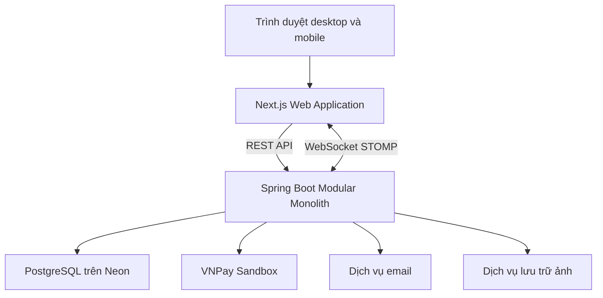
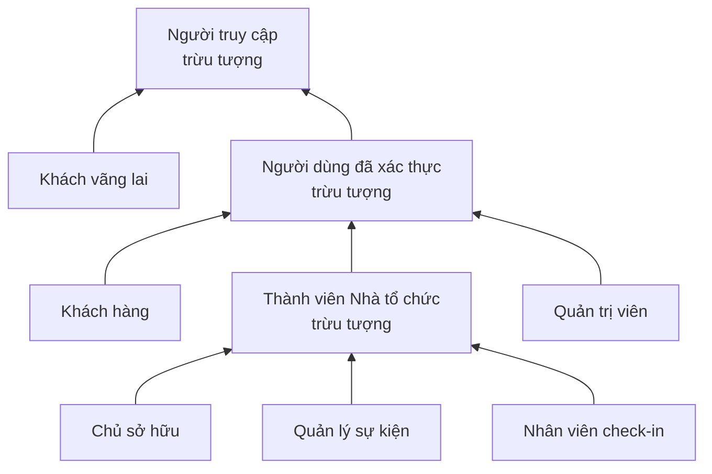

# Đặc tả tổng thể — Hệ thống quản lý và phân phối vé sự kiện

> Tài liệu sống (Living Specification) — nguồn tham chiếu thống nhất cho toàn dự án.

| Thuộc tính         | Giá trị                                    |
| ------------------ | ------------------------------------------ |
| Tên đề tài         | Hệ thống quản lý và phân phối vé sự kiện   |
| Tên làm việc       | TicketsCenter                              |
| Mô hình tham khảo  | Ticketbox.vn                               |
| Phiên bản tài liệu | 0.2.1                                      |
| Cập nhật gần nhất  | 2026-09-07                                 |
| Trạng thái dự án   | Đang phân tích và thiết kế                 |
| Kiến trúc hiện tại | Một website + Spring Boot Modular Monolith |

## Quick Context cho IDE và ChatGPT

Đây là phần phải đọc đầu tiên trước mọi phiên làm việc.

| Nội dung              | Giá trị hiện hành                                  |
| --------------------- | -------------------------------------------------- |
| Sản phẩm              | Sàn quản lý và phân phối vé sự kiện đa Nhà tổ chức |
| Client                | Một website responsive duy nhất                    |
| Frontend              | Next.js App Router + React + TypeScript            |
| Backend               | Java 21 + Spring Boot Modular Monolith             |
| Database              | PostgreSQL trên Neon                               |
| Nhiệm vụ hiện tại     | Review Master Spec 0.2.1                           |
| Nhiệm vụ kế tiếp      | Phiên 1 → UC-00 → Use Case tổng quan               |
| Đầu ra kế tiếp        | Sơ đồ UC-00 trong Sparx Enterprise Architect 17    |
| Điều kiện chuyển bước | Master Spec 0.2.1 được người dùng duyệt            |
| Tài liệu nguồn chuẩn  | `spec.md`                                          |

Quy tắc đọc nhanh:

1. Đọc Quick Context, mục 8 về actor, mục 12 về tiến độ và mục 16 về quy trình làm việc.
2. Chỉ thực hiện nhiệm vụ có trạng thái **Đang thực hiện**.
3. Không thay đổi quyết định **Đã chốt** nếu chưa được người dùng đồng ý.
4. Nếu yêu cầu mới mâu thuẫn với tài liệu, phải nêu mâu thuẫn trước khi sửa.
5. Sau khi một đầu ra được duyệt, cập nhật trạng thái và Change Log trong cùng `spec.md`.

## 1. Mục đích tài liệu

`spec.md` là **Master Specification** và nguồn tham chiếu ưu tiên cao nhất của dự án. Tài liệu này phục vụ đồng thời ba mục tiêu:

- Hướng dẫn phân tích và triển khai dự án theo đúng thứ tự.
- Tạo ngữ cảnh ổn định khi chuyển giữa IDE, ChatGPT và các công cụ khác.
- Là chỉ mục liên kết tới các tài liệu chi tiết phục vụ báo cáo cuối kỳ.

`spec.md` ghi lại:

- Tech stack đã cân nhắc, đã loại bỏ và đang sử dụng.
- Kiến trúc hệ thống đã được thống nhất.
- Các quyết định nghiệp vụ đã chốt.
- Tiến độ ba phiên thiết kế: Use Case, OOP/Domain và Database.
- Các quyết định còn mở cần xử lý sau.
- Lịch sử thay đổi để tránh nhầm lẫn giữa phương án cũ và phương án hiện tại.

Tài liệu chi tiết không nhồi toàn bộ vào Master Spec. Chúng được đặt trong `docs/` và phải dẫn ngược về mã UC, module hoặc quyết định tương ứng trong file này.

Thứ tự ưu tiên khi có mâu thuẫn:

1. Quyết định mới nhất có trạng thái **Đã chốt** trong `spec.md`.
2. Tài liệu chi tiết đã được duyệt trong `docs/`.
3. Hợp đồng API và migration đã được kiểm thử.
4. Mã nguồn hiện tại.
5. Ghi chú, bản nháp hoặc nội dung hội thoại chưa được ghi nhận.

Nếu mã nguồn khác với đặc tả đã chốt, không âm thầm sửa đặc tả cho khớp mã nguồn; phải xác định bên nào sai và xin chốt lại.

Quy ước trạng thái:

- **Đã chốt:** được xem là yêu cầu hiện hành.
- **Đề xuất:** phương án ưu tiên nhưng chưa khóa phiên bản hoặc nhà cung cấp.
- **Chưa chốt:** cần quyết định trong phiên làm việc sau.
- **Đã loại bỏ:** chỉ giữ lại trong lịch sử, không còn thuộc kiến trúc hiện hành.

## 2. Lịch sử định hướng dự án

### 2.1. Phương án ban đầu — website và desktop

Phương án đầu tiên gồm hai client dùng chung một backend:

- Website: React + Vite.
- Desktop: Java 21 + JavaFX + FXML + CSS.
- Backend: Spring Boot REST API.
- Database: PostgreSQL trên Neon.

Phương án phát triển mã nguồn ban đầu là monorepo, sau đó tách thành repo Website + Backend và repo Desktop Client khi nộp bài.

**Trạng thái:** Đã loại bỏ.

Các công nghệ không còn thuộc dự án hiện tại:

- JavaFX.
- FXML.
- CSS dành cho desktop.
- `jpackage`.
- API client Java cho desktop.
- Repository Desktop Client riêng.

### 2.2. Chuyển thành một website duy nhất

Toàn bộ chức năng Khách hàng, Nhà tổ chức, nhân viên check-in và Admin được hợp nhất trong một website có phân quyền theo route.

**Trạng thái:** Đã chốt.

### 2.3. Nâng cấp frontend

Frontend đã chuyển từ React + Vite SPA sang Next.js App Router nhằm hỗ trợ tốt hơn cho:

- SEO của trang sự kiện công khai.
- Metadata động và Open Graph khi chia sẻ sự kiện.
- Tối ưu hình ảnh.
- Kết hợp trang render phía server với các màn hình tương tác phía client.

**Trạng thái:** Đã chốt.

## 3. Phạm vi sản phẩm hiện tại

Hệ thống là một sàn phân phối vé có nhiều Nhà tổ chức, tương tự mô hình Ticketbox ở phạm vi đồ án.

Website gồm bốn khu vực:

1. Public Website cho khách vãng lai.
2. Customer Portal cho khách mua và quản lý vé.
3. Organizer Portal, bao gồm trang check-in responsive.
4. Admin Portal.

Ngoài phạm vi phiên bản chính:

- Ứng dụng desktop.
- Ứng dụng mobile native.
- Microservices.
- Bán lại vé.
- Membership nghệ sĩ.
- Check-in ngoại tuyến.

Các nội dung ngoài phạm vi có thể được ghi trong phần hướng phát triển.

## 4. Kiến trúc tổng thể hiện hành



Nguyên tắc:

- Next.js không truy cập database trực tiếp.
- Toàn bộ nghiệp vụ và phân quyền được thực thi tại Spring Boot.
- Frontend không được xem là nguồn xác thực quyền truy cập.
- PostgreSQL chỉ được truy cập từ backend và công cụ migration được kiểm soát.
- Tích hợp thanh toán, email và lưu trữ được bọc qua interface để có thể thay nhà cung cấp.

## 5. Tech stack hiện tại

### 5.1. Frontend

| Hạng mục           | Công nghệ             | Trạng thái | Mục đích                                   |
| ------------------ | --------------------- | ---------- | ------------------------------------------ |
| Framework          | Next.js App Router    | Đã chốt    | Routing, rendering, SEO, metadata          |
| UI library         | React                 | Đã chốt    | Xây dựng giao diện tương tác               |
| Ngôn ngữ           | TypeScript            | Đã chốt    | Kiểm soát kiểu dữ liệu và hợp đồng API     |
| Styling            | Tailwind CSS          | Đã chốt    | Responsive và design token                 |
| UI components      | shadcn/ui + Radix UI  | Đã chốt    | Component tùy biến, hỗ trợ accessibility   |
| Animation          | Motion for React      | Đã chốt    | Page transition và micro-interaction       |
| Server state       | TanStack Query        | Đã chốt    | Cache, loading, retry, mutation            |
| Form               | React Hook Form + Zod | Đã chốt    | Form và validation phía client             |
| Icon               | Lucide React          | Đã chốt    | Hệ thống icon thống nhất                   |
| Chart              | Recharts              | Đề xuất    | Dashboard và báo cáo                       |
| Carousel           | Embla Carousel        | Đề xuất    | Banner và sự kiện nổi bật                  |
| Notification UI    | Sonner                | Đề xuất    | Toast thông báo                            |
| QR scanner         | `@zxing/browser`      | Đề xuất    | Check-in bằng camera trình duyệt           |
| Web installability | PWA                   | Đề xuất    | Cài trang check-in lên màn hình điện thoại |

Phân chia rendering:

- Trang chủ, danh sách và chi tiết sự kiện: ưu tiên Server Component, SSR hoặc ISR.
- Chọn ghế, checkout, dashboard và check-in: Client Component khi cần tương tác.
- Metadata sự kiện được tạo động theo dữ liệu backend.
- WebSocket từ trình duyệt kết nối tới Spring Boot cho dữ liệu thời gian thực.

### 5.2. Thiết kế giao diện

Hướng thiết kế **Hybrid** đã chốt:

- Trang khách hàng: nền tối, hình ảnh lớn, cảm giác giải trí cao cấp.
- Organizer/Admin: nền sáng hoặc trung tính, ưu tiên khả năng đọc bảng và số liệu.
- Check-in: tương phản cao, nút lớn, trạng thái hợp lệ/không hợp lệ rõ ràng.
- Toàn hệ thống dùng chung color, typography, spacing, radius, shadow và motion token.

Nguyên tắc animation:

- Chuyển động ngắn, chủ yếu trong khoảng 180–250 ms.
- Ưu tiên `transform` và `opacity`.
- Event card chỉ nâng và phóng ảnh nhẹ khi hover.
- Sử dụng skeleton loading, drawer, modal enter/exit và animation chọn ghế.
- Không lạm dụng parallax, glassmorphism hoặc animation lặp.
- Tôn trọng `prefers-reduced-motion`.

### 5.3. Backend

| Hạng mục           | Công nghệ                        | Trạng thái                             |
| ------------------ | -------------------------------- | -------------------------------------- |
| Ngôn ngữ           | Java 21                          | Đã chốt                                |
| Framework          | Spring Boot                      | Đã chốt                                |
| Baseline phiên bản | Spring Boot 3.5.x                | Đề xuất; khóa patch khi khởi tạo dự án |
| API                | REST API                         | Đã chốt                                |
| Realtime           | WebSocket + STOMP                | Đã chốt                                |
| Security           | Spring Security                  | Đã chốt                                |
| Authentication     | JWT Access Token + Refresh Token | Đã chốt                                |
| Authorization      | RBAC + quyền theo tổ chức        | Đã chốt                                |
| ORM                | Spring Data JPA + Hibernate      | Đã chốt                                |
| Validation         | Jakarta Bean Validation          | Đã chốt                                |
| API documentation  | OpenAPI/Swagger                  | Đã chốt                                |
| Migration          | Flyway                           | Đã chốt                                |
| Health/metrics     | Spring Boot Actuator             | Đề xuất                                |
| Build              | Maven                            | Đã chốt                                |

WebSocket chỉ dùng cho các nhu cầu thực sự cần thời gian thực:

- Trạng thái ghế đang được giữ hoặc vừa bán.
- Trạng thái thanh toán.
- Check-in trực tiếp.
- Số liệu bán vé và check-in trên dashboard.

CRUD thông thường tiếp tục dùng REST API.

### 5.4. Database

| Hạng mục           | Công nghệ/Quy ước | Trạng thái |
| ------------------ | ----------------- | ---------- |
| Hệ quản trị        | PostgreSQL        | Đã chốt    |
| Nhà cung cấp       | Neon              | Đã chốt    |
| ORM                | JPA/Hibernate     | Đã chốt    |
| Migration          | Flyway            | Đã chốt    |
| Runtime connection | Pooled connection | Đã chốt    |
| Migration/dump     | Direct connection | Đã chốt    |

Nguyên tắc:

- Không cho frontend biết connection string.
- Không dùng `ddl-auto=update` ở môi trường triển khai chính thức.
- Schema thay đổi thông qua Flyway migration có version.
- Money dùng kiểu `numeric`, không dùng floating point.
- Thời gian lưu theo UTC bằng `timestamptz` và chuyển múi giờ khi hiển thị.
- Các nghiệp vụ giữ ghế, bán vé và hoàn vé phải có transaction và kiểm soát cạnh tranh.

### 5.5. Tích hợp và triển khai

| Thành phần        | Lựa chọn       | Trạng thái                   |
| ----------------- | -------------- | ---------------------------- |
| Frontend hosting  | Vercel         | Đã chốt                      |
| Backend hosting   | Render         | Đã chốt cho môi trường đồ án |
| Backend packaging | Docker         | Đã chốt                      |
| Database hosting  | Neon           | Đã chốt                      |
| Thanh toán        | VNPay Sandbox  | Đã chốt                      |
| Email provider    | Chưa chọn      | Chưa chốt                    |
| Object storage    | Chưa chọn      | Chưa chốt                    |
| CI/CD             | GitHub Actions | Đề xuất                      |
| Version control   | Git + GitHub   | Đã chốt                      |

Lưu ý Render:

- Không lưu ảnh hoặc dữ liệu lâu dài trên filesystem của backend.
- Backend miễn phí có thể ngủ khi không có lưu lượng; cần khởi động trước khi demo.
- Nếu cần WebSocket ổn định liên tục, cân nhắc gói luôn hoạt động khi triển khai thật.

### 5.6. Kiểm thử và chất lượng mã

| Phạm vi                      | Công nghệ                                    |
| ---------------------------- | -------------------------------------------- |
| Backend unit test            | JUnit 5 + Mockito                            |
| Backend integration test     | Spring Boot Test + Testcontainers PostgreSQL |
| Frontend unit/component test | Vitest + React Testing Library               |
| API manual test              | Postman                                      |
| API automation tùy chọn      | Postman Collection + Newman                  |
| Java formatting/lint         | Spotless hoặc Checkstyle — chưa chốt         |
| TypeScript lint/format       | ESLint + Prettier                            |

Postman không thay thế unit test hoặc integration test.

## 6. Kiến trúc backend — Modular Monolith

Kiến trúc **Modular Monolith theo nghiệp vụ** đã được chọn thay cho monolith thuần phân tầng và microservices.

Các module dự kiến:

```text
identity        Tài khoản, đăng nhập, JWT, xác minh email
organization    Nhà tổ chức, thành viên, vai trò
event           Sự kiện, thể loại, lịch diễn, địa điểm
seating         Sơ đồ ghế, khu vực, hàng, ghế
ticketing       Hạng vé, tồn kho, giữ vé, phát hành QR
order           Đơn hàng và chi tiết đơn
payment         VNPay, IPN, giao dịch, hoàn tiền
promotion       Mã giảm giá
checkin         Xác minh QR và lịch sử check-in
settlement      Phí nền tảng, đối soát, thanh toán Nhà tổ chức
notification    Email và thông báo trong hệ thống
reporting       Doanh thu, vé bán, tỷ lệ check-in
admin           Kiểm duyệt và cấu hình toàn hệ thống
```

Cấu trúc nội bộ khuyến nghị cho mỗi module:

```text
api              Controller, Request, Response
application      Application Service, Use Case
domain           Entity, Value Object, Enum, Domain Rule
infrastructure   JPA Repository, adapter và tích hợp bên ngoài
```

Quy tắc phụ thuộc:

- Module không truy cập trực tiếp repository nội bộ của module khác.
- Giao tiếp qua application service, interface hoặc domain event phù hợp.
- Không trả JPA entity trực tiếp qua API.
- Request/Response DTO thuộc lớp API.
- Transaction boundary đặt tại application/service layer.

## 7. Tổ chức mã nguồn hiện tại

Vì dự án hiện chỉ còn một website, mã nguồn được tổ chức trong một monorepo:

```text
event-ticketing-system/
├── backend/
├── web/
├── docs/
│   ├── use-case/
│   ├── oop/
│   ├── database/
│   └── api/
├── docker-compose.yml
├── README.md
└── spec.md
```

## 8. Actor và phân quyền đã chốt

### 8.1. Danh mục actor chuẩn

Tên actor dưới đây là tên chuẩn và phải được tái sử dụng nguyên nghĩa trong UC-00 đến UC-09. Một sơ đồ con chỉ cần hiển thị actor liên quan, nhưng không được tự đổi tên cùng một vai trò.

| Actor                  | Loại                     | Ý nghĩa                                                     |
| ---------------------- | ------------------------ | ----------------------------------------------------------- |
| Người truy cập         | Tổng quát, trừu tượng    | Bất kỳ người nào sử dụng phần công khai của website         |
| Khách vãng lai         | Chuyên biệt              | Người chưa đăng nhập                                        |
| Người dùng đã xác thực | Tổng quát, trừu tượng    | Tài khoản đã đăng nhập hợp lệ                               |
| Khách hàng             | Chuyên biệt              | Người khám phá, mua và quản lý vé                           |
| Thành viên Nhà tổ chức | Tổng quát, trừu tượng    | Người hoạt động trong phạm vi một Nhà tổ chức               |
| Chủ sở hữu             | Chuyên biệt              | Quản lý tổ chức, thành viên và quyền cao nhất trong tổ chức |
| Quản lý sự kiện        | Chuyên biệt              | Tạo và vận hành sự kiện được phân công                      |
| Nhân viên check-in     | Chuyên biệt              | Kiểm tra và ghi nhận vé tại sự kiện được phân công          |
| Quản trị viên          | Chuyên biệt cấp hệ thống | Kiểm duyệt và quản trị nền tảng                             |

### 8.2. Quan hệ kế thừa actor



Trong Sparx EA, dùng connector **Generalization** và đặt đầu tam giác rỗng hướng về actor tổng quát:

- `Khách vãng lai` → `Người truy cập`.
- `Người dùng đã xác thực` → `Người truy cập`.
- `Khách hàng`, `Thành viên Nhà tổ chức`, `Quản trị viên` → `Người dùng đã xác thực`.
- `Chủ sở hữu`, `Quản lý sự kiện`, `Nhân viên check-in` → `Thành viên Nhà tổ chức`.

### 8.3. Actor bên ngoài

- VNPay Sandbox.
- Dịch vụ email.
- Dịch vụ lưu trữ ảnh.

Actor bên ngoài không kế thừa actor con người và luôn đặt ngoài system boundary.

### 8.4. Quy tắc tài khoản và vai trò

Một tài khoản có thể có nhiều vai trò:

- Người dùng mặc định có thể hoạt động như Khách hàng.
- Người dùng có thể sở hữu hoặc tham gia nhiều tổ chức.
- Vai trò tổ chức gồm `OWNER`, `EVENT_MANAGER`, `CHECKIN_STAFF`.
- `ADMIN` là quyền cấp hệ thống.
- Backend là nơi thực thi phân quyền cuối cùng.

Actor trong Use Case thể hiện **vai trò tương tác**, không đồng nhất với một bản ghi tài khoản. Vì vậy cùng một người có thể đồng thời đóng vai Khách hàng và Chủ sở hữu nhưng thực hiện các Use Case khác nhau theo quyền hiện hành.

## 9. Các quyết định nghiệp vụ đã chốt

### 9.1. Sàn đa Nhà tổ chức

- Cá nhân hoặc doanh nghiệp có thể đăng ký Nhà tổ chức.
- Admin xác minh hồ sơ Nhà tổ chức.
- Sự kiện, thành viên, doanh thu và quyền truy cập gắn với tổ chức.
- Mỗi sự kiện thuộc đúng một tổ chức.

### 9.2. Kiểm duyệt sự kiện

Mọi sự kiện phải được Admin duyệt trước khi mở bán.

```text
DRAFT
  → PENDING_APPROVAL
      → REJECTED → chỉnh sửa → gửi lại
      → APPROVED → PUBLISHED → ON_SALE
                                   → SOLD_OUT
                                   → CANCELLED
                                   → COMPLETED
```

Thay đổi quan trọng sau khi duyệt như lịch diễn, địa điểm, giá hoặc sơ đồ ghế phải được duyệt lại.

### 9.3. Lịch diễn và hình thức bán vé

Hình thức bán vé được cấu hình theo từng lịch diễn:

- Vé tự do theo hạng và số lượng.
- Ghế đánh số.
- Kết hợp ghế đánh số và khu vực vé tự do.

Một sự kiện có thể có nhiều lịch diễn với cấu hình khác nhau.

### 9.4. Địa điểm và sơ đồ ghế

- `Venue` và `SeatingPlan` có thể tái sử dụng.
- Sơ đồ gồm khu vực, hàng, ghế và khu vực vé tự do.
- Khi gắn sơ đồ vào lịch diễn, hệ thống tạo snapshot/phân bổ riêng.
- Thay đổi sơ đồ mẫu không làm thay đổi vé của lịch diễn đang bán.
- Nhà tổ chức có thể khóa ghế và gán khu vực vào hạng vé.

### 9.5. Tài khoản và mua vé

- Khách vãng lai được xem và tìm kiếm sự kiện.
- Khách phải đăng nhập và xác minh email trước khi mua vé.
- Vé và đơn hàng được liên kết với tài khoản khách hàng.
- Vé hiển thị trong khu vực “Vé của tôi”.

### 9.6. Giữ vé và ghế

Trạng thái cơ bản:

```text
AVAILABLE → HELD → SOLD
                ↘ EXPIRED → AVAILABLE
```

Các trạng thái bổ sung có thể gồm `BLOCKED`, `CHECKED_IN`, `REFUNDED`.

Thời gian giữ ghế chính xác chưa được chốt; baseline đề xuất là 10 phút.

### 9.7. Thanh toán VNPay

- Khách thanh toán qua VNPay Sandbox.
- Backend tạo URL thanh toán.
- Return URL dùng để hiển thị kết quả cho khách.
- IPN đã xác minh chữ ký là nguồn xác nhận thanh toán chính thức.
- IPN phải được xử lý idempotent.
- Chỉ phát hành vé sau khi backend xác nhận giao dịch thành công và đúng số tiền.
- Không lưu thông tin thẻ ngân hàng.

Luồng chính:

```text
Tạo đơn và giữ vé/ghế
→ PENDING_PAYMENT
→ Chuyển sang VNPay
→ VNPay gửi IPN
→ Xác minh chữ ký, đơn hàng và số tiền
→ PAID
→ Phát hành vé QR
→ Gửi email và cập nhật “Vé của tôi”
```

### 9.8. Hoàn vé

Nhà tổ chức cấu hình một trong các chính sách:

- `NO_REFUND`.
- `REFUND_BEFORE_DEADLINE`.
- `ORGANIZER_APPROVAL_REQUIRED`.

Quy tắc:

- Sự kiện bị hủy: hoàn toàn bộ các đơn đủ điều kiện.
- Vé đã check-in không được hoàn.
- Hỗ trợ hoàn một phần khi đơn có nhiều vé.
- Mọi lần yêu cầu, duyệt, từ chối và hoàn tiền phải có lịch sử.

### 9.9. Phí nền tảng và đối soát

- Nền tảng thu tiền từ khách hàng.
- Doanh thu được ghi nhận theo sự kiện và Nhà tổ chức.
- Hệ thống trừ hoàn tiền và phí nền tảng.
- Hệ thống tạo kỳ đối soát sau sự kiện.
- Admin xác nhận thanh toán cho Nhà tổ chức.
- Chuyển tiền cho Nhà tổ chức được mô phỏng trong phạm vi đồ án.

Các nhóm dữ liệu tài chính dự kiến:

- Payment.
- Refund.
- Commission Rule.
- Settlement và Settlement Item.
- Payout.
- Audit Log.

### 9.10. Phạm vi tính năng nâng cao

Phiên bản chính bao gồm:

- Mã giảm giá.
- Theo dõi sự kiện hoặc Nhà tổ chức.
- Thông báo trong hệ thống và email.
- Báo cáo doanh thu, vé bán và check-in.

## 10. Dữ liệu tham khảo Ticketbox

Dữ liệu Ticketbox chỉ được nhập một lần làm seed data, không crawler hoặc đồng bộ định kỳ.

Nguyên tắc:

- Dùng khoảng 20–30 sự kiện công khai làm dữ liệu tham khảo.
- Chỉ lấy thông tin sự kiện công khai, không lấy tài khoản, đơn hàng hoặc mã vé thật.
- Chuẩn hóa dữ liệu thành JSON, CSV hoặc SQL trước khi nhập.
- Lưu `source_url` và `external_source = 'TICKETBOX'`.
- Không phụ thuộc URL hoặc cấu trúc Ticketbox khi ứng dụng chạy.
- Không sử dụng logo Ticketbox hoặc tự nhận là sản phẩm Ticketbox.
- Ưu tiên ảnh tự tạo, ảnh được phép sử dụng hoặc nhà cung cấp lưu trữ riêng.

Dữ liệu công khai có thể tham khảo:

- Tên, mô tả và thể loại sự kiện.
- Nhà tổ chức.
- Địa điểm và lịch diễn.
- Hạng vé và giá.
- Trạng thái mở bán.
- Điều khoản tham dự và chính sách hoàn vé.

## 11. Route frontend dự kiến

```text
/                         Trang chủ
/events                   Danh sách sự kiện
/events/[slug]            Chi tiết sự kiện
/checkout                 Đặt và thanh toán vé

/auth/*                   Đăng ký, đăng nhập, xác minh, đặt lại mật khẩu
/account                  Hồ sơ khách hàng
/my-tickets               Vé của tôi
/orders                   Lịch sử đơn hàng

/organizer                Organizer Dashboard
/organizer/events         Quản lý sự kiện
/organizer/seating-plans  Quản lý sơ đồ ghế
/organizer/orders         Quản lý đơn hàng
/organizer/reports        Báo cáo và đối soát

/check-in                 Quét và kiểm tra QR

/admin                    Admin Dashboard
/admin/organizers         Duyệt Nhà tổ chức
/admin/events             Duyệt sự kiện
/admin/settlements        Quản lý đối soát
```

Tên route có thể được điều chỉnh khi thiết kế sitemap và UI nhưng ranh giới vai trò phải được giữ.

## 12. Tiến độ ba phiên thiết kế

### Phiên 1 — Use Case

**Trạng thái:** Chưa bắt đầu; chờ duyệt Master Spec 0.2.1.

Lý do thiết kế lại:

- Cần chuẩn hóa một danh mục actor thống nhất cho toàn hệ thống trước khi tách thành các sơ đồ UC-xx.
- Actor trong mỗi sơ đồ con có thể khác nhau theo phạm vi nghiệp vụ, nhưng tên gọi, ý nghĩa và quan hệ kế thừa không được thay đổi tùy ý.
- UC-00 sẽ là sơ đồ tổng quan và nguồn tham chiếu cho actor, system boundary cùng các nhóm nghiệp vụ cấp cao.

Phạm vi UC-00 đã chốt:

- Thể hiện toàn bộ actor chuẩn và quan hệ kế thừa giữa các actor.
- Thể hiện chín nhóm nghiệp vụ cấp cao tương ứng UC-01 đến UC-09.
- Thể hiện actor bên ngoài và nhóm nghiệp vụ mà chúng tham gia.
- Chỉ dùng Association giữa actor và nhóm nghiệp vụ cấp cao.
- Không đưa các Use Case chức năng chi tiết, API, database hoặc thao tác giao diện vào UC-00.
- Không dùng `include` và `extend` cấp thấp trong UC-00; các quan hệ này được phân tích trong sơ đồ UC-01 đến UC-09.

Quy trình bắt buộc cho mỗi UC-xx:

1. Chốt actor tham gia từ danh mục actor chuẩn.
2. Chốt mục tiêu và ranh giới nghiệp vụ.
3. Liệt kê Use Case bằng tên động từ + đối tượng.
4. Xác định Association, Generalization, `include` và `extend` đúng ngữ nghĩa.
5. Viết tiền điều kiện, hậu điều kiện, luồng chính, luồng thay thế và ngoại lệ.
6. Hướng dẫn thao tác chi tiết trong Sparx EA 17.
7. Người dùng vẽ hoặc chỉnh sơ đồ.
8. Review sơ đồ và chỉ chuyển trạng thái khi người dùng duyệt.

Tình trạng hiện tại:

| Mã            | Trạng thái   | Ghi chú                                                                         |
| ------------- | ------------ | ------------------------------------------------------------------------------- |
| UC-00         | Chưa bắt đầu | Nhiệm vụ kế tiếp sau khi Master Spec 0.2.1 được duyệt; bản hiện có trong file EA là bản nháp cũ, chưa phải đầu ra chính thức |
| UC-01         | Cần vẽ lại   | Bản cũ được giữ làm tài liệu tham khảo; sẽ điều chỉnh theo UC-00                |
| UC-02         | Chưa bắt đầu | Bản brainstorming trước chưa được duyệt và chưa được xem là thiết kế chính thức |
| UC-03 – UC-09 | Chưa bắt đầu | Chỉ triển khai sau khi UC-00 được duyệt                                         |

Các kết luận kỹ thuật từ bản UC-01 cũ vẫn được giữ để tái sử dụng:

- “Làm mới phiên đăng nhập” thuộc Sequence Diagram/API Security, không phải Use Case nghiệp vụ.
- Dùng tên “Gửi lại email xác minh”.
- Dịch vụ email là actor bên ngoài và nằm ngoài system boundary.

Bộ sơ đồ dự kiến:

| Mã    | Nội dung                                |
| ----- | --------------------------------------- |
| UC-00 | Tổng quan hệ thống                      |
| UC-01 | Tài khoản và xác thực                   |
| UC-02 | Khám phá và theo dõi sự kiện            |
| UC-03 | Đặt vé, chọn ghế và thanh toán          |
| UC-04 | Quản lý vé, QR và hoàn tiền             |
| UC-05 | Quản lý tổ chức và thành viên           |
| UC-06 | Quản lý sự kiện, lịch diễn và sơ đồ ghế |
| UC-07 | Check-in                                |
| UC-08 | Quản trị và kiểm duyệt                  |
| UC-09 | Báo cáo, phí nền tảng và đối soát       |

### Phiên 2 — OOP và domain model

**Trạng thái:** Chưa bắt đầu.

Đầu ra dự kiến:

- Domain/Class Diagram.
- Aggregate và ranh giới module.
- Entity, Value Object, Enum và service.
- State transition quan trọng.
- Mapping từ Use Case sang module và application service.
- Sequence Diagram cấp nghiệp vụ cho mua vé, thanh toán, phát hành QR và check-in.

### Phiên 3 — Database

**Trạng thái:** Chưa bắt đầu.

Đầu ra dự kiến:

- ERD logic và vật lý.
- Toàn bộ bảng, cột, kiểu dữ liệu, PK, FK và unique constraint.
- Check constraint, index và audit fields.
- Transaction và chiến lược chống bán vượt số lượng.
- Flyway migrations.
- Seed data.
- Script PostgreSQL hoàn chỉnh.

Ba phiên trên là giai đoạn phân tích và thiết kế cốt lõi. API, frontend và triển khai chỉ bắt đầu khi các đầu ra liên quan đã được duyệt theo roadmap ở mục 14.

## 13. Bản đồ tài liệu và artifact

`spec.md` chỉ giữ quyết định tổng thể, trạng thái và chỉ mục. Nội dung chi tiết được tổ chức như sau:

```text
event-ticketing-system/
├── backend/
├── web/
├── docs/
│   ├── use-case/
│   │   ├── UC-00-overview.md
│   │   ├── UC-01-authentication.md
│   │   ├── UC-02-event-discovery.md
│   │   └── ...
│   ├── oop/
│   │   ├── domain-model.md
│   │   ├── class-diagram.md
│   │   └── sequence-diagrams.md
│   ├── database/
│   │   ├── erd.md
│   │   ├── data-dictionary.md
│   │   └── transaction-rules.md
│   ├── api/
│   │   ├── rest-api.md
│   │   ├── websocket.md
│   │   └── openapi.yaml
│   ├── frontend/
│   │   ├── sitemap.md
│   │   ├── ui-flows.md
│   │   └── design-system.md
│   ├── testing/
│   │   └── test-strategy.md
│   └── deployment/
│       └── deployment-guide.md
├── diagrams/
│   ├── event-ticketing.qea
│   └── exports/
├── docker-compose.yml
├── README.md
└── spec.md
```

Quy ước:

- File `.qea` là nguồn chỉnh sửa sơ đồ Sparx EA; ảnh/PDF trong `diagrams/exports/` chỉ là bản xuất.
- `docs/EA/TicketsCenter.qea` là artifact cũ để tham khảo. File hiện chứa bản nháp UC-00 và UC-01 chưa được duyệt; UC-00 trong file chưa đủ chín nhóm nghiệp vụ và toàn bộ actor chuẩn. Khi bắt đầu UC-00, nguồn chỉnh sửa chính thức phải được lưu tại `diagrams/event-ticketing.qea` theo cấu trúc mục tiêu ở trên.
- Mỗi tài liệu Use Case phải dùng đúng mã `UC-xx` trong Master Spec.
- Tên module, entity, API và bảng phải có khả năng truy vết về Use Case hoặc quy tắc nghiệp vụ.
- Các đường dẫn trên là cấu trúc mục tiêu; chỉ tạo file khi bắt đầu đầu ra tương ứng.

## 14. Roadmap từ phân tích đến triển khai

Không ấn định nhân sự hoặc thời gian. Dự án tiến theo **approval gate**: chỉ chuyển bước khi đầu ra bắt buộc của bước trước đã được duyệt.

| Giai đoạn            | Trạng thái   | Đầu ra bắt buộc                                            | Approval gate                      |
| -------------------- | ------------ | ---------------------------------------------------------- | ---------------------------------- |
| 0. Master Spec       | Chờ duyệt    | Kiến trúc, stack, actor, roadmap và giao thức làm việc     | `spec.md` 0.2.1 được duyệt         |
| 1. Use Case          | Chưa bắt đầu | UC-00 đến UC-09 và đặc tả luồng                            | Tất cả UC được duyệt               |
| 2. OOP/Domain        | Chưa bắt đầu | Domain Model, Class Diagram, aggregate và state            | Domain model được duyệt            |
| 3. Database          | Chưa bắt đầu | ERD, data dictionary, constraint, index và transaction     | Database được duyệt                |
| 4. API/Security      | Chưa bắt đầu | REST contract, OpenAPI, JWT, WebSocket và integration flow | API contract được duyệt            |
| 5. Frontend UX/UI    | Chưa bắt đầu | Sitemap, UI flow, design system và prototype chính         | UI direction được duyệt            |
| 6. Project Bootstrap | Chưa bắt đầu | Monorepo, cấu hình môi trường, CI cơ bản                   | Backend và frontend chạy local     |
| 7. Implementation    | Chưa bắt đầu | Các vertical slice hoạt động end-to-end                    | Từng slice vượt Definition of Done |
| 8. Hardening/Deploy  | Chưa bắt đầu | Test toàn luồng, Docker, Vercel, Render, Neon              | Demo production-like thành công    |
| 9. Academic Handoff  | Chưa bắt đầu | Báo cáo, hình vẽ, hướng dẫn cài đặt và demo script         | Bộ nộp bài hoàn chỉnh              |

Thứ tự vertical slice triển khai:

1. Identity và authentication.
2. Public event catalog và discovery.
3. Organization và event management.
4. Schedule, seating và ticket inventory.
5. Order, seat hold và VNPay Sandbox.
6. Ticket QR, My Tickets và check-in.
7. Refund, promotion và notification.
8. Admin moderation, reporting và settlement.
9. Hardening, observability và deployment.

Một slice phải đi xuyên suốt từ database → backend → API → frontend → test; không xây toàn bộ database hoặc toàn bộ controller trước rồi mới nối nghiệp vụ.

## 15. Definition of Done và approval gate

### 15.1. Đối với một Use Case

Một UC chỉ được đánh dấu **Đã duyệt** khi có đủ:

- Actor lấy từ danh mục chuẩn.
- Mục tiêu và phạm vi rõ ràng.
- Trigger, tiền điều kiện và hậu điều kiện.
- Luồng chính, luồng thay thế và ngoại lệ.
- Association, Generalization, `include` và `extend` được giải thích.
- Sơ đồ Sparx EA đọc được, không giao cắt khó hiểu và có system boundary đúng.
- Tài liệu chi tiết được lưu theo đúng đường dẫn.
- Người dùng xác nhận chấp thuận.

### 15.2. Đối với một đầu ra thiết kế

- Không để ký hiệu giữ chỗ hoặc nội dung chưa hoàn thiện; vấn đề chưa chốt phải nằm trong mục Open Decisions.
- Không mâu thuẫn với quyết định **Đã chốt**.
- Có khả năng truy vết tới Use Case hoặc quy tắc nghiệp vụ.
- Có source chỉnh sửa và bản xuất phù hợp.
- Đã tự review trước khi xin người dùng duyệt.

### 15.3. Đối với một vertical slice mã nguồn

- Luồng chính chạy end-to-end.
- Validation, phân quyền và lỗi nghiệp vụ được xử lý.
- Migration có thể chạy trên PostgreSQL sạch.
- Unit test và integration test liên quan vượt qua.
- Không lộ secret, connection string hoặc dữ liệu thanh toán.
- API documentation và tài liệu liên quan được cập nhật.
- `spec.md` ghi nhận trạng thái, thay đổi và bước tiếp theo.

## 16. Giao thức làm việc qua IDE và ChatGPT

### 16.1. Khi bắt đầu một phiên mới

IDE agent hoặc ChatGPT phải:

1. Đọc `spec.md`.
2. Xác nhận `current_session`, `current_task`, `current_task_status` và `next_approval_gate` trong front matter.
3. Đọc duy nhất các tài liệu chi tiết liên quan tới nhiệm vụ hiện tại.
4. Kiểm tra mã nguồn và thay đổi chưa commit nếu repository đã tồn tại.
5. Nêu rõ phạm vi dự định thực hiện trước khi thay đổi kiến trúc hoặc mã nguồn.

Prompt khởi đầu khuyến nghị:

```text
Hãy đọc spec.md trước. Xác nhận nhiệm vụ hiện tại, các quyết định đã chốt,
các vấn đề còn mở và approval gate kế tiếp. Chỉ làm nhiệm vụ hiện tại;
không tự đổi kiến trúc hoặc tech stack. Khi hoàn thành, hãy kiểm thử và
cập nhật spec.md cùng tài liệu liên quan.
```

### 16.2. Trong khi thực hiện

- Chỉ một nhiệm vụ chính ở trạng thái **Đang thực hiện** tại một thời điểm.
- Không dùng ký ức hội thoại làm nguồn duy nhất; quyết định phải được ghi vào file.
- Không tự nâng cấp framework hoặc thêm thư viện khi chưa có lý do và phê duyệt.
- Không đổi mã UC, module, role, enum hoặc tên khái niệm đã chốt một cách âm thầm.
- Nếu phát hiện mâu thuẫn, dừng phần bị ảnh hưởng, mô tả hai phương án và xin quyết định.
- Không ghi secret thật vào tài liệu, repository hoặc ảnh chụp màn hình.
- Giữ thay đổi nhỏ, có thể review và đúng phạm vi nhiệm vụ.

### 16.3. Khi hoàn thành một nhiệm vụ

Phần bàn giao phải nêu:

- Kết quả đã hoàn thành.
- File đã tạo hoặc thay đổi.
- Kiểm tra/test đã thực hiện và kết quả.
- Quyết định mới hoặc quyết định bị thay thế.
- Vấn đề còn mở.
- Nhiệm vụ kế tiếp được đề xuất.

Sau khi người dùng duyệt:

1. Cập nhật trạng thái đầu ra thành **Đã duyệt**.
2. Chuyển nhiệm vụ kế tiếp sang **Đang thực hiện**.
3. Cập nhật front matter của `spec.md`.
4. Tăng phiên bản tài liệu theo quy ước.
5. Thêm Change Log.

### 16.4. Trạng thái công việc chuẩn

| Trạng thái     | Ý nghĩa                                                          |
| -------------- | ---------------------------------------------------------------- |
| Chưa bắt đầu   | Chưa được phép triển khai                                        |
| Đang phân tích | Đang làm rõ yêu cầu, chưa chốt thiết kế                          |
| Đang thực hiện | Nhiệm vụ chính hiện tại                                          |
| Chờ duyệt      | Đã có đầu ra, chờ người dùng xác nhận                            |
| Cần chỉnh sửa  | Đã review nhưng chưa đạt                                         |
| Đã duyệt       | Đầu ra chính thức và được phép làm cơ sở cho bước sau            |
| Đã loại bỏ     | Không còn hiệu lực, chỉ giữ trong lịch sử                        |
| Bị chặn        | Không thể tiếp tục nếu chưa giải quyết phụ thuộc hoặc quyết định |

## 17. Các quyết định còn mở

- Phiên bản patch chính xác của Spring Boot.
- Có chốt Recharts, Embla Carousel, Sonner và `@zxing/browser` khi bắt đầu đầu ra frontend tương ứng hay không.
- Có dùng Spring Boot Actuator trong bản chính hay không.
- Nhà cung cấp email.
- Nhà cung cấp object storage.
- Có hỗ trợ Google/OAuth hay chỉ email và mật khẩu.
- Thời gian giữ ghế chính xác.
- Công thức phí nền tảng và bên chịu phí.
- Định dạng chuẩn cuối cùng cho seed data Ticketbox.
- Tên thương hiệu cuối cùng, màu thương hiệu và logo; `TicketsCenter` hiện là tên làm việc.
- Có triển khai PWA cho check-in ngay trong bản chính hay không.
- Có dùng GitHub Actions cho CI/CD trong bản chính hay không.
- Công cụ Java format: Spotless hay Checkstyle.

## 18. Quy trình cập nhật tài liệu

Sau mỗi phần công việc được người dùng chấp thuận:

1. Cập nhật yêu cầu hoặc quyết định trong phần tương ứng.
2. Chuyển trạng thái từ “Chưa chốt/Đề xuất” sang “Đã chốt” khi phù hợp.
3. Cập nhật tiến độ phiên làm việc.
4. Thêm một dòng vào Change Log.
5. Không xóa quyết định cũ có ý nghĩa; chuyển nó vào lịch sử và ghi rõ “Đã loại bỏ”.
6. Tăng phiên bản:
   - Patch: chỉnh giải thích hoặc lỗi nhỏ.
   - Minor: hoàn thành một phần thiết kế hoặc chốt thêm module.
   - Major: thay đổi phạm vi hoặc kiến trúc nền tảng.

## 19. Change Log

### 0.1.0 — 2026-09-07

- Tạo tài liệu đặc tả sống đầu tiên.
- Ghi lại phương án website + desktop đã bị thay thế.
- Chốt mô hình một website duy nhất.
- Ghi nhận Next.js thay React + Vite SPA.
- Ghi nhận kiến trúc Spring Boot Modular Monolith.
- Tổng hợp tech stack, actor, phạm vi nghiệp vụ và tiến độ UC-01.

### 0.1.1 — 2026-09-07

- Đặt lại trạng thái Phiên 1 để thiết kế từ UC-00.
- Chuyển UC-01 sang trạng thái “Cần vẽ lại”.
- Chuyển UC-02 đến UC-09 về trạng thái “Chưa bắt đầu”.
- Ghi nhận yêu cầu chuẩn hóa actor toàn hệ thống trước khi vẽ các sơ đồ Use Case con.

### 0.2.0 — 2026-09-07

- Chuyển `spec.md` thành Master Specification dùng chung cho IDE và ChatGPT.
- Thêm front matter mô tả nhiệm vụ, trạng thái và approval gate hiện tại.
- Chốt cấu trúc Master Spec + tài liệu chi tiết trong `docs/`.
- Chuẩn hóa danh mục actor và toàn bộ quan hệ kế thừa.
- Chốt UC-00 ở mức chín nhóm nghiệp vụ tổng quát, có actor inheritance và không chứa Use Case chi tiết.
- Tách lại ba phiên thiết kế thành Use Case, OOP/Domain và Database.
- Bổ sung roadmap từ phân tích đến triển khai theo vertical slice.
- Bổ sung Definition of Done, bản đồ artifact và giao thức bàn giao giữa các công cụ.
- Đặt Master Spec 0.2.0 ở trạng thái “Chờ duyệt”; UC-00 là nhiệm vụ kế tiếp.

### 0.2.1 — 2026-09-07

- Chuyển Master Spec về `spec.md` tại thư mục gốc để khớp với nguồn tham chiếu và bản đồ artifact.
- Đưa tài liệu và file EA vào phạm vi quản lý phiên bản của Git.
- Phân loại UC-00 và UC-01 hiện có trong `docs/EA/TicketsCenter.qea` là bản nháp cũ, chưa được duyệt.
- Sửa chiều quan hệ kế thừa actor trong sơ đồ Mermaid để thống nhất với mô tả Generalization.
- Sửa tham chiếu roadmap từ mục 17 thành mục 14 và thống nhất tên giai đoạn OOP/Domain.
- Phân biệt `TicketsCenter` là tên làm việc với quyết định thương hiệu cuối cùng.
- Bổ sung các công nghệ còn ở trạng thái “Đề xuất” vào danh sách quyết định còn mở.
- Giữ Master Spec 0.2.1 ở trạng thái “Chờ duyệt”; UC-00 vẫn là nhiệm vụ kế tiếp.
